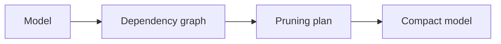

# torch-kirigami

**Structural dependency analysis and physical pruning for PyTorch.**

torch-kirigami determines which tensor regions must change together when a channel, feature, or attention dimension is removed. It separates dependency analysis from pruning decisions and model mutation, so the same structural model supports manual pruning, automatic selection, sparse training, and custom operators.

The library requires **Python 3.10+ and PyTorch 2.6+**. PyTorch is its only runtime dependency.

## How it works



- **Dependency analysis** captures a model with FX, describes tensor regions and operator relations, and computes the impact of a selection without changing the model.
- **Pruning** discovers candidates, scores and selects them, validates an executable plan, and commits parameter and module-attribute changes.
- **Sparse training components** provide scalar regularizers, explicit channel gates, parameter projections, cumulative budgets, and schedules. The caller owns the task loss, optimizer, and training loop.
- **Measurement** reports parameter counts, supported multiply–accumulate operations, and inference latency, including `torch.compile` execution.

See the [architecture overview](docs/architecture.md) for the complete component diagram and dependency boundaries.

## Install

From the repository root:

```bash
uv venv .venv
source .venv/bin/activate
uv pip install --torch-backend=auto -e .
```

The [ImageNet workflow guide](examples/workflows/README.md) installs the additional dependencies needed by the pretrained-model examples.

## A complete pruning round

This small model illustrates the API. For accuracy experiments, use the pretrained ImageNet workflows below.

```python
import torch
from torch import nn

from torch_kirigami import DependencyGraph
from torch_kirigami.pruning import Pruner

model = nn.Sequential(nn.Linear(4, 6), nn.ReLU(), nn.Linear(6, 3))
x = torch.randn(2, 4)

# Capture structure and inspect the dependency closure without mutation.
graph = DependencyGraph.build(model, args=(x,))
selection = graph.parameter("0.weight").axis(0).select([1, 4])
impact = graph.propagate(remove=[selection])
print(graph.explain(impact))

# Validate all physical edits before applying them to the original model.
pruner = Pruner(model, graph=graph)
plan = pruner.plan_remove([selection])
print(plan.explain())
model, result = pruner.apply(plan)

assert model[0].out_features == 4
assert model[2].in_features == 4
assert model(x).shape == (2, 3)

# Structure changed: rebuild analysis and bind a new optimizer.
graph = DependencyGraph.build(model, args=(x,))
optimizer = torch.optim.SGD(model.parameters(), lr=0.01)
```

Removing two outputs of the first linear layer also removes their bias entries and the corresponding input columns of the second layer. Public input and output dimensions remain unchanged.

For automatic selection, replace the explicit `plan_remove(...)` call with:

```python
from torch_kirigami.pruning import ChannelRatio, Greedy, Magnitude

pruner = Pruner(model, graph=graph)
space = pruner.discover_candidates()
plan = pruner.plan(space, budget=ChannelRatio(0.25), strategy=Greedy(Magnitude(p=2)))
```

Use a `Pruner` bound to the current graph. An automatic budget may be underfilled when valid structural constraints prevent the requested reduction; inspect the plan's selection report. A resolved dependency impact is not a guarantee of physical executability or numerical equivalence to the unpruned model.

## Pretrained ImageNet workflows

The [workflow guide](examples/workflows/README.md) provides seven standalone scripts using torchvision's pretrained **ResNet-18** or **ViT-B/16**, with ImageNet training and validation kept separate:

| Workflow | Purpose |
| --- | --- |
| Basic pruning | Magnitude or task-gradient Taylor selection, pruning, optional fine-tuning |
| Iterative pruning | Repeated selection with cumulative channel budgets |
| BN sparsity | L1 regularization of ResNet batch-normalization scales |
| Dependency-group sparsity | Group Lasso or increasing squared-L2 regularization |
| Soft pruning | Repeated zeroing or gradual norm reduction before physical deletion |
| Gate pruning | Train explicit channel scales, then prune using their magnitudes |
| Stability-driven pruning | Monitor retained-channel selections while increasing regularization |

Each workflow reports validation accuracy before and after pruning, optional fine-tuning results, parameter counts, MACs, and latency. These are compact algorithm examples, not reproductions of published benchmark results.

## Documentation

Start at the [documentation index](docs/index.md), or choose a path:

| Goal | Read |
| --- | --- |
| Understand component responsibilities and control flow | [Architecture overview](docs/architecture.md) |
| Learn the public API step by step | [Getting started](docs/getting-started.md) |
| Review graph construction, relations, and class contracts | [Dependency graph design](docs/dependency-graph-design.md) |
| Understand candidate selection and physical execution | [Pruning design](docs/pruning-design.md) |
| Save plans and restore compact models | [Persistence](docs/persistence.md) |
| Assemble sparse training and iterative algorithms | [Sparse training](docs/sparse-training.md) |
| Interpret complexity and latency measurements | [Measurement](docs/measurement.md) |
| Check supported operators and limitations | [Operator coverage](docs/operator-coverage.md) |
| Run tests and contribute changes | [Testing and development](docs/testing.md) |

The executable [custom rule](examples/custom_rule.py) and [fused attention](examples/fused_attention.py) examples demonstrate operator extension.

## Operating boundaries

Capture uses FX symbolic tracing and shape propagation. Tensor-dependent Python branches, dynamic loops, unknown operators, and edits requiring an unsupported forward rewrite are reported rather than silently approximated. Supported behavior is specific to each operator and pruning axis; consult the coverage guide.

A graph is bound to the captured input metadata, structure, module modes, and relevant configuration. Rebuild it after physical pruning or incompatible model changes. Parameter replacement also requires a new optimizer; optimizer state is not migrated automatically.

Graph construction isolates example inputs and registered buffers and restores supported RNG state. Model forwards must not mutate parameters or produce external side effects, and capture must not run concurrently with training on the same model.

## Development

```bash
uv pip install --torch-backend=auto --group dev -e .
python -m pytest
ruff check .
ruff format --check .
```

Use the activated repository environment. Install dependencies with `uv pip install` and invoke Python and developer tools directly to preserve separately installed workflow packages. The project does not pin a CPU-only PyTorch index. See [testing and development](docs/testing.md) for optional example dependencies, CUDA checks, and minimum-version validation.

Licensed under the [MIT License](LICENSE).
