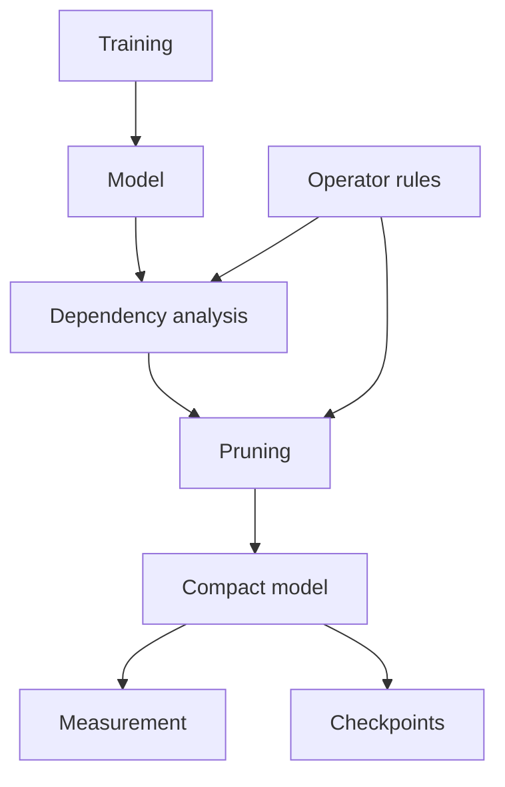

# Architecture overview

torch-kirigami separates structural dependency analysis, pruning decisions, and model mutation. Training algorithms compose these layers from outside the dependency core.

Read this page for the system map, then use the [dependency class reference](dependency-graph-design.md) and [pruning design](pruning-design.md) for implementation detail.

## Complete system overview

Arrows in this diagram indicate information flow or use of a service, not Python import edges.

There is one operator definition mechanism. Analysis, candidate discovery, rewrite support, and capture effects belong to the same registration contract. There is no independent executor registry that must be kept in sync with analysis.

## Layer responsibilities

| Layer | Owns | Does not own |
| --- | --- | --- |
| Coordinates and contracts | Tensor references, region algebra, relation protocols, constraints, diagnostics and shared operation descriptors | Model training, candidate ranking or tensor mutation |
| Capture | FX graph, isolated metadata execution, capture signature and binding provenance | A fallback tracing backend or arbitrary Python execution semantics |
| Dependency graph | Registered tensor identity, aliases, structural relations and closure queries | Deciding which channels are least important |
| Pruning | Candidate discovery, logical budgets, ranking/selection interfaces, recipe compilation and commit | A task loss or optimizer-state migration |
| Sparsity | Differentiable penalties, explicit gates, parameter operations and reusable schedules | A complete training framework or paper-specific phase policy |
| Measurement | Parameter/MAC accounting and inference latency measurement | Accuracy evaluation, latency-based pruning budgets or a speedup guarantee |
| Workflow examples | Pretrained models, data, task gradients, training phases, evaluation and training state | New library-level execution semantics |

## Dependency direction

The pruning layer consumes dependency analysis; sparsity components reuse graph and pruning contracts. The dependency core does not import either package, and library modules do not import examples. Shared parameter-region access lives in [regions.py](../torch_kirigami/regions.py), below its scoring and training consumers.

The [import tests](../tests/architecture/test_imports.py) check explicit, acyclic package imports and runtime resolution of public record annotations.

## From a model to a structural graph

Capture uses FX symbolic tracing and ShapeProp. Example tensors provide concrete metadata for that capture; they do not make tensor-dependent Python control flow traceable. Inputs and registered buffers are isolated during capture, and relevant RNG state is restored. Forward code must not write parameters or perform external side effects.

Repeated calls to a shared module remain separate calls. References to the same registered tensor are canonicalized by object identity and retain their alias paths. Distinct tensor objects sharing storage are not treated as freely compactable independent parameters.

## From a request to an executable plan

`Pruner` owns the graph, interface protection, extra constraints and optional `Granularity` settings. Candidate discovery is explicit: `pruner.discover_candidates()` returns an immutable `CandidateSpace` containing candidates and logical `channel_axes`. The space retains no model, graph or policy. Automatic planning consumes it through `plan(space, budget=..., strategy=...)`; exact manual requests use `plan_remove(remove)`.

`Granularity` resolves exact module types and paths into ordinary `Divisible` constraints. Strategies implement `select(context) -> StrategyResult` and own their scoring policy. Metrics implement `score(context, candidates, *, selected)`; `selected` is the accepted joint dependency impact. `PlanningContext.score()` validates scores and complete influence. See [alignment configuration](pruning-design.md#retained-width-alignment) and [scoring contracts](pruning-design.md#scoring-and-strategy-contracts).

`Greedy` ranks once; `DynamicGreedy` rescores after each accepted complete change.
Both share the same search verification and completion implementation. Metrics
own model-specific statistics; planning neither trains nor calibrates a model.
The workflow baseline is `GroupMagnitude`, which normalizes deduplicated
dependency-region energy per logical channel axis. Learned gates and BN scales
use explicit alternative metrics. The dependency graph and execution recipes
remain independent of these policies.

The research workflows exercise different upper-layer contracts. VBP supplies
calibrated activation statistics through `Metric`; Isomorphic implements
independent family selection through `Strategy`; OSSCAR solves reconstruction
problems and submits exact selections through `plan_remove`. Neither a metric
nor a custom strategy is required for a solver that already knows its selections.
`PlanningContext` provides joint analysis, executable recipe checks and actual
parameter counts without requiring a greedy search. Final strategy selections
are independently verified by `Pruner.plan`.

Calibration, bias compensation, weight reconstruction and optional training
remain explicit workflow stages. Structural plans contain coordinate changes,
not calibrated tensor values: save the resulting compact checkpoint after those
value updates. These examples validate the API against distinct algorithms;
they do not justify changing an algorithm to fit a particular built-in strategy.

Relations grow the removal set until no new regions appear. Constraints inspect the resulting joint selection. A strategy can try additional candidates to satisfy a joint constraint; the dependency core does not rank those alternatives.

Planning combines the closure with physical representation requirements. It checks that the original model can execute with the proposed compact shapes and supported attribute edits. A candidate can have a complete impact but still fail physical planning.

Automatic planning accepts separate immutable budget objects. `ChannelRatio` and
`ChannelCount` cap logical removals and report underfill. `ParameterBudget` caps
the final whole-model parameter count and rejects an unmet target before apply.
All share candidate selection, dependency propagation and recipe verification.
The parameter baseline includes fixed, frozen and uncaptured Parameter objects,
deduplicated by identity; it is independent of candidate-space channel axes.

## Mutation and object lifetime

The module hierarchy is preserved by supported rewrites, but affected parameters are replaced. An optimizer created before physical pruning still holds old parameter objects. Recreate it, or implement and verify an explicit state transfer in the calling algorithm.

A graph is a snapshot of structure, modes, relevant configuration and capture assumptions. Ordinary weight-value changes can leave the snapshot usable. Structural changes, mode changes, relevant configuration edits and guarded structural-constant changes require a fresh graph. Candidate and parameter-group bindings are subject to the same lifetime constraints.

A static plan has a different lifetime: it records compatible structure and selected coordinates without retaining the graph or live model. Replaying it uses the current parameter values and does not rerun importance scoring.

## Persistence and training state

A final-structure checkpoint restores the compact model without requiring a dependency graph or pruning history. The caller still supplies a compatible model definition, including custom modules or gates. It is not a general serializer for arbitrary Python model code.

Training recovery is a separate concern: optimizer state, phase policy, random number generators and data-loader state belong to the application. See [pruning design](pruning-design.md) and [sparse training](sparse-training.md).

## Design choices and review implications

| Choice | Why it exists | What a reviewer should inspect |
| --- | --- | --- |
| Regions rather than only axis index lists | Grouped layouts and reshapes can require different local slices | Coordinate transforms and union semantics |
| Explicit operator semantics | Shape similarity alone does not prove a dependency | Relation direction, constraints, effects and rewrite coverage |
| Original module mutation | Retains the user's forward definition and module hierarchy | Every attribute and tensor binding consumed by that forward |
| Static plans | Separates a decision from its later execution | Compatibility checks, coordinate maps and replay preconditions |
| Scalar sparse losses | Uses normal autograd, AMP and gradient accumulation | Formula, reduction precision and binding lifetime |
| Explicit unsupported results | Avoids inventing semantics for unknown paths | Whether diagnostics preserve independent valid alternatives |

## Where to make a change

| Change | Main source entry points | Required follow-up |
| --- | --- | --- |
| Add an operator | [registry.py](../torch_kirigami/registry.py), [operation.py](../torch_kirigami/operation.py), [operators/](../torch_kirigami/operators) | Capture, propagation and public plan/apply tests |
| Add a coordinate transform | [selection.py](../torch_kirigami/selection.py), [relations.py](../torch_kirigami/relations.py) | Independent small-domain set references and region-limit tests |
| Add a ranking or selection policy | [metrics.py](../torch_kirigami/pruning/metrics.py), [planner.py](../torch_kirigami/pruning/planner.py) | Score alignment, joint feasibility and budget reporting |
| Add a physical representation | [rewrite.py](../torch_kirigami/pruning/rewrite.py), [recipes.py](../torch_kirigami/pruning/recipes.py), [state.py](../torch_kirigami/pruning/state.py) | Failure-state preservation and checkpoint tests |
| Add a regularizer | [regularizers.py](../torch_kirigami/sparsity/regularizers.py) | Independent formula, gradients, precision and stale-binding tests |
| Add a training algorithm | [workflow examples](../examples/workflows/README.md) | Explicit stages, real data evaluation and optimizer rebuilding |

For the supported forms of each operator family, use [Operator support](operator-coverage.md). For the distinction between tested contracts and unverified combinations, use the [verification guide](testing-coverage.md).
