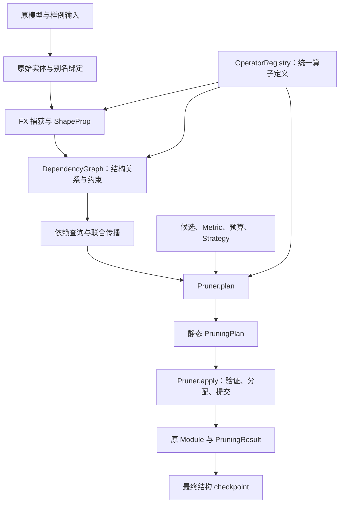

# torch-kirigami 当前架构说明

本文说明库的职责、流程、扩展接口与支持边界，适合首次阅读项目时查阅。

## 1. 整体设计

这个库做两件可以分开使用的事：分析张量结构位置之间的依赖，以及依据分析结果物理缩小原 PyTorch 模型。依赖分析不决定重要性和剪枝比例，执行器不重新决定删哪些位置。

核心设计可以归纳为以下六点：

1. **固定使用 FX symbolic tracing + ShapeProp。** FX 保存计算图，本库补充轴、索引对应、约束和修改要求；没有另造计算 IR，也没有自研 tracer 或可替换前端。
2. **结构变化用原坐标的张量区域表示。** 简单情况是删整行/整列，分组情况允许各组删除不同局部位置。
3. **一个请求通过依赖关系传播到闭包。** 不要求从第一层或最后一层开始，也不预先把全图强行分成互不重叠的剪枝组。
4. **一个算子定义贯通分析、候选发现和执行描述。** 内置算子和第三方融合模块使用同一注册接口，通用关系、约束和布局负责复用。
5. **公开流程是 `plan → apply`，`prune` 封装这两步。** plan 是可序列化的静态决定；执行保留原 Module，替换受影响张量并更新明确绑定的属性。
6. **checkpoint 保存最终结构和权重。** 新脚本提供兼容的原模型构造结果即可恢复，不需要重新评分、建图或重放每轮剪枝历史。



“通用”指结构表示、求解流程和扩展方式可以复用，**不表示任意 Module、任意算子参数或任意 Python 控制流都已兼容**。

## 2. 用户实际怎样调用

下面是完整的手工剪枝例子。自动剪枝只替换生成 plan 的参数。

```python
import torch
from torch import nn

from torch_kirigami import DependencyGraph
from torch_kirigami.pruning import Pruner

model = nn.Sequential(nn.Linear(4, 6), nn.ReLU(), nn.Linear(6, 2))
x = torch.randn(3, 4)
graph = DependencyGraph.build(model, args=(x,))

remove = graph.parameter("0.weight").axis(0).select([1, 4])
impact = graph.propagate(remove=[remove])
print(graph.explain(impact))  # 独立分析，不修改模型

pruner = Pruner(model, graph=graph)
plan = pruner.plan(remove=[remove])
print(plan.explain())  # 查看实际张量与属性修改
model, result = pruner.apply(plan)

assert model[0].weight.shape == (4, 4)
assert model[2].weight.shape == (2, 4)
assert model(x).shape == (3, 2)
```

第一层输出位置 `1、4` 会联动到第一层 bias 和最后一层 weight 的输入列。输入宽度 4、模型输出宽度 2 保持不变，中间宽度由 6 变成 4。

自动路径使用 `pruner.plan(metric=Magnitude(p=2), budget=ChannelRatio(0.2))`；无需预览时使用 `model, result = pruner.prune(...)`。两种执行入口均返回二元组，model 与传入的原 Module 是同一对象，执行报告单独放在 result 中。

默认通过 `Fixed` 约束保护外部输入和输出的全部轴，手工请求也一样。`preserve_io=False` 关闭默认保护，`constraints=` 可以补充限制；关闭后调用方需要配合改变输入、标签或外部消费者。

## 3. 分层职责与代码入口

| 层 | 负责什么 | 主要文件 |
| --- | --- | --- |
| 捕获 | 参数绑定、FX 叶子接入、样例执行、元数据与状态隔离 | [capture.py](../torch_kirigami/capture.py) |
| 来源与配置 | 注册对象、普通容器引用、配置冻结、共享状态编辑 | [bindings.py](../torch_kirigami/bindings.py)、[configuration.py](../torch_kirigami/configuration.py) |
| 结构表示 | 张量、轴、区间与区域选择、索引映射、约束、诊断 | [selection.py](../torch_kirigami/selection.py)、[relations.py](../torch_kirigami/relations.py)、[contracts.py](../torch_kirigami/contracts.py) |
| 算子共享契约 | TensorFacts、调用上下文、PartitionedLayout、OutputContract、OperatorSpec 和 OperatorRule | [operation.py](../torch_kirigami/operation.py) |
| 依赖图 | FX 节点与原实体关联、联合传播、来源解释、有效性检查 | [graph.py](../torch_kirigami/graph.py) |
| 算子语义与组装 | 各家族实现结构语义；上层注册表组装内置规则 | [registry.py](../torch_kirigami/registry.py)、[operators/defaults.py](../torch_kirigami/operators/defaults.py)、[operators/](../torch_kirigami/operators/) |
| 规划与评分 | 候选发现、预算、Metric、Strategy、生成静态 plan | [pruning/planner.py](../torch_kirigami/pruning/planner.py)、[metrics.py](../torch_kirigami/pruning/metrics.py)、[pruner.py](../torch_kirigami/pruning/pruner.py) |
| 剪枝共享数据 | 候选、预算、配方、结构快照及 RewriteContext/RewriteResult | [pruning/types.py](../torch_kirigami/pruning/types.py) |
| 配方与提交 | 联合保留布局、共享坐标校验、原调用检查、分配及事务提交 | [pruning/recipes.py](../torch_kirigami/pruning/recipes.py)、[rewrite.py](../torch_kirigami/pruning/rewrite.py)、[validation.py](../torch_kirigami/pruning/validation.py)、[state.py](../torch_kirigami/pruning/state.py) |
| 持久化 | 静态 plan、数据编码、最终结构 checkpoint 与恢复 | [pruning/plan.py](../torch_kirigami/pruning/plan.py)、[serialization.py](../torch_kirigami/pruning/serialization.py)、[checkpoint.py](../torch_kirigami/pruning/checkpoint.py) |

依赖核心可以单独调用，不导入评分策略或执行权重修改。统一的 `OperatorRule` 持有分析和可选 lowering 入口，但依赖建图只调用分析部分。没有自定义 lowering 时，规则返回 `None`，由剪枝编译层消费共享描述；规则契约不反向导入执行器。

模块依赖按以下方向组织，箭头表示“左侧导入右侧”：

```text
capture / graph → registry → operators.defaults → 算子家族 → operation
pruner → rewrite → validation / recipes → pruning.types
pruner → plan → serialization / state → pruning.types / recipes
checkpoint → serialization / state → pruning.types / recipes
```

`operation` 只依赖基础结构表示，`pruning.types` 不依赖 plan、编解码或执行实现。共享 storage 身份检查归入 bindings，剪枝状态操作无需导入 FX 捕获。所有导入位于模块顶层，没有 `TYPE_CHECKING` 或函数内延迟导入；[导入架构测试](../tests/architecture/test_imports.py) 检查声明依赖图无环、公开记录的运行时类型注解可解析，以及单独导入依赖核心不会加载剪枝层。

`OperatorRegistry` 从根包导入；`OperationContext`、`OperatorRule` 等共享对象的定义位于 operation，根包继续提供这些公开名称。`PruningPlan`、`PruningResult` 的定义位于 pruning.plan，用户仍从 `torch_kirigami.pruning` 导入。

仓库采用 flat layout：包直接位于 `torch_kirigami/`。运行依赖只有 PyTorch；Torch-Pruning 和 NNI 不是本库的运行依赖。本库直接执行结构收缩，不走 NNI 式的 mask 训练再 speedup 管线。

## 4. 建图：复用 FX 到什么程度

### 4.1 固定捕获流程

建图依次进行：

1. 在 tracing 前收集原模型的参数、buffer、模块、别名和可支持的普通属性引用，避免 FX 规范化路径后丢失来源。
2. 按 `forward` 签名绑定 `args`、`kwargs` 和默认参数。
3. 通过 FX 的叶子模块钩子与函数包装配置捕获计算图。注册的 opaque 根模块使用公开 FX Graph 构造单个 `call_module`，解决根模块绕过叶子钩子的问题。
4. 对已识别的写入及其他不支持条件做检查，在隔离状态中运行 ShapeProp，取得 shape、stride、dtype、device 和受支持的标量元数据。
5. 调用每个算子的语义规则，建立关系、约束、尺寸来源、候选轴和执行要求。
6. 释放中间激活，并解除 FX Graph 对临时 GraphModule 的持有，避免长期保留隔离 buffer。之后的依赖查询不再运行原模型。

支持普通数据流分叉与合流、FX 可展开的配置常量分支和固定次数循环。Tensor 数据或输入 shape 控制的 Python `if`、动态循环若不能 symbolic trace，会给出捕获失败；没有降级到其他 tracer。

**样例是给 ShapeProp 执行和取得元数据的，不是用来替 FX 选择动态分支。** 成功建图的结论只覆盖本次捕获结构、样例元数据及声明前提。

### 4.2 PyTorch 负责什么，本库还必须负责什么

| 内容 | 复用部分 | 本库补充部分 |
| --- | --- | --- |
| 计算依赖 | FX 节点、参数、用户关系与 GraphModule | 将节点中的值关联到原模型实体及各次调用 |
| 元数据 | ShapeProp；验证阶段可用的 meta Tensor 运算 | 尺寸来源、原坐标含义、具体 backend 布局边界 |
| 物理张量操作 | PyTorch gather、concat、clone、Parameter | 挑选保留段、处理分组布局、共享绑定、属性修改与回滚 |
| 保存权重 | `state_dict`、`load_state_dict`、`torch.save/load` | 最终结构描述、形状恢复、别名及加载结果验证 |
| 结构语义 | PyTorch 没有通用“删此通道会怎样”的接口 | 算子关系、约束、候选轴和原调用保持正确的条件 |

FX 的一条边只说明某个值被消费，不能说明输出第 3 个通道对应哪个权重区域，也不能说明删通道后一个写死的索引是否仍正确。因此仍需算子语义代码，但同类算子可以组合共享原语，无需为每个模型重写一套规则。

捕获依赖成熟公开接口；实现并非完全没有私有状态访问：全局 forward/registration hook 检查集中读取 PyTorch hook 注册状态，隔离时直接恢复 `_buffers` 绑定以免再次触发回调，规划期间还读取 Tensor 的 `_version` 辅助检测变化。这些是局部兼容性处理，不是自研捕获机制。

### 4.3 状态保护与前提

建图保留 train/eval 和梯度上下文；样例输入与注册 buffer 一起隔离复制，保留受支持的共享关系。模型普通容器中缓存的 buffer 引用也临时指向隔离副本。成功或异常退出均恢复绑定、模式以及 CPU/已初始化 CUDA 的随机数状态。

先按原 forward 签名补齐默认值，再共同隔离全部实际入参，包括可变默认对象。内部 FX placeholder 不保存默认对象，ShapeProp 总是读取已绑定的隔离输入；这也避免 FX 将 Tensor 默认值嵌入生成函数定义的错误。用户原 forward 签名与默认值保持不变。

隔离开始前拒绝全局 parameter/buffer/module registration hooks，避免安装或恢复 buffer 时被回调替换。`out=None` 是普通只读调用；真实的 `out=Tensor` 写入仍在元数据执行前拒绝，包括可解析的 Python 函数位置参数。

参数不会整体复制。契约要求 `forward` 不修改参数、不产生外部 Python 副作用，也不要与同一模型的训练并发建图。已识别的不支持写入、安全复制失败、forward/pre-forward hooks（包括全局 hooks）会明确拒绝；这不是任意 Python 程序的副作用沙箱。

symbolic tracing 中直接执行、未进入 FX 的 buffer 写入会使图缺少真实行为，因此建图拒绝；同时检查绑定、尺寸、版本和实际值，覆盖绕过版本计数的 `.data` 写入。值比较使用已有隔离副本与原 buffer，不再复制一份。注册槽位和 FX 临时添加的常量属性在成功、失败后均清理。BN 等已声明叶子在 ShapeProp 中更新隔离统计量仍受支持。

当前还明确拒绝零元素样例或中间 Tensor：现有区域表示不能完整保留空张量上的轴变化意图，不能用一次空 batch 执行证明一般 batch 的结构关系。

## 5. 张量、坐标与共享身份

### 5.1 核心数据结构

| 类型 | 含义 |
| --- | --- |
| `TensorRef` | 某个参数、buffer 或图中张量值；保存原 shape、类型与来源路径 |
| `CallRef` | 一次模块调用；同一模块调用两次会有两个调用对象 |
| `AxisRef` | 某个 TensorRef 的一个轴 |
| `IndexSet` | 排序且互不重叠的半开区间集合，支持并、交、差与偏移 |
| `Region` | 每个轴各一个 IndexSet 的笛卡尔积 |
| `Selection` | 同一张量上多个区域的并集，去除重叠后表达删除位置 |

所有位置均使用建图时的原坐标。默认保留剩余位置的原顺序；不因传播路径不同重复计数，也不隐式重排通道。

普通 Linear 删除输出位置 `[1, 4]`，就是 weight 第 0 轴上的两个完整横截面。一个选择也可以同时包含行、列等多个区域，其交集只计算一次。

### 5.2 为什么必须支持区域，而不能只有“轴上的通道集合”

以 `Conv2d(6, 4, groups=2)` 为例，weight 的前两轴是 `(4, 3)`，第二轴是**组内输入列**。删除全局输入通道 `0、4` 对应：

| 旧组 | 删除区域覆盖的 weight 输出行 | 删除该组局部输入列 | 保留局部输入列 |
| --- | --- | --- | --- |
| 0 | 0、1 | 0 | 1、2 |
| 1 | 2、3 | 1 | 0、2 |

不能把删除列合并为 `{0, 1}` 后统一切整个 weight。当前表示保留两个独立区域，执行按旧组分别 gather，再按原组序 concat，得到前两轴为 `(4, 2)` 的紧凑权重。

`Selection.fully_selected_indices(dim)` 用于寻找被完整选中的轴横截面；`compact_shape()` 判断能否直接得到矩形保留形状。分组场景可能需要额外布局描述，不能只靠这个 shape 判断函数完成执行。

### 5.3 别名、共享与普通容器引用

同一个 Parameter 对象的多个注册路径对应一个实体；同一模块重复调用共同约束这个实体。不同 Tensor/Parameter 对象即使共享 storage，也不会合并成同一个参数，其相关变化会受到别名限制。

除 `_parameters`、`_buffers`、`_modules` 外，共享绑定工具还处理模型普通属性里的直接 Tensor 引用，以及 plain list/tuple/dict 中的注册 Tensor/Module 引用。例如 `self.cached = [self.weight]` 在权重替换后也必须更新。

这套工具同时用于建图隔离、apply 和 checkpoint，避免三个环节各写一次缓存引用处理。支持范围不包括任意自定义对象、闭包或模型外部容器中的隐藏引用；内部重叠、无法安全描述的 storage view 也不会被当作普通别名静默处理。

## 6. 索引关系与依赖传播

### 6.1 用少量映射原语组合场景

| 原语 | 主要用途 |
| --- | --- |
| `AxisRelation` + `AxisPort` | 两个轴或局部分区之间的对应 |
| `BlockMap` | 恒等、偏移、分段、一个位置对应一整块，以及完整块联动 |
| `BroadcastRelation` | 广播维度和重复横截面的对应 |
| `PermuteRelation` | transpose/permute 等轴置换 |
| `SliceRelation` | 静态切片的原坐标映射 |
| `ReshapeRelation` | 在可证明条件下，按逻辑元素顺序映射 reshape/flatten 区域 |

例如 `N,C,H,W → N,C*H*W`，在该展平顺序成立时，通道 `c` 对应 `[c*H*W, (c+1)*H*W)`。若前面有 permute，先通过轴置换关系再传播，不能只看最终 shape 猜测通道位置。

关系支持双向传播。多个关系沿 FX 图连接后完成组合，不需要给整个激活分配逐元素标签，也不需要为每条模型路径生成专用组合代码。复杂 reshape/区域拆分仍可能产生许多区间，达到内部分析限额时返回不完整诊断。

### 6.2 工作队列求闭包

传播先按实体合并所有种子，再将选择增加的实体放入工作队列。每次用该实体的**累计选择**经过相邻关系推导目标选择；目标集合增加就继续入队，直到不再增加。

使用累计选择是必要的：来自不同分支的两部分删除可能一起构成一个完整块，仅分别传播增量会漏掉这种联动。共享路径、循环关系和多次调用也不能用“访问过节点便跳过”处理。

传播完成后检查约束、收集受影响操作的修改要求并保留原因。增加删除位置是单调的；在有限坐标和分析限额下，闭包计算会停止。

### 6.3 确定联动与合法性约束分开

| 约束 | 表达的问题 |
| --- | --- |
| `Fixed` / `NonEmpty` | 保护指定轴；禁止删空 |
| `Balanced` | 固定分区的保留数量必须相同 |
| `BlockBalance` | 存活组内保留成员数量一致，例如 depthwise multiplier |
| `Divisible` | 保留宽度须能被某个数整除 |
| `LayoutConstraint` | 选择需要满足可支持的紧凑排列 |
| `Barrier` / `AxisBarrier` | 某个操作或轴缺少可证明的语义，阻断相关完整性结论 |

依赖层传播必然发生的联动，但不会为了满足“每组一样多”偷偷挑选另一组哪个通道。存在多种补全方式时由策略决定，手工请求则按原请求验证。

`Impact` 是当前图上的分析结果，包含请求、联动选择、诊断、约束、修改要求、外部接口变化和传播来源。`resolved` 只表示结构分析已解决；它不等于执行器已支持，也不表示与未剪枝模型数值等价。`unresolved` 表示尚未解决或未能证明，`conflict` 表示违反约束；`complete` 则单独说明影响范围是否完整。

### 6.4 独立分析可以查询什么

| 查询 | 返回的信息 |
| --- | --- |
| `parameter(path)` / `buffer(path)` | 按原模型路径取得共享 TensorRef |
| `calls(module_path)` | 该模块及其别名对应的全部调用；不默认取第一次 |
| `values()` / `metadata(ref)` | 张量引用与捕获时的元数据，不返回中间激活 |
| `interfaces()` | 外部输入输出张量引用 |
| `tensor(ref)` / `tensor_bindings()` / `bindings(ref)` | 注册 Tensor 的原对象，以及注册的 owner/name 绑定 |
| `operations()` / `operator_spec(op)` | 调用参数上下文及该调用的共享算子描述 |
| `relations` / `constraints` / `shape_expressions` | 结构对应、约束和尺寸来源 |
| `propagate(...)` / `explain(impact)` | 联合分析及可读解释 |
| `validate(model)` / `invalidate()` | 检查模型归属与已知前提，或显式废弃图 |

只读快照查询不都重新扫描模型；传播和活 Tensor 绑定访问等入口会检查有效性。取得活 Tensor 对象不意味着持有读锁。模型原属性中的别名只能说明对象共享，不能恢复每次 Python 调用究竟使用了哪个属性拼写。

所有接收 TensorRef 的分析入口核对完整登记信息，不能仅凭 ID 相同接受不同 shape 的引用。操作查询同时检查 `graph_id` 与已登记调用身份，正常的 `operations()` 检查副本可以继续查询；跨图操作和 Impact 会直接报错。`Impact.selection(ref)` 只对本图未受影响的张量返回空选择。

公开内置约束保存不可变的分析事实。`CallArgumentConstraint` 仅持有节点名称、需要保持不变的尺寸表达式及捕获值、分区布局，不持有 OperationContext、FX 节点或共享字典。`operations()` 的参数容器是检查副本，表达式表则是各调用共享的一份只读映射，避免按调用重复复制全图表达式。自定义规则及约束仍必须遵守无副作用契约。

基础描述在构造时统一校验：负轴规范化，块宽为正整数，映射范围不越界，排列和切片与目标 shape 一致，reshape 元素数一致，分区有界且不重叠。`Balanced` 允许只约束轴的部分位置；零长度轴可以由 TensorRef 表示，但会违反显式 NonEmpty。图不对完全未参与计算的注册张量自动附加 NonEmpty，未使用的空 buffer 不会阻断其他分支。这些检查不替策略决定补选，也不替代原 forward 和 stride 验证。

## 7. 尺寸、索引与原 forward 的检查

执行器保留原 Python `forward`，因此必须验证：换成紧凑张量之后，原调用写法是否仍表示计划要求的结构。

### 7.1 尺寸来源不是 shape 相等

`ShapeExpr` 保存常量、维度读取、`numel`、`-1` 推断以及受支持的整数运算等来源。标量尺寸依赖也会参与受影响操作的调度，即使该操作的输入没有直接收到删除区域。

`ShapeExpr.refs` 统一提供尺寸来源；`Requirement` 的命名载荷只保存标量、切片、结构引用和不可变嵌套序列。修改类别可以由扩展定义，图在接收 OperatorSpec 时也会检查载荷内的引用归属。

`x.reshape(x.size(0), -1)` 可能在收缩后自然成立；写死的 `reshape(batch, 64)` 若需要改成 48，则不能自动改原 Python。两个尺寸恰好都等于 64，不意味着它们来自同一个可更新属性。

属性修改仅依据规则明确声明的绑定，例如 Linear 的 `out_features` 或融合 attention 的 head 数。不对无法追溯的闭包、硬编码索引和其他 Python 用途作自动修复承诺。

### 7.2 检查的是坐标与布局，不只是运行不报错

| 情况 | 当前处理原则 |
| --- | --- |
| reshape / flatten | 重新计算有来源的尺寸，确认原写法与预期紧凑形状一致 |
| view | 进一步检查最终配方的 stride/布局；仅 shape 相同不够 |
| slice / narrow / index_select | 确认原索引作用于紧凑输入后，仍选中要求的旧坐标 |
| split / chunk / unbind | 保留分段边界、原坐标对应和输出端口；不能只检查总元素数 |
| squeeze | 防止剪到单例维度后意外改变输出 rank |
| padding / crop | 变换过的轴受保护，即使负 padding 与正 padding 抵消后 shape 相同 |
| 原地操作 | 需要来源、fresh output 和消费者关系等证据；无法证明写入安全则拒绝相关变化 |
| sum / mean / softmax / norm | 在紧凑域重新计算；不承诺与置零 mask 模型等价 |

验证会复用已声明安全的原生 meta 运算，并结合原坐标和布局规则。meta 结果不能证明所有 CPU/CUDA backend 的实际 stride；attention 等布局依赖 backend 的输出会保守处理。

每项相关 `Requirement` 最终必须被处理为：完成明确修改、证明原调用无需修改，或拒绝需要改写 forward 的请求。不会忽略一个尚未处理的要求后继续生成 plan。

### 7.3 不支持一处，不等于全网禁止剪枝

捕获成功但某算子或轴缺少语义时，依赖图保留，该处作为局部障碍。若请求的联动经过障碍，就无法生成可信计划；与之独立的结构路径仍能剪枝。共享参数或残差可能把原本看似独立的区域连起来，是否受影响由传播决定。

手工提交的联合请求整体通过或整体报错，不会悄悄只执行其中一部分。自动策略可以排除失败的临时组合、保留其他合法选择，并报告预算欠达。动态控制流导致的捕获失败、无法隔离的输入等则发生在建图前，不能按局部障碍处理。

## 8. 统一扩展：“一个地方定义”具体意味着什么

### 8.1 一个注册入口，一份共享描述

`OperatorRegistry` 是局部注册表，精确匹配模块类型、函数对象或 Tensor 方法。重复注册报错；自定义子类不会自动继承父类的结构语义。build 复制注册表结构，规则 callback 本身仍要求确定性和无副作用。

扩展以一个 `OperatorRule` 为单位，可提供：

| 入口 | 时机与职责 |
| --- | --- |
| `preflight` | 元数据执行前检查已识别的不支持行为 |
| `effects` | 描述是否原地写入、是否产生独立输出 |
| `analyze(OperationContext)` | 返回共享的 `OperatorSpec` |
| `lower(RewriteContext)` | 可选；返回特殊修改配方，或返回 `None` 让剪枝层编译共享描述 |

`OperationContext` 包含 FX 节点、参数角色、输入输出元数据、模块、绑定和尺寸来源。`argument()` / `raw_argument()` 统一读取位置、关键词及变长参数，原生别名（如 axis/keepdims、view 的 size、repeat 的 repeats）由共享表解析，原始尺寸来源和执行参数复核复用相同入口。它不是覆盖所有 PyTorch 签名的自动规范化引擎，新增拼写仍需登记。`RewriteContext.compact_shape(ref)` 查询普通紧凑形状，不能替代分区布局描述。

`OperatorSpec` 可声明关系、约束、修改要求、候选轴、分区布局、原调用契约、尺寸表达式和需要守卫的整数常量。分析读取关系和约束，候选发现读取候选轴，通用 lowering 读取布局和属性绑定；保存恢复读取最终结构，不再按算子重新写保存 callback。

`Requirement.arguments` 使用 `ArgumentRef(name, position, variadic=False)` 指明该要求会验证哪些调用参数的变化。许可按具体参数位置匹配；即使同一个 size 表达式同时用于 groups 和 stride，允许并验证 groups 变化也不豁免 stride。没有声明专门验证的尺寸来源参数必须保持原值。数据未裁剪、仅尺寸来源改变的消费者，同样激活它的全部执行要求；索引改变而 shape 相同不能通过剪枝规划。

`CallEffects` 是分配新存储与原地写入的唯一声明，捕获保护和执行验证共同读取 `OperatorRule.effects`；`OutputContract` 只描述布局。自定义规则在同一处提供这些事实。未知分配、view 和可能返回原对象的操作不猜成新存储，原地消费者还需满足消费者关系检查。

算子声明的结构整数常量必须有注册 parameter/buffer 来源，才能进入图有效性及静态计划的值 guard。普通属性、闭包和临时 Tensor 常量不具备这份持久化保证，相关剪枝明确拒绝；可将索引注册为 buffer。其他独立组件仍可分析和剪枝。

已声明安全的原生规则可设置 `evaluate_on_meta=True` 复用 meta 调用；第三方规则默认依赖声明的结构事实。opaque 内部行为和自定义 lowering 的正确性由扩展作者保证，框架不会自动证明任意融合代码等价。下游 view 需要的输出 stride 只有在能证明时才应声明。

注册方式为 `OperatorRegistry.default().register(MyModule, OperatorRule(my_analyze))`，再通过 `DependencyGraph.build(..., operators=registry)` 使用。完整可运行例子见 [融合 GQA](../examples/fused_attention.py) 和 [基础融合模块](../examples/custom_rule.py)。前者在一个定义中声明 Q/K/V 联动、整 KV 组候选和 head/投影属性，使用默认 lowering 即可剪枝和保存恢复。

### 8.2 复用的三个层次

1. **通用原语：** 区间/区域、轴与块映射、广播、分区布局、尺寸表达式、约束、gather/concat。
2. **算子家族：** Conv1d/2d/3d 共用卷积逻辑，模块/functional 形式尽量复用语义，形状和索引操作复用坐标检查。
3. **复合场景：** GQA、GLU、shuffle 或融合投影，将前两层组合成一份算子定义。

因此“一处定义”指同一个特殊场景的知识集中在同一 `OperatorRule` 和共享描述中，**不是每个场景只能有一个函数**。确有特殊布局时可以在同一规则提供 `lower`，但它返回配方，不能直接修改模型。

也不能保证任意新场景都无需改共享层。如果新语义无法用现有映射、约束或布局表达，仍需增加通用原语与验证支持。当前 `Requirement` 仍采用 kind 加数据字段的描述形式，通用 lowering 和验证分别消费相关要求，并未全部改成强类型的独立类；这属于当前实现的维护取舍。

## 9. 自动剪枝：入口、评分、预算与策略

### 9.1 没有固定的“前面先剪”或“后面先剪”

一次请求可以从参数输出轴，也可以从消费者输入轴开始。在等价关系成立的链式例子里，两种入口会传播到同一组联动位置。广播、分组和块映射有自己的规则，不能据此认为任意两个端点的任意单点请求都等价。

默认自动候选通常从模块输出特征建立，是为了给选择策略稳定的入口；不代表执行顺序从前向后。Embedding、MHA 等使用各自声明的逻辑轴。depthwise 默认候选是整通道组，显式请求仍可表达合法 multiplier 收缩。

这里需区分三个概念：`Candidate` 是一次打包提交的种子，依赖闭包是这些种子必然联动到的区域，整块约束则规定哪些位置必须一起变化。把几个种子包装为一个 Candidate，不会自动创建全局不可拆分约束。

### 9.2 最小策略扩展接口

| 接口 | 契约 |
| --- | --- |
| `Candidate(key, remove, axis=None)` | 稳定 key 与一组原坐标选择；自定义候选直接传 Iterable |
| `Metric(context, candidate_batch)` | 返回与候选对齐、有限的一维分数，越低越优先 |
| `Strategy(context)` | 返回已经登记的候选 key；最终联合请求仍由框架验证 |
| `PlanningContext` | 提供图、候选、预算、联合影响查询、批量评分与执行检查 |

上下文的图、候选、预算轴、约束和目标是只读前提，策略仅记录计数及排除说明。候选发现按 AxisRef 去重预算域，key 的重复声明必须语义一致。缓存命中也验证完整引用和 Impact 图归属；最终计划按调用方原预算与约束独立重验，不信任策略修改后的前提。

没有额外 Proposal、prepare、Session、候选生成协议或独立统计注册中心。Metric 的梯度/统计由对象或调用方持有；自定义 Strategy 可以不使用 metric。自定义 Metric 可以对临时组合 Candidate 联合评分，框架不要求分数可加；默认 Greedy 则只做一次静态候选评分。

### 9.3 内置重要性指标

令 `S` 为候选传播后，所有受影响 Parameter 的删除区域并集：

| 指标 | 公式 |
| --- | --- |
| `Magnitude(p=1)` | `sum(abs(w))`，遍历 S |
| `Magnitude(p=2)` | `sqrt(sum(abs(w)**2))`，遍历 S |
| `WeightTaylor(mode="elementwise_abs")` | `sum(abs(w * grad))`，遍历 S |
| `WeightTaylor(mode="joint_abs")` | `abs(sum(w * grad))`，先跨 S 求和再取绝对值 |

默认包括受影响的 bias 和归一化参数，不包括 buffer；可用参数过滤器调整范围。共享参数、重复调用和区域交集不重复计分。低精度至少用 float32 累积，float64 不降精度。

L1 在取绝对值前提升到 float64/complex128，Taylor 在乘法前提升到 float64，避免低精度中间结果先丢失数值。L2 继续使用缩放与 hypot 合并。最终归约为 float64；这不保证超出 float64 表示范围的运算或任意抵消均可精确计算。

WeightTaylor 只支持实数参数，读取调用方当前未缩放的 `.grad`，不执行 backward、清梯度或 optimizer.step。loss reduction、梯度累积和 AMP 去缩放由调用方负责；它不是逐样本 Fisher。缺梯度、非有限分数、返回长度错误会明确报错。没有默认层间归一化，全局选择不保证不同层的原始分数天然可比。

### 9.4 通道预算

`ChannelRatio` 按本轮原始逻辑轴宽度计量，不按候选数量计量：local 对每个轴使用 `floor(ratio * width)` 上限；global 对宽度总和使用一个上限，不另加局部比例限制。

自动发现时，先排除可证明完全受默认输入输出保护的域，再冻结分母。之后因未知算子、执行限制或补全失败造成的不足，只报告欠达，不继续缩小分母。自定义 candidates 必须通过 `ChannelRatio.axes` 指定预算轴；显式轴不自动排除。共享别名只计一次，联动的不同逻辑轴分别计量其宽度变化。

当前预算是通道删除上限，比例小于 1，不是参数量、MACs 或延迟目标。候选包装成整块不会改变预算分母。

### 9.5 默认 Greedy

`Greedy(max_trials=10_000)` 先验证空请求，再对可完整评分的候选静态评分，按 `(score, stable_key)` 排序。依次尝试把候选加入当前选择，对联合影响检查预算和执行支持。

暂时不满足 `Balanced` 或 `Divisible` 时，使用已有候选做确定性的追加补全；每次必须新增位置，重新计算联合影响，不回溯。只有整个临时组合通过约束和配方验证，才接受这一批变化。失败的临时追加会丢弃，已接受集合改变后可重试之前拒绝的候选。

空请求也可能不合法，例如宽度 10 加上 `Divisible(4)`；策略允许搜索删除 2 个位置后达到宽度 8。反过来，未知算子导致影响不完整时，不能拿局部参数影响作为可信评分。策略不提供一般约束求解，也不会自动穷举所有 `BlockBalance` 组合。

达到尝试限额或无法继续时，返回已完整验证的集合及欠达原因；如果没有找到任何合法集合则报错。“未找到”不等于证明数学上无解。影响缓存有界，最近编译结果也有界，不在搜索阶段物化全部新参数。

## 10. 静态 plan 与物理执行

### 10.1 为什么仍保留 plan / apply 两步

plan 决定**删什么、怎样保留、需要改哪些属性、什么结构可以执行**；apply 将这份决定作用到符合前提的当前张量值上。一个是只读计算，一个会改变模型和参数身份，仍然存在清晰的逻辑边界。

这使预览、保存决定、换脚本执行、统一分配前检查成为可能。普通调用不需要承担两步的操作负担，`prune()` 已封装。不存在必须持有原 Pruner 的隐藏计划签发状态。

`plan()` 不修改模型，不提前生成新权重，也不在模型上登记 plan。它会执行分析、评分和规则 callback，产生临时查询缓存、评分张量或 meta 张量。有属性修改时，还会用同一 FX 流程在隔离配置副本上重新 symbolic trace：副本共享原 Parameter、隔离 buffer，不运行真实输入的 forward/ShapeProp，不调用自定义 Module.__deepcopy__。callback 与 tracing 执行的 Python 代码仍须遵守副作用契约。

### 10.2 plan 保存什么

| 字段 | 内容 |
| --- | --- |
| `analysis` | 冻结的 `AnalysisSummary`：原请求、联动选择和原因；不是持有图的活 `Impact` |
| `recipes` | `TensorRecipe`：原坐标保留段、concat 轴、最终 memory format |
| `attributes` | `AttributeRecipe`：明确路径及旧值、新值 |
| `selected` / `budget` / `notes` | 候选选择说明、冻结预算基线、实际删除量、限额和排除原因 |
| `before` / `after` | `ModelStructure`：执行前提和预期结果结构 |

plan 不保存模型、FX 图、活 Tensor、callback 或原图的运行期身份。其序列化是直接按当前结构校验的封闭数据编码，不通过保存算子代码恢复执行。

它可以在兼容的原模型上重放，而不是严格的一次性 token。对已经被改变结构的同一模型重复 apply，通常因 `before` 不匹配失败；空 plan 可以再次使用。

**权重更新后仍可重放保存的选择，但不会重新评分。** 保存前提覆盖结构、dtype/device、布局、模式、已知配置及绑定关系，不包含所有权重数值，也不能证明任意 Python forward 代码或外部状态都没有变化。

### 10.3 配方如何生成

剪枝层对完整联合 Impact 生成配方，而不是分别切每个候选后叠加结果。普通多轴删除生成联合保留段；grouped/depthwise Conv 使用分区 gather/concat。共享 Parameter 的所有用途必须要求同一旧新坐标映射，仅删除数量或最终 shape 一样不够。

最终 memory format 在原调用与布局验证之前确定。包括 channels-last 在内的实际执行布局必须与规划检查一致，不能验证完 contiguous 配方后再改成另一种格式。

属性更新依据显式绑定计算；多个调用要求同一属性时必须一致。无法处理的修改要求导致 `PlanningError`，因此返回的 plan 已经过执行支持检查。

旧 FX 图可能把 `self.layer.out_features` 折叠成常量，无法证明它没有其他消费者。配置重捕获因此核对整个图的节点、边、实际 get_attr 绑定、调用常量和输出：任一变化均拒绝相关请求，不靠整数相等猜测绑定。这样可以发现另一分支的 reshape、同形状索引、标量输出、配置条件和固定循环变化。该检查要求捕获结构在属性修改后保持一致；不透明算子内部继续依靠声明的规则，也不声称完整证明任意 Python 程序等价。

比较 get_attr 时，注册张量使用来源别名与元数据，临时 Tensor 常量比较 dtype、shape、stride 和实际值；忽略 FX 自动生成的常量名称。原图签名在 ShapeProp 前保存，不保存整份参数权重。相同属性修改的验证结果在一个 PlanningContext 内最多缓存 32 项，包括拒绝结果；检测到参数或 buffer 版本变化后清空，最终计划使用独立上下文复验。

属性配方保留 list、tuple、torch.Size 类型前提：列表冻结成 FrozenList，torch.Size 使用有类型标记的静态数据，提交与恢复时还原原容器类型。三种 nn.Unflatten 配置均支持计划序列化和 checkpoint。

### 10.4 apply 的提交过程

1. 验证 plan 数据及模型结构前提、别名、模式、属性和 hook 状态。
2. 在 `torch.inference_mode(False)` 与 `torch.no_grad()` 中完成全部 gather/concat/clone 和新 Parameter 分配。
3. 分配成功后再次检查前提，再集中替换注册绑定、普通容器引用、明确属性和受管理的结构记录。
4. 普通提交错误通过撤销记录恢复绑定及属性；成功后返回原模型与 `PruningResult`。

同一 Parameter 只生成一个新对象，所有已支持的别名共同指向它。新 Parameter 是普通叶子，保留 dtype、device、requires_grad；受影响参数的 `.grad=None`。结果提供旧新 Parameter 映射和分段 `CoordinateSegment` 坐标映射，不生成逐元素映射表。

静态计划保存完整张量引用目录。`plan.analysis.selection(ref)` 和 `result.coordinate_maps[ref]` 共用解析逻辑，可接受原图引用或 `ref.portable()`；已知未受影响的引用返回空选择，未知引用报 KeyError，形状/类别/别名不符报 ValueError。静态引用是结构标签，不证明活图归属；DependencyGraph 自身仍严格检查图身份。plan、checkpoint 和模型内结构记录均不设置格式版本，不提供历史格式迁移或兼容分支。

事务不承诺恢复任意自定义 setter 或其他用户代码的外部副作用，也不要在 apply 期间并发训练。优化器持有的旧 Parameter 引用及状态不自动迁移，调用方需重建 optimizer。

apply 不执行原 forward，不自动重建图。结构修改后旧图失效；下一轮提供新的样例显式建图。原模型外部缓存的旧参数引用也需要调用方自行处理。

## 11. 保存与新脚本恢复

### 11.1 几种保存方式的区别

| 方式 | 保存内容 | 新脚本恢复要求 | 适用目的 |
| --- | --- | --- | --- |
| plan 数据 | 原坐标选择、配方、结构前提；没有权重 | 构造兼容的原模型，再 apply | 重放同一结构决定；比较不同权重初始化 |
| 本库 checkpoint | 最终结构、state_dict、非 persistent buffer 及受支持 extra state | 构造兼容原模型，调用 load_checkpoint | 保存剪枝及训练后的最终模型，推荐日常使用 |
| 单独 state_dict | 注册状态的数值，通常不含完整尺寸属性 | 已有与剪后结构匹配的实例 | 外部已管理模型结构时 |
| `torch.save(model)` | PyTorch/Python 对象序列化 | 满足对应类定义、导入和反序列化环境要求 | 用户自行选择的原生对象保存方式；本库没有额外封装 |

checkpoint 不靠逐轮 apply plan 恢复。它描述最终状态，因此多轮剪枝后也不需要保留全部历史。它也不自动生成一个能复现任意 Module 的 Python 构造器。

### 11.2 最终模型 checkpoint

下面代码可独立运行；实际使用时，将最后两行放入新的脚本，并提供相同模型定义。

```python
import torch
from torch import nn

from torch_kirigami import DependencyGraph
from torch_kirigami.pruning import Pruner, load_checkpoint, save_checkpoint


def make_original_model():
    return nn.Sequential(nn.Linear(4, 6), nn.ReLU(), nn.Linear(6, 2))


model = make_original_model()
graph = DependencyGraph.build(model, args=(torch.randn(3, 4),))
selection = graph.parameter("0.weight").axis(0).select([1, 4])
model, result = Pruner(model, graph=graph).prune(remove=[selection])
save_checkpoint(model, "pruned.pt")

restored = load_checkpoint(make_original_model(), "pruned.pt", map_location="cpu")
assert restored[0].out_features == 4
```

恢复过程先验证目标骨架，再分配最终结构张量，在隔离的模块状态中执行原生加载，最后验证并提交。最终普通属性引用按准备完成后的模块图映射回原模型，包含受支持的新增/删除状态；不会把临时模块引用留在恢复结果里。

提交前的最终检查包括注册张量的类型、存储共享和实际目标设备；设备以本次 map_location 分配结果为准。加载回调改变这些结构前提时拒绝提交，保留原模型的绑定与值。

`ModelStructure` 记录模块类型与路径、注册槽位、已知配置、Tensor 的 shape/stride/dtype/device/requires_grad、持久性和别名，以及受支持的普通引用结构。配置冻结保留 bool/int/float、list/tuple 等类型区别。模型上的 `_kirigami_structure` 是受管理的纯结构记录，不包含剪枝历史或权重。

保存和加载都会验证实际 state_dict payload，拒绝注册的 state_dict pre/post hooks，以及不符合键、shape、dtype、共享值等约定的自定义返回。支持符合数据契约的 `get_extra_state` / `set_extra_state`，但不会自动捕获任意未注册 Python 状态。

当前恢复要求兼容的原模型类、路径、共享关系和相关配置。特殊 Tensor 子类、稀疏/量化存储、复杂 storage 重叠不在通用恢复范围。构造原模型可能先分配完整权重，当前接口不保证无完整初始化或最低峰值显存。

### 11.3 单独保存 plan

以下代码使用第 2 节生成的 plan，在另一份兼容原结构上重放：

```python
from torch_kirigami.pruning import PruningPlan

torch.save(plan.to_dict(), "decision.pt")
saved_plan = PruningPlan.from_dict(torch.load("decision.pt", weights_only=True))
original = nn.Sequential(nn.Linear(4, 6), nn.ReLU(), nn.Linear(6, 2))
replayed, report = Pruner(original).apply(saved_plan)
```

不需要原图、原 Pruner 或原 Metric，但 `original` 必须满足 plan 的结构前提。这里保留的是新实例当前权重对应的切片，不是恢复原剪枝模型的训练权重；后者使用 checkpoint。

## 12. 当前支持范围与失败边界

完整的形式、轴与参数限制见 [算子覆盖矩阵](operator-coverage.md)。主要已实现家族如下：

| 类别 | 已有能力摘要 |
| --- | --- |
| 参数化层 | Linear，Conv/ConvTranspose 1d–3d，普通/grouped/depthwise，Embedding 特征轴 |
| 归一化与激活 | BN/LN/GN/InstanceNorm/RMSNorm/PReLU、常用激活与逐元素广播 |
| 矩阵与注意力 | matmul/mm/bmm、addmm/baddbmm、受限 einsum、SDPA/GQA、MHA |
| 结构变换 | cat/stack/split/chunk/unbind、静态基本索引、permute、可证明 reshape/view/flatten、维度增删 |
| 块与重复 | repeat/tile/expand/expand_as、GLU、ChannelShuffle、PixelShuffle/Unshuffle、2D Unfold/Fold |
| 空间与归约 | 池化、unpool、interpolate 的受支持轴；padding 未变换轴；显式归约与 softmax |

这些不是“整个家族的所有用法都可剪”。例如 grouped Conv 必须满足分组约束；Embedding 词表轴固定且 `max_norm` 写入被拒绝；MHA 使用固定 head 数的平衡宽度收缩；隐式 causal SDPA 固定 Q/K token 轴；einsum 不支持操作数内部重复标签的对角语义。

尚未提供动态 Python 控制流捕获、一般数据相关索引重映射、RNN/PackedSequence、MoE 路由、KV cache 重建、原 forward 改写、一般约束求解器、optimizer state 迁移、训练框架或硬件搜索。`torch.nn.utils.prune` 的 mask 训练适配也未接入，它本身不负责物理缩小张量。

图的有效性检查覆盖可记录的结构、模式、配置、绑定、布局和声明常量。普通权重训练更新不必然要求重建依赖图；结构或分析前提改变则必须重建。若 forward 根据 grad/inference 上下文选择不同 Python 结构，也不能跨结构路径复用结论，FX 无法完整证明这些外部程序前提。

## 13. 验证、性能与审阅重点

### 13.1 已有验证依据

测试使用 pytest，覆盖依赖闭包、别名、分组坐标、约束补全、评分公式、原调用限制、执行回滚、静态计划和 checkpoint。数值参考使用手工紧凑模型或算子对应的独立保留域公式，不能仅凭 forward 成功，更不能统一把 LN/GN/softmax 与置零 mask 比较。

逐对象契约与组合用例见 [测试覆盖清单](testing-coverage.md)，完整环境矩阵见 [测试与兼容性](testing.md)。包括参数别名与尺寸来源的坐标/数值参考、预算域去重、缓存归属、注册回调和 checkpoint 结构检查。

仓库要求 Python 3.10+、PyTorch 2.6+，uv 开发锁当前为 PyTorch 2.14 CPU。Ruff 采用 Google docstring 与常用 Python 检查；CI 配置覆盖最低/开发 CPU 组合，另有兼容性与 CUDA 工作流。工作流配置存在不代表远端已成功执行，操作说明见 [testing.md](testing.md)。

### 13.2 当前复杂度在哪里

不创建全激活逐元素标签、不预计算全图互斥剪枝组、不保存所有候选完整 Impact，有助于控制内存。区间交集采用双指针扫描，批量绑定查询避免逐参数反复扫描结构，影响缓存和近期配方缓存均有界。

但一般自动选择仍可能反复做依赖传播与约束检查；区域规范化或 reshape 映射可能膨胀；逐区域 GPU 评分存在同步开销。当前没有宣称已具备大模型规模下的最优规划性能，也没有通用约束求解保证。

### 13.3 值得审阅的设计取舍

| 当前取舍 | 获得的能力 | 付出的限制 |
| --- | --- | --- |
| 固定成熟 FX 捕获 | 少一套捕获实现，复用 PyTorch 计算图 | 动态 Python 控制流不自动兼容 |
| 显式算子语义与共享原语 | 坐标、分组和来源可解释，同类场景可复用 | 新算子仍需语义定义；未知处保守阻断 |
| 保留原 Module/forward | 调用与模型身份连续，能回到原定义恢复 | 写死尺寸/索引和无法证明的布局变化会拒绝 |
| 单一 OperatorRule | 特殊场景知识集中，分析/候选/执行共享描述 | 少数场景需要多个生命周期 callback，公共原语仍需维护 |
| 静态 plan + 可选 prune 封装 | 可预览、重放，执行与选择职责清晰 | 需要维护可序列化配方及结构验证；权重变化后不重评分 |
| 最终结构 checkpoint | 多轮结果恢复无需剪枝历史 | 需要兼容模型骨架，不能自动保存任意 Python 程序 |
| 有界贪心而非一般求解器 | 流程可控、可扩展、能报告欠达 | 可能错过其他合法组合或更优选择 |

进一步阅读：[依赖核心细节](dependency-graph-design.md)、[剪枝与保存契约](pruning-design.md)、[算子覆盖](operator-coverage.md)、[融合扩展示例](../examples/fused_attention.py)。

## 稀疏训练组件

候选空间和参数组位于剪枝层，供规划与稀疏训练共同消费；张量区域访问放在共享下层。`torch_kirigami.sparsity` 提供标量正则、显式门控规则、参数操作和调度统计，不进入依赖分析或物理执行的职责。具体算法在 `examples/workflows/`，库不得导入示例。接口和生命周期见[稀疏训练契约](sparse-training.md)。

测量工具位于独立的 `torch_kirigami.measurement`，复用下层推理隔离，不依赖剪枝策略或示例。MACs 使用原生 FLOP 公式与显式遗漏报告；计时单独运行，支持 CPU/CUDA 和 torch.compile。共享示例负责输入配置、前后比较和打印。详见[测量说明](measurement.md)。
