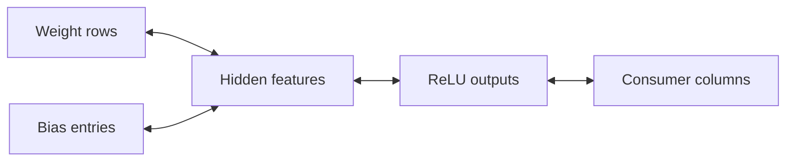
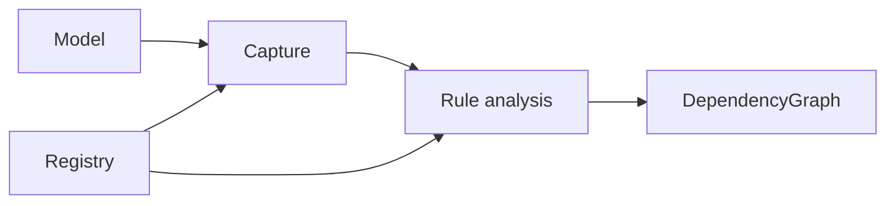
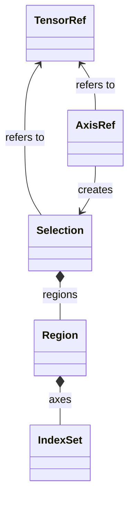
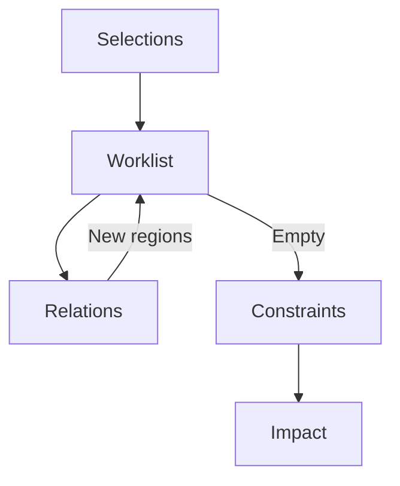
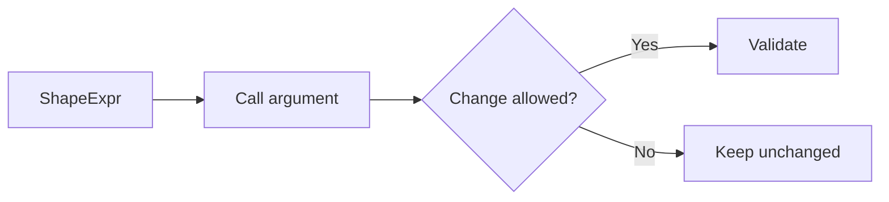
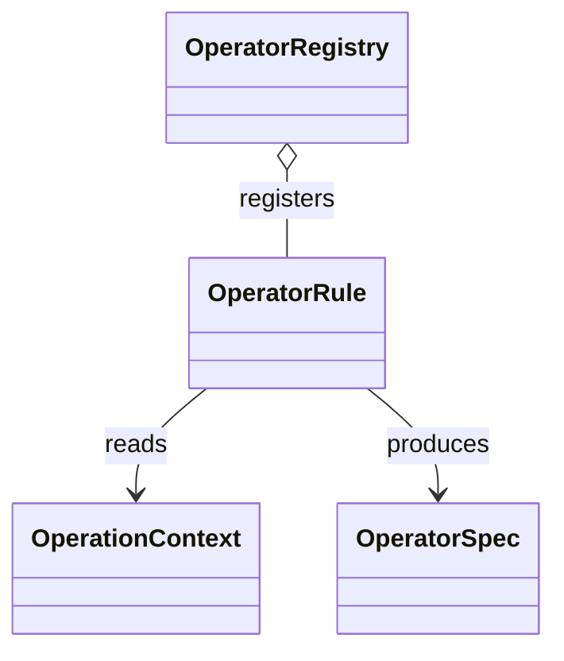
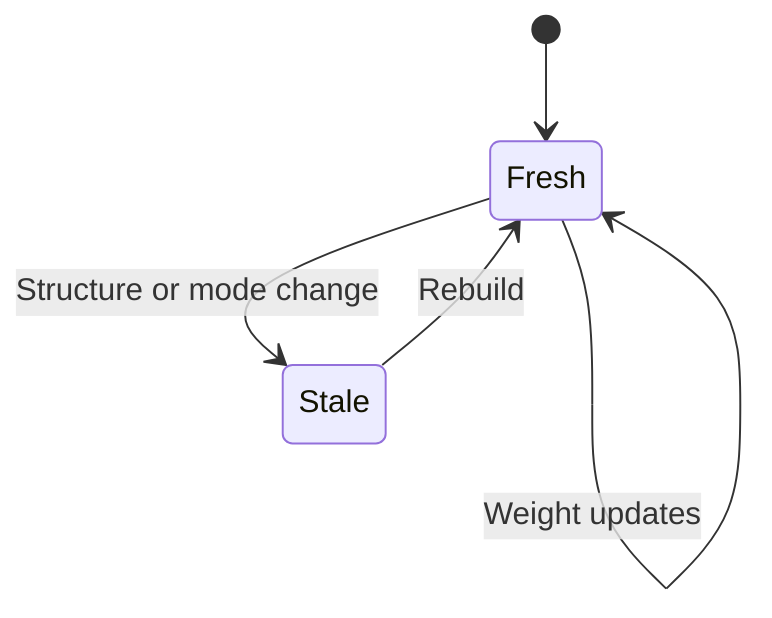

# Dependency graph design

The dependency graph answers one question: **if these original tensor positions are removed, which other positions and structural properties must change?** It captures a model once, records operator semantics, and computes the closure of a joint removal request. Scoring candidates, choosing a budget, and replacing model parameters belong to the [pruning layer](pruning-design.md).

This document explains construction, propagation, lifecycle rules, and every class defined in the dependency core. Start with the [architecture overview](architecture.md) for the complete library, or [operator support and extension](operator-coverage.md) when implementing a rule.

## 1. The representation

An FX node identifies an invocation. A `TensorRef` identifies a tensor entity. A `Selection` identifies removed coordinates of that entity. These identities differ: one module can be invoked repeatedly, and several registered paths can reference the same parameter object.

All selections use the coordinates of the captured model. A channel at original position 7 remains position 7 throughout a query, even if positions 1 and 3 are also selected. Compact coordinates appear only when the execution layer constructs the retained tensors.

### A concrete query

This small model illustrates the dependency API; it is not a pruning-quality experiment.

```python
import torch
from torch import nn
from torch_kirigami import DependencyGraph, Fixed

model = nn.Sequential(nn.Linear(4, 8), nn.ReLU(), nn.Linear(8, 2)).eval()
graph = DependencyGraph.build(model, args=(torch.randn(1, 4),))

hidden = graph.parameter("0.weight").axis(0)
impact = graph.propagate(
    remove=[hidden.select([1, 5])],
    constraints=[Fixed(graph.parameter("2.weight").axis(0))],
)
assert impact.status == "resolved"
assert impact.complete
print(graph.explain(impact))
```

The closure includes rows 1 and 5 of the first weight, the matching first-layer bias and activation positions, and columns 1 and 5 of the second weight. The classifier's output width remains fixed. No parameter changes during this query.



## 2. Construction pipeline

`DependencyGraph.build(model, args=..., kwargs=..., operators=...)` uses a fixed public FX capture path. Example arguments provide actual tensor metadata. They do not specialize tensor-dependent Python branches.



Construction proceeds in this order:

1. Registered parameters and buffers are deduplicated by object identity. All original aliases remain on the resulting reference. Distinct tensors that share storage receive a conservative storage-alias barrier.
2. Capture temporarily binds copied buffers and copied example inputs. It records the traced computation and configuration before metadata execution.
3. Metadata execution records shape, stride, dtype, and device without retaining activation tensors in the final graph.
4. Each call receives an `OperationContext`. The exact registered `OperatorRule` emits an `OperatorSpec`. Every referenced tensor is checked for ownership by this graph.
5. Missing semantics become barriers. Used tensors receive nonempty-axis checks; unused tensors receive an unbound-tensor barrier. Layout restrictions and relation adjacency are finalized.
6. A final fingerprint check rejects detectable structural changes during construction.

Capture restores buffer bindings, module training flags, and CPU/initialized-CUDA RNG state on success and failure. Parameters are not copied: `forward` must not mutate them. Forward hooks, unsupported registration callbacks, and recognized unsafe writes are rejected. Arbitrary external side effects and concurrent use of the same model are outside the isolation contract.

### Unsupported Python decisions that FX may not detect

Tensor identity/type tests and decisions based on Tensor runtime state are outside the capture contract. In particular, `x.grad is None` or `self.layer.weight.grad is None` can test a lazy FX attribute proxy, silently choose a different branch from the original Tensor, and leave no usable trace of the test. `isinstance(x, torch.Tensor)` and Tensor identity tests have related limitations.

The eager TorchFunctionMode guard cannot observe these Python operations on proxies. Therefore this library cannot promise a capture error for every unsupported branch: successful `build()` is not proof that an arbitrary Python forward was captured correctly. Do not prune models containing these decisions under the current contract. Move the choice into explicit, guarded Python configuration or give an opaque module an appropriate declared contract. The library retains the original no-custom-Proxy/no-concrete-tracer boundary; it does not conceal this gap with an unused-node heuristic.

## 3. Graph and capture classes

Sources: [graph.py](../torch_kirigami/graph.py), [capture.py](../torch_kirigami/capture.py).

### `DependencyGraph`

The public analysis snapshot owns the original model, copied registry tables, captured references, operator contexts, relations, constraints, requirements, and structural guards. Its main interfaces are:

| Interface | Purpose |
| --- | --- |
| `build()` | Capture and analyze a model. |
| `parameter(path)`, `buffer(path)` | Resolve original registered aliases. |
| `calls(module_path=None)` | Inspect invocations, including repeated calls to shared modules. |
| `values()`, `metadata(ref)`, `interfaces()` | Inspect tensor references, metadata, and external input/output tensors. |
| `operations()`, `operator_spec()`, `operator_rule()` | Inspect captured operation semantics. Returned FX nodes and argument containers are copies; module bindings still reference the source model. |
| `tensor(ref)`, `tensor_bindings()`, `bindings(ref)` | Access live registered tensors or their unique owner/attribute slots after freshness checks. |
| `constants()`, `constant_guards()` | Distinguish lifted FX constants from registered integer tensors whose values are structural assumptions. |
| `propagate()` | Compute a joint removal closure and check constraints. |
| `explain(impact)` | Format selected regions, reasons, diagnostics, and requirements. |
| `validate()`, `invalidate()` | Check or explicitly end snapshot validity. |
| `validate_attribute_changes()` | Re-trace proposed configuration edits in isolation to verify captured computation remains compatible. |

`fx_graph` returns an inspection copy. `relations`, `constraints`, `diagnostics`, and `shape_expressions` expose recorded analysis facts. `validate_impact()` checks result ownership; it does not replace a fresh propagation or prove that a forged result is executable.

### `CallRef`

A frozen public record of one operation invocation: its FX `name`, original `module_paths`, and flattened `inputs`/`outputs`. `input(i)` and `output(i)` select tensor ports. The same module can produce several `CallRef` objects; aliases describe module identity, not the exact Python attribute spelling used at each invocation.

### `_LeafTracer` — private

An `fx.Tracer` subclass that adds exact registered opaque module types and function autowrap registrations to FX's leaf policy. It does not implement a second tracing backend. A root model that is itself a leaf is represented by a small wrapper FX graph containing one `call_module`.

### `_MetadataPropagator` — private

A `ShapeProp` subclass that resolves placeholders from the bound original `forward` signature and records metadata trees for each node. Tensor results become `TensorFacts`; supported scalar leaves remain scalar values. It rejects zero-element tensor examples and unsupported metadata value types. Intermediate activations are needed during execution but are not the stored analysis representation.

### `CaptureResult` — internal

Transfers the temporary `GraphModule`, node-indexed metadata, cloned-buffer-to-original aliases, and capture signature from `capture()` to `DependencyGraph.build()`. It is an implementation handoff, not a user-facing alternative to `DependencyGraph`.

## 4. Coordinates and selection classes

Source: [selection.py](../torch_kirigami/selection.py).



### `IndexSet`

An immutable normalized union of nonnegative half-open integer intervals. Overlapping and adjacent intervals merge; `of()` removes duplicate individual indices and `span()` creates a contiguous range. Union, intersection, subtraction, and shifting operate symbolically without dense masks. Invalid bounds and excessive interval fragmentation are rejected.

### `Region`

A Cartesian product of one `IndexSet` per tensor dimension. For example, selected rows of a weight matrix combine selected row indices with the complete column range. `Region(())` represents the scalar coordinate. Intersections remain Cartesian; subtraction can return several disjoint regions.

### `TensorRef`

A frozen snapshot-qualified identity with original `shape`, `kind`, and registered alias `paths`. Parameters and buffers retain bindings; inputs and intermediate values are metadata entities. `axis()` constructs an `AxisRef`, and `select()` constructs a region selection. `portable()` removes the graph UUID for saved-plan lookup; portable labels do not establish ownership in another live graph.

### `AxisRef`

A frozen pair of a `TensorRef` and canonical nonnegative dimension. Negative dimensions are normalized at construction. `select(indices)` selects complete cross-sections across all other dimensions. It rejects out-of-range indices rather than clipping a request.

### `Selection`

An immutable, normalized union of disjoint regions on one tensor. Equality compares selected coordinates, not the particular rectangle decomposition. Set operations require matching tensor references.

`fully_selected_indices(dim, scope=None)` returns positions whose entire cross-section is selected. Partial weight-row coverage is therefore not enough to delete an output channel. `compact_shape()` returns the dimensions left by ordinary whole-axis deletion, or `None` when the regions need partition-specific packing. `None` does not itself establish an invalid request: a declared `PartitionedLayout` may support it.

### `TensorRefMap` — internal shared record

An immutable mapping used by portable structural records. It accepts compatible live or portable tensor labels and checks shape, kind, and aliases when resolving them. Unknown labels raise `KeyError`; known labels with incompatible metadata raise `ValueError`. It does not make graph-local references reusable after pruning.

The shared [regions.py](../torch_kirigami/regions.py) module defines no classes. Its `gather_region()` function reads a Cartesian tensor region for scoring and training consumers, keeping tensor access below both layers.

## 5. Relation classes

Source: [relations.py](../torch_kirigami/relations.py).

Relations express forced coordinate correspondence. They cannot score channels, modify the model, or choose a completion to satisfy a budget.

### `Relation` — protocol

Requires endpoint `refs`, a human-readable `reason`, and `propagate(source) -> tuple[Selection, ...]`. Implementations must be deterministic, monotone, and side-effect free. The graph schedules a relation whenever an endpoint selection grows. A relation may need the complete accumulated selection to recognize a newly completed block.

### `AxisPort`

Exposes an `AxisRef` within an optional `Region` scope. Without a scope it covers the full tensor. With a scope it can describe one group of a grouped-convolution weight or one packed projection partition. `select()` intersects positions with that scope; `fully_selected_indices()` requires complete scoped cross-sections.

### `BlockMap`

Maps corresponding contiguous blocks using source/target starts, block count, and source/target block widths. Its two completion flags control whether touching part of a source block is enough to propagate or whether the whole block must be selected. Reverse mapping swaps endpoints and uses the target completion policy. A one-to-one channel mapping uses block widths of one.

### `AxisRelation`

Connects two `AxisPort` objects through one or more `BlockMap` records, in both directions. `equal(left, right)` is the common identity mapping between equally sized axes. Maps must fit endpoint bounds; port scopes then restrict the selected regions. Only complete scoped cross-sections propagate.

### `BroadcastRelation`

Connects a broadcastable smaller tensor to its expanded output. Forward propagation repeats selected regions. Reverse propagation selects an original coordinate only when **all** of its broadcast copies are selected. This avoids treating removal of one batch copy as removal of a shared bias parameter.

### `ReshapeRelation`

Maps equal-element-count tensors through logical row-major offsets after a rule proves the reshape valid. It preserves matching leading dimensions symbolically to avoid multiplying interval counts across batch and token dimensions. It does not independently prove `view` stride compatibility; operation validation supplies that check.

### `PermuteRelation`

Maps regions through an explicit axis permutation and its inverse. Construction checks that each original axis appears exactly once and that the declared output shape matches that permutation.

### `SliceRelation`

Maps normalized basic integer indexing and positive-step slices between original and sliced coordinates. Integers remove axes; slices retain them. Rule code expands ellipses before construction and handles inserted axes separately. Advanced indexing and mutable/data-derived index semantics are outside this relation.

## 6. Propagation and result classes

Source: [contracts.py](../torch_kirigami/contracts.py); algorithm: [graph.py](../torch_kirigami/graph.py).



The queue processes accumulated selections, not isolated deltas. Two paths may jointly complete a broadcast fiber or a logical block; propagating only the most recent delta would miss that implication. Provenance records only newly discovered target coordinates.

A relation that exceeds the exact representation limit is disabled for that query and contributes an incomplete diagnostic. Constraints are checked after the fixed point; they do not add removals. Choosing balancing channels belongs to the planner.

### `Diagnostic`

A frozen explanation with `code`, `message`, optional FX `node`, involved tensor IDs, `severity`, and `complete`. Severity is `unresolved` when a condition needs proof or additional choices, and `conflict` when a required condition is violated. `complete=False` means the influence range is not fully known.

### `Provenance` — internal result record

Records a `source` selection, newly added `target` regions, and the relation's `reason`. It is exposed through `Impact.provenance` for explanation; callers normally consume it rather than construct it.

### `Impact`

The immutable result of a dependency query: graph identity, original requests, closure selections, diagnostics, requirements, provenance, affected interfaces, checked constraints, and known tensor references. `selection(ref)` returns an empty selection for a known unaffected tensor. `parameters` and `buffers` expose affected registered selections; shared parameter objects appear once.

`impact.parameters` contains parameter selections, not a `ParameterGroup` object. `Impact` neither stores nor constructs `ParameterGroup`. The pruning-layer method `Pruner.parameter_groups(candidates)` runs dependency queries, filters their parameter selections, and constructs groups for training operations. See the [extraction sequence and ownership](sparse-training.md#live-parameter-groups).

| Result property | Meaning |
| --- | --- |
| `status == "resolved"` | No checked condition produced a diagnostic. |
| `status == "unresolved"` | At least one condition needs further proof or choices, with no conflict diagnostic. |
| `status == "conflict"` | At least one required condition is violated. |
| `complete` | Every diagnostic says the influence range is known; independent of validity. |

An unbalanced grouped request can be complete but unresolved. A protected-axis violation can be complete but conflicting. Reaching an unknown operator can make the result incomplete. A resolved impact still requires executable lowering and does not imply numerical equivalence between dense and compact models.

## 7. Constraint classes

Constraints inspect the accumulated closure. The distinction between **propagating required effects** and **checking admissibility** prevents the analysis layer from silently making pruning-policy choices.

### `Constraint` — protocol

Requires `refs` and `check(selections) -> Diagnostic | None`. The mapping is keyed by graph-local tensor IDs and must be treated as read-only. A constraint checks its own declared references; it must not execute the model or select more channels.

### `NonEmpty`

Requires at least one retained position on an axis. Selecting the whole axis produces an `empty_axis` conflict. Graph construction adds these checks to structurally used tensors.

### `Fixed`

Protects complete positions on one axis. A selected full position is a `fixed_axis` conflict. If partitioned packing prevents proof that the physical axis remains unchanged, the result is unresolved; protecting the corresponding logical axis is preferable.

### `Balanced`

Requires equal retained counts across fixed, nonempty, disjoint original partitions of an axis. The partitions may cover only part of the axis. By default each partition must remain nonempty. Unequal counts are unresolved and require a planner choice; an emptied required partition is a conflict.

### `BlockBalance`

Checks member counts for surviving logical groups. A `groups` axis represents groups, a `members` axis contains equal contiguous blocks, and `block_size` connects their original sizes. Entire groups may disappear; surviving groups must retain equal positive member counts. This differs from `Balanced`, whose partition structure stays fixed.

### `Divisible`

Requires the retained axis size to be divisible by a positive integer factor. A remainder produces an unresolved diagnostic rather than choosing channels to remove. Partitioned layouts must be checked on a suitable logical axis.

### `Barrier`

Marks tensors whose structural influence is unproved. It activates only when a query affects one of its references and then produces `complete=False`. Unknown operators, unsupported storage aliases, and structurally unbound tensors use this mechanism. An unrelated branch can remain analyzable.

### `AxisBarrier`

Limits unsupported behavior to full positions of one physical axis. It is useful when channel changes are supported but token, spatial, or mask positions must remain fixed. Activated barriers mark the influence incomplete.

### `LayoutConstraint`

Checks whether selected regions fit ordinary axis compaction or the allowed scoped axis ports of a tensor use. Each shared-tensor use must satisfy its own layout restriction; merging incompatible consumers into one permissive set would lose information. Unsupported packing is unresolved.

### `CallArgumentConstraint` — internal, `operators/shapes.py`

Stores immutable pairs of `ShapeExpr` and observed integer argument values, plus relevant `PartitionedLayout` descriptors. During a query it reevaluates shape-derived arguments on compact shapes. Arguments explicitly validated by a requirement are excluded by argument location, not expression identity; the same `size()` expression can feed both a permitted width and a semantic stride that must remain unchanged.

### `_PendingLayout` — private, `operators/shapes.py`

An internal exception used when reevaluating a compact shape still requires balanced partition counts or a proved layout. `CallArgumentConstraint` converts it into an unresolved layout diagnostic. It is not an exception callers should use to control pruning.

## 8. Shape provenance and execution requirements

Source: [contracts.py](../torch_kirigami/contracts.py).



### `ShapeExpr`

A small immutable provenance tree for integer shape calculations. It supports constants, inferred `-1`, unknown provenance, tensor dimension/shape/rank/element-count reads, tuples, and integer addition, subtraction, multiplication, floor division, and modulo. `refs` lists its source tensors. This is intentionally smaller than a general computation IR: observing one integer value is insufficient to infer arbitrary Python semantics.

### `ArgumentRef`

Identifies a canonical call parameter by name, positional slot, and whether it occupies the remaining positional arguments. Native aliases are resolved consistently, including the Tensor receiver in method positions. It lets requirements describe precisely which argument changes they validate.

### `Requirement`

A declarative future edit or execution obligation: `kind`, `target`, determining `tensors`, explanatory `detail`, immutable named `data`, and permitted `arguments`. Examples include changing a module's feature count, deriving a shape attribute, retaining a partition order, or recomputing normalization over a compact domain.

Payloads accept documented scalar and structural records, and nested sequences are frozen. Opaque mutable objects are rejected. `refs` includes sources embedded in payloads for graph-ownership checks. Kind names are extensible, but an executor must explicitly implement or reject each requirement; recording one never performs the edit.

## 9. Operator and registry classes

Sources: [operation.py](../torch_kirigami/operation.py), [registry.py](../torch_kirigami/registry.py).



### `TensorFacts`

A frozen shape, stride, dtype, and device record detached from activation storage. These are observed properties of the example execution, not symbolic ranges of all possible inputs.

### `OperationContext`

The normalized call passed to `analyze()`: FX node, argument and result trees, optional called module and original path, module-local registered tensor bindings, shape-expression table, metadata, captured small integer constants, and graph identity. Tensor leaves are `TensorRef` objects. `inputs` and `outputs` flatten the trees; `argument()` resolves normalized arguments, `raw_argument()` preserves FX operands, and `binding()` looks up a module-local parameter or buffer.

### `CandidateAxis`

A stable logical-domain `key`, `AxisRef`, and positive `block_size` for default contiguous removal candidates. An optional registered tensor `binding` identifies the same logical coordinates across repeated calls when the seed axis belongs to an activation, as with transposed convolution. Matching keys must agree on that binding, width, and block size; equal widths alone do not establish identity. The key is independent of an invocation's FX name. Declaring candidates supplies discovery information; it does not impose an algorithm or a budget. Relations map logical seeds into actual parameter regions.

An optional `alignment_axis` identifies the corresponding logical width used by
retained-width constraints. It defaults to the seed axis and must have the same
original width. Grouped convolution uses its output activation axis because
partitioned input-column removals can prevent its physical weight tensor from
having a single Cartesian compact shape. The rule declares the correspondence;
the pruning layer does not infer it from shapes or module types.

### `PartitionedLayout`

Describes a tensor as disjoint original-coordinate partitions, compacted separately and concatenated in declared order along `concat_dim`. `retained_regions(selection)` computes remaining regions without allocating tensors. Dependency constraints and pruning lowering consume the same descriptor so their interpretation of grouped storage agrees.

### `OutputContract`

Declares output layout knowledge used by original-call validation: `unknown`, `contiguous`, `cast`, or `backend_dependent`. Shape compatibility alone cannot prove backend strides. Output layout information also does not grant permission to change semantic scalar arguments; requirements provide those permissions separately.

### `OperatorSpec`

The frozen output of analysis. It combines relations, constraints, requirements, optional candidates and partitioned layouts, optional output contract and shape expression, and registered integer `constants` whose values must remain unchanged. Constructor checks validate descriptor types; graph construction checks tensor ownership. It contains no surgery callbacks.

### `CallEffects`

Pre-execution effects with `mutates_input` and `fresh_output` flags. Capture uses write information before metadata execution; downstream alias validation uses allocation information. Declaring fresh output is a rule-author promise that the operation creates independent output storage. For example, an allocating gate can safely precede some in-place consumers, while multiple-consumer alias conflicts still require rejection.

### `OperatorRule`

The unified extension object with four distinct responsibilities:

| Callback or option | Contract |
| --- | --- |
| `preflight(node, module)` | Reject recognized unsafe calls before metadata execution. |
| `effects(node, module)` | Describe writes and allocation before output metadata exists. |
| `analyze(context)` | Return pure structural facts as an `OperatorSpec`. |
| `lower(context)` | Optionally return declarative rewrite recipes for the pruning layer; `None` uses shared compilation. |
| `evaluate_on_meta` | Opt into native meta execution for compact-call validation; third-party rules default to declared output facts. |

The core defines this interface but does not import a pruning executor. Extension code that needs custom recipes can import them from the pruning package; built-in declarative descriptors usually suffice.

### `OperatorRegistry`

A local collection of exact module-type, function-object, and Tensor-method-name registrations, plus opaque leaf sets. `default()` creates a fresh built-in registry. `copy()` duplicates tables and sets while retaining rule callables. Duplicate registration raises an error; custom subclasses do not automatically inherit a registered module's semantics. Builds copy the registry so later table edits do not alter an existing snapshot, but shared rule callables must remain deterministic and immutable in behavior.

## 10. Binding and configuration classes

Sources: [bindings.py](../torch_kirigami/bindings.py), [configuration.py](../torch_kirigami/configuration.py).

### `AttributeEdit` — internal

A prepared ordinary-object-state assignment or deletion with `path`, `value`, and `delete`. Capture uses these records to temporarily rebind copied buffers inside ordinary containers; execution and restoration use them to preserve supported references when replacing registered tensors. Shared containers use a common copy memo so their alias relationships are retained.

### `FrozenScalar` — internal

An exact scalar type/value guard for recognized configuration. It distinguishes values with different scalar types and gives floating-point NaNs stable equality through frozen representations. It also carries `torch.Size` configuration without retaining mutable state.

### `FrozenList` — internal

A tuple-backed representation that retains the fact that the original configuration container was a list. `freeze()` recursively freezes supported scalar/list/tuple/dict values; `thaw()` creates independently owned containers. Unsupported objects are not a general-purpose serialization target.

### `FrozenDict` — internal

An ordered tuple of frozen key/value pairs. Guards retain insertion order and exact scalar types, including nested configuration dictionaries. Configuration and ordinary references are read from both the instance dictionary and initialized Python `__slots__`. Custom object internals and arbitrary properties are outside this inspection contract.

Binding helpers support registered tensors referenced directly or through plain lists, tuples, and dictionaries. Separate ordinary-attribute views into registered storage are rejected. Arbitrary custom objects must not hide tensor bindings: the fingerprint is not a complete audit of Python state.

## 11. Freshness and error classes

Source: [errors.py](../torch_kirigami/errors.py).



The fingerprint tracks detectable tensor identities, shapes, strides, dtype/device/storage, module identities and recognized configuration, modes, hooks, and supported ordinary bindings. Declared structural integer constants also have value guards. Numeric optimizer updates to floating-point parameters do not alone make a graph stale. Replacing parameters, switching relevant configuration or module modes, or changing guarded integer values can do so.

### `KirigamiError`

Base class for the library's capture, analysis-limit, and freshness exceptions.

### `CaptureError`

The model could not be safely traced or executed for metadata. Examples include invalid example arguments, tensor-dependent Python branching, recognized parameter writes, unsupported hooks, or inputs that cannot be safely isolated.

### `AnalysisLimitError`

The exact symbolic representation exceeded its bounded complexity. Constructing an excessively fragmented selection can raise it immediately. Propagation catches limits encountered while following relations or checking constraints and reports an incomplete diagnostic rather than fabricating an approximate closure.

### `StaleGraphError`

The source model no longer satisfies the captured structural assumptions, or the graph was explicitly invalidated. Rebuild the graph and recreate references before another structural operation.

### `UnsupportedOperation`

An exception raised by rule analysis when the captured arguments have no proven semantics. It derives directly from `Exception`, separately from `KirigamiError`, because graph construction normally converts it to a barrier and diagnostic. An unexpected programming error in an extension is not silently converted into unsupported behavior.

## 12. Review checklist and source map

When reviewing a dependency change, verify that it preserves these boundaries:

- Relations propagate only forced original-coordinate implications, using accumulated selections.
- Constraints report conditions without making candidate-selection decisions.
- Requirements describe edits without executing them.
- Shared tensors satisfy every consumer's contract and retain their aliases.
- Unsupported behavior is explicit and scoped to affected dependencies.
- Capture does not leak supported buffer, mode, or RNG changes.
- Public build/plan/apply tests validate executable consequences, beyond direct rule tests.

The class inventory above covers `graph`, `capture`, `selection`, `relations`, `contracts`, `operation`, `registry`, `bindings`, `configuration`, `errors`, and the two classes in `operators/shapes.py`. The other operator modules are function-based rule families, described in [operator support and extension](operator-coverage.md). See [verification](testing-coverage.md) for the corresponding test layers.

## Value and layout influence beyond selected coordinates

Coordinate propagation answers which original positions must be removed together. Execution validation also follows downstream FX data edges: a slice may retain exactly the same positions while its stride changes, and a reduction may remove all selected axes while its scalar value still depends on the changed parameter. Every such downstream call must remain valid under its rule's declared semantics.

Unknown calls form a barrier over their data ancestors, including reductions and casts. They may use values as indices or sizes, so a coordinate-neutral edge cannot prove independence. An unrelated branch remains usable. This conservative barrier does not infer a numerical implementation for an unknown operator.

Registered integer buffers are structural constants only when their captured reads have no recognized writes or observed mutations. Restoring the original value later in the forward does not make an earlier read constant. Mutable indices require an explicit rule; their final observed values are not substituted into dependency relations.

### Eager Tensor decisions and ordinary constants

`_TraceDataGuard` uses public `TorchFunctionMode` during symbolic tracing to reject eager Tensor data extraction that FX would omit, such as buffer `.item()`, `bool`, `tolist`, `torch.equal`, or metadata read from a computed Tensor. This guard does not trace another branch or implement a second tracer. Calls involving FX proxies remain subject to normal graph effect checks. Unrecorded derived tensors lifted into FX constants are rejected, as are eager runtime-state reads such as `.grad` and writes to unisolated ordinary constants.

Metadata reads from registered tensors preserve the observed value, not every axis. A read of `size(dim)` or `len(tensor)` constrains that dimension; `numel()` constrains the element count. Reading `shape` or `size()` constrains the complete tuple, even if Python subsequently indexes it: that indexing is outside FX. Rank, dtype, device and type predicates remain unchanged by compaction and are covered by structural preconditions. Eager `stride(dim)`, `stride()` and `is_contiguous()` reads are checked against the final tensor recipe, so unrelated axis changes remain legal when the observed result is preserved. All checks stay local to the affected tensor. Storage-position reads such as `storage_offset()` are unsupported because portable plans do not track storage positions.

Direct Tensor attributes and tensors in plain lists, tuples and dictionaries carry portable shape, stride, dtype, device and tensor-flag premises, in addition to registered-reference aliases. Their numerical values are constructor-owned unless registered or saved through extra state. Arbitrary custom objects must not hide untracked tensor state or Python side effects; FX does not prove a complete Python program.

Dictionary keys must be supported immutable configuration values, even when their values contain no tensors. Tensor/Module keys, including tensors nested in tuple keys, are rejected because they can hide live bindings used by the original forward.

Native `torch.dtype`, `torch.device`, `torch.layout`, and `torch.memory_format` configuration values are frozen explicitly, including inside supported containers.
