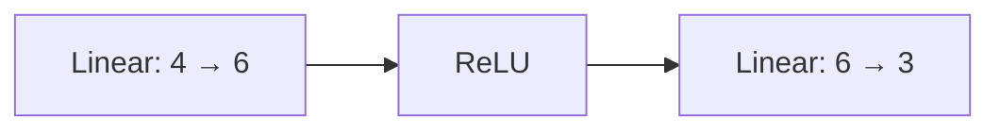

# Getting started

This walkthrough demonstrates the public analysis, planning and execution APIs with a small network. The network is an API teaching example; meaningful accuracy comparisons use the [pretrained ImageNet workflows](../examples/workflows/README.md).

## Install from the repository

Python 3.10 or newer and PyTorch 2.6 or newer are required. From the repository root:

```bash
uv venv .venv
source .venv/bin/activate
uv pip install --torch-backend=auto -e .
```

Install test and lint tools with `uv pip install --group dev`. Use the activated environment's `python`, `pytest`, and `ruff` directly. The installation command selects PyTorch for the host; the project keeps the portable runtime dependency `torch>=2.6` and does not pin a CPU-only index.

The Python blocks below form one script when run in order.

## 1. Define the model and capture its structure

```python
import torch
from torch import nn

from torch_kirigami import DependencyGraph
from torch_kirigami.pruning import Pruner, load_checkpoint, save_checkpoint


def make_model():
    return nn.Sequential(nn.Linear(4, 6), nn.ReLU(), nn.Linear(6, 3)).eval()


torch.manual_seed(7)
model = make_model()
inputs = torch.randn(2, 4)
graph = DependencyGraph.build(model, args=(inputs,))
```

Choose the model's mode before building the graph. Use example inputs with the shape, device, dtype and argument structure you intend to analyze.

This model has a hidden width of six. The output rows of the first weight tensor correspond to its six hidden features; the input columns of the last weight tensor consume those features.



## 2. Inspect a removal without modifying the model

```python
hidden_axis = graph.parameter("0.weight").axis(0)
remove = hidden_axis.select([1, 4])
impact = graph.propagate(remove=[remove])

print(graph.explain(impact))
assert impact.status == "resolved"
consumer = graph.parameter("2.weight")
assert set(impact.selection(consumer).fully_selected_indices(1)) == {1, 4}
assert model[0].out_features == 6
```

The request is expressed in the original coordinates of this graph. The result includes the first layer's bias and the last layer's dependent columns. No parameters have been removed.

Use `impact.diagnostics` and `impact.requirements` to investigate unresolved requests. `impact.complete` reports whether the influence range is known; `impact.status` also reflects constraint validity. Neither is a promise that a physical rewrite is executable.

## 3. Plan and apply the change

```python
pruner = Pruner(model, graph=graph)
plan = pruner.plan_remove([remove])
print(plan.explain())

returned_model, result = pruner.apply(plan)
assert returned_model is model
assert model[0].out_features == 4
assert model[2].in_features == 4
assert model(inputs).shape == (2, 3)
```

Planning protects external input and output axes by default. It validates the joint removal and the physical tensor and attribute edits. Applying the plan replaces affected tensors on the original module hierarchy.

The old graph, axis references and parameter groups must not be used for another pruning round. Rebuild them from the compact model.

## 4. Continue ordinary training

```python
model.train()
optimizer = torch.optim.SGD(model.parameters(), lr=0.01)
targets = torch.tensor([0, 2])

optimizer.zero_grad()
loss = nn.functional.cross_entropy(model(inputs), targets)
loss.backward()
optimizer.step()
```

This single batch demonstrates optimizer rebuilding and a valid backward pass; it is not a fine-tuning recipe. The library does not implement your task loss or migrate optimizer state. Real workflows evaluate the pretrained baseline, the freshly pruned model and any fine-tuned result on the same held-out data.

## 5. Save and restore the compact model

```python
model.eval()
save_checkpoint(model, "compact.pt")
restored = load_checkpoint(make_model(), "compact.pt", map_location="cpu")
torch.testing.assert_close(restored(inputs), model(inputs))
```

The checkpoint includes final structural information and values. The supplied original model definition provides the Python module code. You do not need to rebuild a graph or replay earlier pruning rounds to restore the final structure.

## Let a policy choose the channels

This is an independent example using a fresh model:

```python
from torch_kirigami.pruning import ChannelRatio, Greedy, Magnitude

automatic_model = make_model()
automatic_graph = DependencyGraph.build(automatic_model, args=(inputs,))
automatic_pruner = Pruner(automatic_model, graph=automatic_graph)
space = automatic_pruner.discover_candidates()
automatic_plan = automatic_pruner.plan(
    space,
    strategy=Greedy(Magnitude(p=2)),
    budget=ChannelRatio(0.34),
)
print(automatic_plan.explain())
automatic_pruner.apply(automatic_plan)
assert automatic_model[0].out_features == 4
```

The explicit `discover_candidates()` call discovers entry axes declared by operator rules throughout the captured graph. The resulting space is passed unchanged to planning. **The Linear rule declares its output-feature axis, not its input-feature axis.** In this example, the first Linear supplies six hidden-feature candidates; the last Linear's three output features are protected as the model output. ReLU supplies dependency relations, but no independent candidates.

Selecting a hidden feature removes the first Linear's corresponding weight row and bias entry and, through dependency propagation, the second Linear's corresponding weight column. These linked changes do not require separate candidates at both ends. Default discovery does not enumerate every possible entry axis; custom candidates or manual requests can select other supported entries. See [default candidate discovery](pruning-design.md#default-candidate-entry-axes).

`Magnitude` scores the union of affected parameter regions. `ChannelRatio` measures logical channel deletions, not parameter count, MACs or latency. The default strategy can return less pruning than requested when constraints prevent reaching the target.

For a cap on the final whole-model parameter count, pass
`budget=ParameterBudget(max_params=...)` after importing `ParameterBudget` from
`torch_kirigami.pruning`. It counts all unique Parameters, including fixed and
frozen tensors, and stops once an executable selection meets the cap. Unlike a
channel removal allowance, an unmet parameter target raises `PlanningError`
before applying changes. `plan.selection_report` then uses `ParameterReport`
with exact before/after counts instead of channel-count fields.

For caller-provided task gradients, use `WeightTaylor`; for custom candidates, domains and strategies, read [Pruning design](pruning-design.md).

## Diagnose the common failure modes

| Symptom | Meaning | Next step |
| --- | --- | --- |
| `CaptureError` | FX tracing or isolated metadata execution failed | Inspect forward control flow and use representative inputs |
| Unsupported diagnostic | No sufficient rule covers the affected operation or selection | Inspect the named operation and [operator support](operator-coverage.md) |
| `StaleGraphError` | Tracked structure, mode, configuration or constants changed | Rebuild the graph and all live bindings |
| `PlanningError` | The joint selection or physical representation is not valid | Read the exception and graph.explain(impact); change the request or extend the rule |
| `ExecutionError` | Execution preconditions or state validation failed | Verify model compatibility and inspect the reported binding or recipe |
| Smaller-than-requested deletion count | Constraints or bounded selection left budget unused | Read the selection report; do not count the shortfall as deleted channels |

The [architecture overview](architecture.md) explains why these phases are separate. The [dependency graph reference](dependency-graph-design.md) documents the objects used to inspect each phase.
