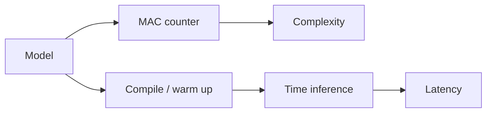

# Complexity and latency measurement

`torch_kirigami.measurement` measures an eager PyTorch model independently of dependency analysis and pruning policy. It reports parameter elements, matrix/convolution multiply-accumulates (MACs), and inference latency on CPU or CUDA. Latency can use `torch.compile`.

## Basic use

For parameter counts alone, use `count_parameters(model)` from
`torch_kirigami.measurement`. It requires no sample input or forward execution
and returns the sum of unique registered Parameter elements. Frozen and unused
parameters count; buffers do not. Aliases of one Parameter count once, while
distinct Parameters sharing storage count separately. It does not transfer data
between devices. Complexity measurement and `ParameterBudget.from_ratio()` use
the same counter. Zero weights and pruning masks do not reduce this count;
physical tensor sizes determine the number of parameters.

For MACs and latency, pass the original eager module to
`calculate_model_complexity()` and `measure_module_latency()`, with its parameters
and buffers already on the selected device. `compile=True` requests compilation
inside the latency function.

```python
import torch
from torch import nn

from torch_kirigami.measurement import (
    calculate_model_complexity,
    measure_module_latency,
)

model = nn.Sequential(nn.Linear(8, 12), nn.ReLU(), nn.Linear(12, 4)).eval()
x = torch.randn(2, 8)
complexity = calculate_model_complexity(model, (x,))
latency_ms = measure_module_latency(model, (x,), compile=True, warmup=5, repetitions=20)
print(f"#Params: {complexity.params}")
print(f"#MACs: {complexity.macs}")
print(f"Unsupported operations: {complexity.unsupported_ops}")
print(f"Recorded FLOPs (registered formulas only): {complexity.flops}")
print(f"Batch latency: {latency_ms:.3f} ms")
```

Both functions accept a single input or a tuple/list of positional arguments, plus `input_kwargs` for keyword arguments. Nested tensor containers are supported. Inputs are isolated jointly and moved to the chosen device while retaining repeated tensor and container identity across positional and keyword arguments. This preserves identity-sensitive paths such as `MultiheadAttention(x, x, x)`. Distinct storage-sharing views remain supported on the selected device; automatic cross-device transfer of those views is rejected because moving each tensor separately would break their relationship. Move their shared base and recreate the views on the target device before measurement. A list intended as one model argument must itself be wrapped in an outer positional-argument tuple.

When `device` is omitted, the device is inferred from registered model tensors, falling back to CPU for a tensor-free model. All model parameters and buffers must already be on that one device. The functions do not move the model for the caller.

## Two independent execution paths



Counting and timing are separate forwards. Instrumentation and the math attention backend used for counting do not affect the timed path. The measurement functions do not require a dependency graph and do not select a pruning budget.

## Parameter and MAC definitions

`calculate_model_complexity(target, input_args, device=None, input_kwargs=None)` returns the immutable `ModelComplexity` record:

| Field | Meaning |
| --- | --- |
| `params: int` | Number of elements in unique registered parameters, including frozen parameters; buffers are excluded |
| `macs: int` | MACs for the entire supplied input batch and executed path |
| `flops: int` | Native counter total for registered FLOP formulas, including non-MAC formulas; not a complete model FLOP count |
| `unsupported_ops: tuple[str, ...]` | Observed operations whose MAC coverage could not be verified; excludes known non-MAC operations |

One MAC is one multiply-accumulate, equivalent to two FLOPs in the counting convention. Matrix products and convolutions contribute, including the matrix products in attention. Bias addition, activation, normalization, and other elementwise work are excluded. Parameter sharing is deduplicated by `Parameter` identity, not by comparing numerical values.

`flops` retains the native counter's total without converting units. Additional registered non-MAC formulas contribute to `flops` but not `macs`. Operations without a formula or counted decomposition contribute nothing to `flops`; for example, standard activation and normalization work is generally absent from the native counter. `unsupported_ops` describes MAC coverage only: an empty tuple does not establish FLOP completeness. Consequently, `flops` may equal `2 * macs` for common models, but that equality is not an API invariant.

The implementation sums audited matrix and convolution entries from PyTorch's native `FlopCounterMode`, converting each from FLOPs to MACs. It does not divide the counter's unrestricted total by two: formulas registered for other operations need not represent multiply-accumulates. A formula on an explicitly excluded operation cannot increase MACs; an unverified formula on a computational operation remains unsupported. Replacing an audited PyTorch formula is outside the contract; malformed negative, odd or non-integer counts are rejected, but this check cannot verify an arbitrary replacement formula.

Counts describe dense theoretical work, not hardware instructions. Matrix multiplication contributes `M * N * K` per batch item. Ordinary convolution contributes output elements times kernel volume times input channels per group; transposed convolution uses the input spatial positions. Attention contributes the `QKᵀ` and `AV` matrix products. Zero weights, causal masks and kernel fusion do not reduce these counts. Pooling, activation, normalization and bias work are excluded; twice the MAC count is not a complete model FLOP count.

Executed operations are profiled to identify missing coverage. The SDPA math backend is selected temporarily so fused attention does not silently bypass matrix-operation counting. Counting uses `no_grad` outside inference mode.

A nonempty `unsupported_ops` means MAC completeness could not be established, not that every listed operation necessarily contains omitted MACs. Known excluded operations such as ReLU and pooling do not cause this warning. Coverage describes the observed execution path; it cannot establish the cost of arbitrary opaque Python or native code. Pass an eager module, not a previously compiled wrapper.

## Latency definition

```python
latency_ms = measure_module_latency(
    model,
    (x,),
    device="cpu",
    repetitions=20,
    warmup=5,
    compile=True,
    compile_kwargs={"mode": "default"},
)
```

`measure_module_latency` returns the median duration of one forward for the entire supplied batch, in milliseconds. `repetitions` must be positive and `warmup` nonnegative.

| Device | Timing mechanism |
| --- | --- |
| CPU | `time.perf_counter()` around each uninstrumented forward |
| CUDA | Preinitialized events on the selected device's current stream, with synchronization before and after measurement |

Input transfer, state isolation, compilation, the initial compiled invocation, and warmup are outside the timed region. Timing uses inference mode and the normal attention backend. It measures model execution, not data loading or end-to-end application latency.

`compile_kwargs` forwards native options such as `backend` and `mode` to `torch.compile`; it requires `compile=True`. Compilation errors propagate instead of silently switching execution mode. A callable wrapper retains module call semantics without permanently adding compilation bookkeeping to the original model. Each measurement call creates its own wrapper, while PyTorch manages any underlying compiler caches.

After physical pruning, call measurement again with the compact eager model. A previously compiled callable is not the artifact to compare against the newly changed structure.

## State preservation and boundaries

Both functions restore per-module training flags, complete registered buffer tables and values (including `None`, added/deleted entries, and persistence flags), isolated input state, and torch RNG state on success and failure. Latency also restores the garbage-collector enabled state. Existing supported isolation contracts apply; incompatible storage aliasing can be rejected.

Forward execution must not modify parameter values. Arbitrary Python side effects are outside the isolation contract, and the same model must not be concurrently trained or mutated during measurement. Only CPU and CUDA devices are supported.

## Interpreting before/after results

Use identical input shapes, batch size, dtype, device, thread count, compilation options, warmup, and repetitions for the baseline and compact model. MACs and latency are batch-level quantities; report batch size alongside them. Lower parameter count or theoretical MACs does not guarantee lower latency because kernel choices, shape alignment, launch overhead, and hardware utilization also change.

The [workflow examples](../examples/workflows/README.md) print and save parameter counts, MACs, unsupported operations, latency, and measurement settings alongside validation accuracy. `--val_batch_size` sets both the accuracy loader batch and the fixed synthetic inference batch used for MACs and latency. `--train_batch_size` controls training separately. Inspect unsupported operations before interpreting MAC reduction.

From `examples/workflows`, after installing its requirements and downloading the required data:

```bash
python prune_finetune.py --model resnet18 --device cuda --compile_latency \
  --finetune_epochs 0
python gate_pruning.py --model resnet18 --device cuda --compile_latency \
  --sparse_epochs 1 --finetune_epochs 0
```

These commands also perform the workflow's task-specific evaluation or training; they are not isolated benchmark-only commands. `--compile_latency` compiles only the latency-measurement forward, excluding compilation time from the timing; training and accuracy evaluation remain eager. See the workflow README for required ImageNet splits and training controls.

Inputs sharing identity or storage with Tensor leaves of ordinary model attributes
are isolated together and temporarily rebound, including nested containers. Shared input/container identity is retained as well, including empty containers; same-device measurement does not rebuild that tree.
Bindings are restored on both success and failure. Moving only the input to another
device would break this relationship and is rejected; move the model-owned state
and its shared input together before measuring.
