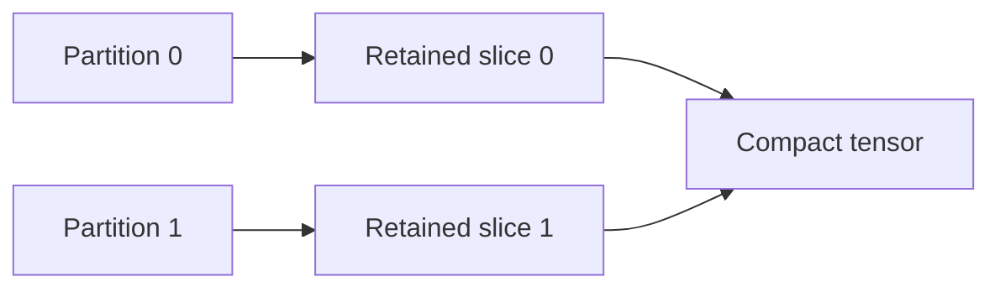
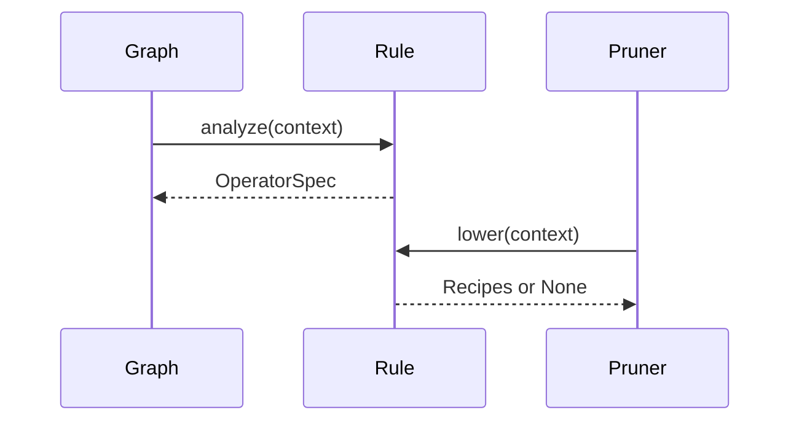

# Operator support and extension

Operator support is a contract for a captured call, its arguments, the selected axes, and the resulting compact execution. A registered name alone does not imply that every parameter combination or removal request is supported.

The [dependency design](dependency-graph-design.md) explains the shared records. The [pruning design](pruning-design.md) explains how those records become executable plans.

## Support is checked in stages

A call can execute successfully during capture and still lack a structural rule. A rule can propagate a request correctly while its constraints require additional balancing choices. A resolved dependency result can still require an unsupported edit to the original `forward`. Each stage reports its own failure instead of treating successful forward execution as sufficient proof.

Registrations match exact module classes, function objects, and Tensor method names. A custom `nn.Linear` subclass does not automatically receive `nn.Linear` semantics. Opaque registrations preserve a callable boundary where FX supports it; the rule author then owns that boundary's semantics.

## Built-in families

The table summarizes supported structural domains and their principal restrictions. Exact registered spellings are defined by [defaults.py](../torch_kirigami/operators/defaults.py), [extended.py](../torch_kirigami/operators/extended.py), [indexing.py](../torch_kirigami/operators/indexing.py), and [attention.py](../torch_kirigami/operators/attention.py).

| Family | Structural behavior | Main boundary |
| --- | --- | --- |
| `Linear`, functional linear | Input/output features, weight columns/rows, bias. | Exact registered types and spellings; original functional arguments must remain valid. |
| `Conv` / `ConvTranspose`, 1D–3D | Ordinary, grouped, and depthwise channels; original partitions are compacted and concatenated. | Spatial/kernel positions are fixed. Functional group arguments must already express a valid compact call. |
| BatchNorm, LayerNorm, GroupNorm, InstanceNorm, RMSNorm, PReLU, `normalize` | Related affine parameters, statistics buffers, and dimension attributes. | GroupNorm preserves its group count and balances retained channels. Normalization is recomputed on the compact domain. |
| Embedding | Embedding feature width and downstream consumers. | Vocabulary positions are fixed. `max_norm` parameter mutation is rejected before metadata execution. |
| Pooling, adaptive pooling, unpooling, interpolation, Upsample | Batch/channel correspondence, including paired pooling values and indices. | Spatial positions remain fixed. |
| Padding modules and `pad` | Coordinates on axes unaffected by padding/cropping. | Transformed axes remain fixed even when cropping and padding happen to preserve the original shape. |
| Elementwise arithmetic, activations, comparisons, `where`, `masked_fill` | Broadcasting and joint dependencies across operands. | Only registered spellings; mutation and alias safety must still be established. |
| Tensor casts and device moves, `clone`, `detach`, `contiguous` | Data-coordinate correspondence. | Dtype/device reference tensors are not broadcast operands. View/copy changes cannot bypass alias checks. |
| `matmul`, `mm`, `bmm`, `addmm`, `baddbmm` | Free dimensions, contracted dimensions, and broadcast batch axes. | Original ranks and call semantics must remain valid. |
| `einsum` | Explicit free/contracted labels and supported ellipsis broadcasting. | Requires an explicit string output equation; repeated labels within an operand and diagonal semantics are unsupported. |
| `cat`, `stack`, `split`, `chunk`, `unbind` | Segment offsets and original output ports. | Existing call spelling must preserve retained coordinates and output ports; stack/unbind port counts stay fixed. |
| Basic slicing, `narrow`, `index_select` | Static original-to-output coordinate maps. | Positive-step basic slices. `index_select` needs a captured registered integer index vector and does not rewrite that vector. |
| Permutation, transpose, reshape/view, flatten, squeeze/unsqueeze | Coordinate remapping and supported dimension provenance. | Hard-coded incompatible sizes, changed rank, and unproved view strides reject affected requests. |
| `repeat`, `tile`, `repeat_interleave`, `expand`, `expand_as`, `broadcast_to` | Repetition blocks and broadcast fibers. | Positive static repeat factors; `repeat_interleave` requires scalar repeats and an explicit dimension. `expand_as` also depends on its template's shape. |
| GLU, ChannelShuffle, PixelShuffle/Unshuffle | Paired gate positions, channel permutation, and complete channel blocks. | Shuffle requires compatible retained local patterns; pixel spatial axes stay fixed. |
| Unfold/Fold | Channels mapped to im2col channel blocks. | Batched 2D forms with static kernels; spatial/kernel positions stay fixed. |
| Sum, mean, product, extrema, logsumexp, softmax/log_softmax | Reduced dimensions distinguished from retained dimensions. | Compact reductions are recomputed; reductions returning position indices are not generally covered. |
| Scaled dot-product attention | Q/K feature agreement, K/V sequence agreement, output-value width, batch/head broadcasting, and masks. | Explicit head dimensions; legal GQA group/multiplier changes only. Causal Q/K token axes are fixed. |
| `MultiheadAttention` | Packed/separate projections and balanced embedding-width changes for self/cross attention. | Head count stays fixed; batch, token, mask, and attention-weight positions stay fixed. |
| `ChannelGate` through explicit registration | Activation axis, trainable scale, and fixed mask shrink together. | Register with `register_gate_operators()`; gates add no default budget domain. |

Default candidate declarations cover module linear output features, convolution output channels, embedding width, and native MHA embedding width. Depthwise convolution defaults to whole logical groups. Functional operations and most coordinate/normalization operators provide dependencies without independent default candidate domains. A custom rule may declare additional domains with `CandidateAxis`.

Grouped ConvTranspose illustrates why logical domains matter: the complete output-channel width is the budget domain, while a physical weight dimension may store only a per-group width. Counting that local dimension as the whole network domain would produce an incorrect budget.

## Grouped and partitioned storage

Logical positions and storage coordinates need not have a one-to-one axis representation.



`PartitionedLayout` is shared by dependency checking and physical lowering. `LayoutConstraint` checks every consumer separately. This is necessary for shared tensors: one consumer's legal packing must not accidentally authorize a layout that another consumer cannot interpret.

Balancing is a planner decision. A dependency query can know all affected coordinates and still report that retained group counts differ. The planner may add candidates within the budget; it must report a shortfall when no legal completion fits.

## Attention has distinct pruning domains

Do not treat native MHA width pruning and explicit-head attention pruning as interchangeable.

Native MHA ties output-projection axes to query/output width and to its packed or separate projections. It preserves the number of heads and requires balanced retained feature counts in the original head partitions. It does not implement internal whole-head deletion while keeping the external embedding width unchanged.

An explicit SDPA graph exposes head axes. Relations can then describe complete KV-group removal or valid changes to the query-head multiplier. With `is_causal=True`, Q/K token positions remain fixed because removing arbitrary tokens would change the meaning of the implicit triangular mask. KV-cache maintenance is outside the library.

The pretrained [workflows](../examples/workflows/README.md) currently demonstrate ViT **FFN intermediate-width pruning**, which leaves the attention and external embedding widths unchanged.

## Structural validity and numerical references

For a linear hidden channel followed by a compatible elementwise operation, a dense model with that channel masked can provide an independent reference for physical deletion. The mask must be placed where all removed contributions are represented.

Normalization, softmax, reductions, and attention can recompute statistics or probabilities over a smaller domain. A dense masked output is generally not an equivalent reference for those operations. Use an independently constructed compact model or a formula evaluated on retained coordinates.

Unknown operators and unsupported axes block requests that reach them. They do not automatically invalidate every independent branch in the model. Tensor-dependent Python control flow, data-dependent index remapping, quantized/sparse storage compaction, RNN/PackedSequence, MoE routing, and optimizer-state migration are not general built-in capabilities.

## Implementing an operator rule

Prefer a small declarative `OperatorSpec` composed from existing relations, constraints, requirements, candidates, and layouts. Keep the definition outside the dependency core if it depends on a third-party package.



### A minimal allocating, shape-preserving module

The following complete example registers a module that multiplies every input coordinate by a fixed scalar. The relation preserves coordinates; the effects callback truthfully declares fresh output storage. No attributes or parameters inside the custom module require lowering.

```python
import torch
from torch import nn
from torch_kirigami import (
    CallEffects,
    DependencyGraph,
    OperatorRegistry,
    OperatorRule,
    OperatorSpec,
    ReshapeRelation,
)
from torch_kirigami.pruning import Pruner


class Half(nn.Module):
    def forward(self, input):
        return input * 0.5


def analyze_half(context):
    return OperatorSpec(
        relations=(
            ReshapeRelation(
                context.inputs[0], context.outputs[0], reason="same element coordinates"
            ),
        ),
    )


def half_effects(node, module):
    return CallEffects(fresh_output=True)


registry = OperatorRegistry.default()
registry.register(Half, OperatorRule(analyze_half, effects=half_effects))

model = nn.Sequential(nn.Linear(4, 8), Half(), nn.Linear(8, 2)).eval()
x = torch.randn(2, 4)
graph = DependencyGraph.build(model, args=(x,), operators=registry)
pruner = Pruner(model, graph=graph)
plan = pruner.plan(remove=[graph.parameter("0.weight").axis(0).select([1, 5])])
pruner.apply(plan)
assert model[0].out_features == model[2].in_features == 6
assert model(x).shape == (2, 2)
```

This rule applies specifically to `Half`. Reusing it for an arbitrary equal-shaped operation would be incorrect: equal input/output shapes do not prove coordinate independence, alias behavior, or reduction semantics.

### Describing a parameterized operator

For an affine custom module, relate input features to weight columns, output features to weight rows, and output features to bias positions. Add an attribute `Requirement` when the module stores its width in configuration. The built-in descriptor compiler can handle supported requirements without custom lowering.

For packed projections or grouped tensors, declare scopes and `PartitionedLayout` explicitly. For logical budget axes, supply stable `CandidateAxis` keys that do not depend on one FX call's name. Repeated calls and aliases should resolve to the same structural domain when they represent the same pruning choice.

If shared compilation cannot express a necessary edit, implement `OperatorRule.lower()` using the public recipe records from `torch_kirigami.pruning`. The callback returns declarative results and accounts for handled requirements; it must not mutate the model. See the complete [fused-attention example](../examples/fused_attention.py) and [extension integration tests](../tests/integration/test_extensions.py).

### What rule authors must prove

| Area | Required reasoning |
| --- | --- |
| Coordinates | Relations map original positions correctly in both directions, including broadcast fibers and complete blocks. |
| Constraints | Unsupported axes and required balance/nonempty conditions are explicit. |
| Effects | Recognized parameter writes are rejected before execution; allocation declarations match actual storage behavior. |
| Shape provenance | Permitted shape-argument changes are declared by argument location; semantic parameters remain unchanged. |
| Bindings | Parameters and buffers use registered references; structural integer constants have persistent value guards. |
| Lowering | Every activated requirement is implemented or rejected; original Python call semantics remain valid. |
| Persistence | A compatible original model factory plus the same extension definitions can restore the compact model. |

Opaque modules do not exempt the author from these contracts. Their internal computation is not visible to FX, so the extension supplies the proof that ordinary tracing would otherwise expose.

## Validation for a new rule

Use three complementary test layers. The [verification guide](testing-coverage.md) explains the repository-wide commands and inventory.

1. Add an independent expected-coordinate case to [operator_cases.py](../tests/support/operator_cases.py) when adding a built-in registration. The [registered-entry test](../tests/operators/test_registered_entries.py) checks that every registration has a matching case. These are direct rule tests, not proof of capture or execution support.
2. Add family tests for valid alternatives and meaningful boundaries: keyword spellings, negative axes, shape provenance, partition balance, and storage layout as applicable. Keep numerical references independent of the implementation.
3. Add public `DependencyGraph.build()` → `Pruner.plan()` → `Pruner.apply()` coverage with post-pruning forward/backward, and save/load when introducing persistent structure. Rejected requests must leave parameter values, identities, module attributes, and relevant state unchanged.

Useful family suites include [convolution](../tests/operators/test_convolution.py), [normalization](../tests/operators/test_normalization.py), [shapes](../tests/operators/test_shapes.py), [indexing](../tests/operators/test_indexing.py), [attention](../tests/operators/test_attention.py), and [cross-layer extensions](../tests/integration/test_extensions.py). The machine-readable [contract inventory](../tests/architecture/contract_inventory.json) records the distinction between rule-level checks and public execution tests.
