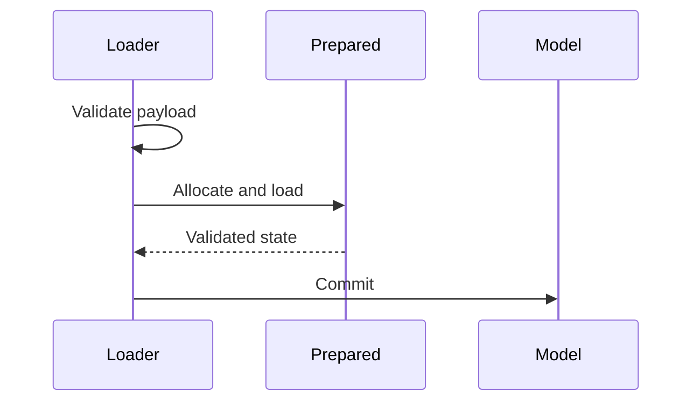
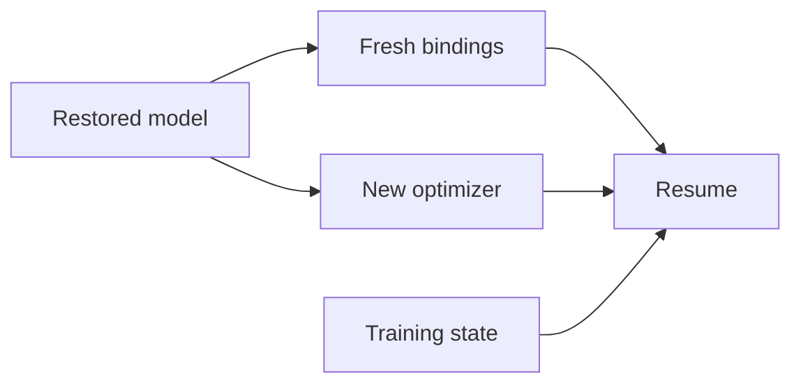

# Plans, model checkpoints, and training state

Persistence has three distinct purposes: replay a pruning decision, restore a final compact model, or resume an algorithm's training progress. Keeping them separate avoids requiring a graph or a pruning-history replay just to load a model.

| Artifact | Contains | Does not contain |
| --- | --- | --- |
| `PruningPlan.to_dict()` | Decision, recipes, analysis summary, budgets, before/after structure | Weight values, model code, FX graph, scoring callbacks |
| `save_checkpoint(model, path)` | Final registered state, compact structure, supported configuration and aliases | Original constructor code, pruning history, optimizer or algorithm progress |
| Caller training checkpoint | Optimizer and application-defined recovery data | An automatic guarantee that all external data-loader or application state is captured |

## Save and replay a static plan

```python
import torch
from torch import nn

from torch_kirigami import DependencyGraph
from torch_kirigami.pruning import Pruner, PruningPlan


def make_model():
    return nn.Sequential(nn.Linear(8, 12), nn.ReLU(), nn.Linear(12, 4))


model = make_model()
graph = DependencyGraph.build(model, args=(torch.randn(2, 8),))
plan = Pruner(model, graph=graph).plan(remove=(graph.parameter("0.weight").axis(0).select([1, 3]),))
torch.save(plan.to_dict(), "decision.pt")

restored_plan = PruningPlan.from_dict(torch.load("decision.pt", weights_only=True))
other_model = make_model()
other_model, result = Pruner(other_model).apply(restored_plan)
```

`to_dict()` produces basic data suitable for weights-only loading. `from_dict()` validates the envelope, record schema, and recipe consistency without importing a model class. Portable references identify registered paths and structural facts rather than live graph identities.

A plan chooses original coordinates once. Replaying it uses the receiving model's current numerical weights; it does not restore the weights used for scoring or recompute importance. The receiving structure, supported configuration, and guarded constants must match the plan's preconditions. Applying the same nonempty plan twice to an already compact model normally fails those preconditions.

Use a plan to audit or share a decision. Use a model checkpoint to reproduce the compact model's actual outputs.

## Save and restore the final model

```python
from torch_kirigami.pruning import load_checkpoint, save_checkpoint

save_checkpoint(other_model, "compact.pt")
restored = load_checkpoint(make_model(), "compact.pt", map_location="cpu")
assert restored[0].out_features == restored[2].in_features == 10
```

`save_checkpoint(model, path)` accepts a pruned, restored, or ordinary module. `load_checkpoint(model, path, *, map_location=None)` changes and returns the supplied skeleton with the same module identity. It requires no input example, operator registry, dependency graph, or original pruning history.

The factory must reproduce the original module classes, hierarchy, alias relationships, registered slots, and constructor configuration. Loading reconstructs the saved final tensor sizes and library-managed structural attributes. A checkpoint cannot infer arbitrary missing model code or repair a different module hierarchy.

The checkpoint includes parameters, persistent buffers, and explicitly saved nonpersistent registered buffers. It preserves supported tensor layouts, parameter `requires_grad`, tensor sharing by object identity, module sharing, and saved module configuration, including training flags. `map_location` accepts `None`, a destination device (`str` or `torch.device`), or a source/destination device dictionary. These use PyTorch storage relocation. Per-storage callable mappings are rejected before reading the checkpoint.

For a gated model, construct the skeleton with the same `ChannelGate` definitions and placements. The saved weight and mask are restored with their retained values and compact sizes; no assumption sets surviving scales back to one.

### Load transaction



Registered state is validated and prepared before commit. Data-oriented extra-state setters run on isolated module shells; final configuration and references are checked before assigning the prepared state to the original model. Setters may update ordinary attributes, including a child's data, but must preserve every registered module and Tensor binding, tensor values/layouts, buffer persistence, and runtime hooks. Arbitrary external side effects from user callbacks are outside the transaction contract.

The transaction preserves registration categories: an ordinary cached parameter reference remains an ordinary attribute, and a parent-module reference does not become a registered child. It copies initialized Python slots as well as instance dictionaries. Final structural validation runs inside the rollback boundary.

The format stores raw registered tensor slots and loads them directly into the declared final shapes. It does **not** call `state_dict`, `load_state_dict`, `_save_to_state_dict`, or `_load_from_state_dict`, including third-party overrides. A module may define those methods without affecting this checkpoint: encoded names, constructor-dependent decoding, and old PyTorch state-dictionary metadata do not participate. BatchNorm/InstanceNorm and torchvision modules work through the same registered parameter/buffer handling, without a codec allowlist or delayed resize hooks.

Paired `get_extra_state`/`set_extra_state` methods are handled separately for ordinary application data. A shared module has one canonical extra-state entry, and its getter/setter runs once. Saving calls the getter on the source module: it must be read-only, and arbitrary getter side effects are not isolated or rolled back. A module using extra state cannot also register a Tensor named `_extra_state`, since the two payload keys would collide. All prepared registered tensors already contain their saved values when setters run. Module graph reconstruction, registered Tensor replacement, and mutation of registered values or runtime hooks in a setter are rejected before commit. To persist an application-specific encoding or missing external state, use an application-owned format.

Extra state must be a bounded, acyclic tree of supported basic values, plain containers (including `OrderedDict`), and ordinary tensors suitable for `weights_only=True`. Hidden tensor/container attributes and tensor hooks are rejected in the payload. References or views into registered tensor storage, and arbitrary objects such as `datetime.date`, are rejected during save before writing the destination. Save a basic representation or an independent tensor clone instead, and reconstruct application objects explicitly in `set_extra_state`.

Tensor gradient hooks are runtime bindings, not serialized model state. Loading rejects target parameters/buffers with gradient or post-accumulate hooks before replacing them; remove and register those hooks on the restored parameters explicitly. Physical pruning applies this restriction only to tensors it replaces, including hooks added after planning.

Explicitly unsupported cases also include registered `state_dict` hooks, custom parameter/tensor subclasses, distinct tensor objects sharing storage, and layouts whose non-overlap cannot be proved. Registered aliases of the same ordinary parameter or buffer are different from distinct storage-sharing tensors and are supported.

## Training state is caller-owned

A final model checkpoint is sufficient for model restoration, but not for resuming sparse training. Save at a well-defined boundary outside an in-flight backward graph, and record all state the algorithm needs:

- Optimizer state and any AMP gradient-scaler state.
- Epoch, optimizer-step, and schedule-position counters.
- `CumulativeChannelBudget.state_dict()` and `SelectionWindow.state_dict()` when used.
- Algorithm-specific selections, original group norms, decay progress, and stage flags.
- RNG states and any application-specific sampler/data-loader progress needed for reproducibility.

Pure schedules such as `Linear` or `Polynomial` do not maintain a step counter. Save their configuration and the caller's position. A parameter operation does not manage momentum, so an algorithm's checkpoint must retain whichever optimizer policy it actually implements.



Do not serialize live `AxisRef`, `ParameterGroup`, or `GateBinding` objects as a replacement for rebinding. Graph references belong to one dependency snapshot. After restoring or physically pruning a model, construct fresh bindings and validate saved component state against them.

`CumulativeChannelBudget.load_state_dict(state, space)` checks domains and structure before replacing state. `SelectionWindow.load_state_dict(state)` checks window compatibility and stored similarities; reset it when the coordinate universe changes. Optimizer state loading is valid only when the recreated optimizer and compact parameter layout match the saved state.

The workflow scripts save the compact model and a separate training-state file. Their saved state demonstrates the separation of responsibilities; it is not a general-purpose resume CLI or a distributed-training checkpoint framework.

## Failure and review contracts

Structural compatibility errors are reported before committing ordinary registered state. Review persistence changes with both successful round trips and failure-state tests: malformed recipes, mismatched factories, inconsistent aliases, unexpected payload values, extra-state failures, and nonpersistent buffers all affect correctness.

Round-trip comparisons should verify final outputs and sharing relationships in addition to tensor shapes. Plan replay and checkpoint restoration have different numerical expectations: replay adopts the target model's current weights, whereas a model checkpoint restores the saved values.

Checkpoint loading disables inference mode throughout deserialization, shell preparation and copying of ordinary/extra Tensor state. Restored parameters and copied constants can therefore participate in ordinary autograd even if the caller loads inside inference mode. Actual module extra-state keys are distinguished from ordinary tensor names such as `weight_extra_state`.

Ordinary Tensor constants have structural compatibility guards but their numerical values are not implicitly checkpointed. Construct them consistently in the skeleton, or register/save them explicitly. Device remapping validates these constant premises using one actual destination per source device, including extra-state-only storages. Constructor-owned constants must have compatible devices; loading does not relocate tensors that were never serialized. Extra-state setters may retain loaded tensors or reconstruct independent tensors on the mapped device. No per-storage callback or hidden payload-origin tracking is needed.
