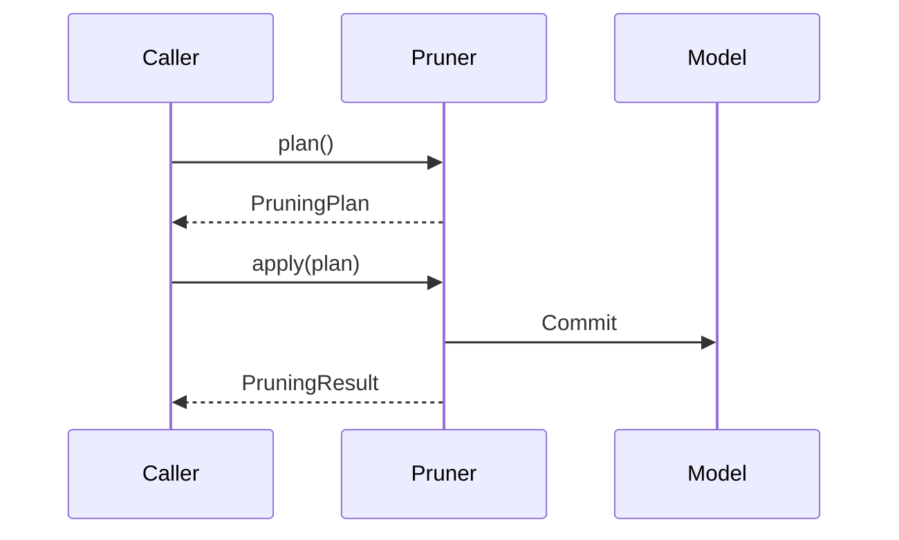
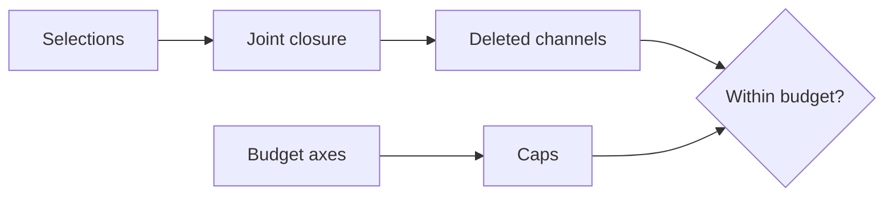
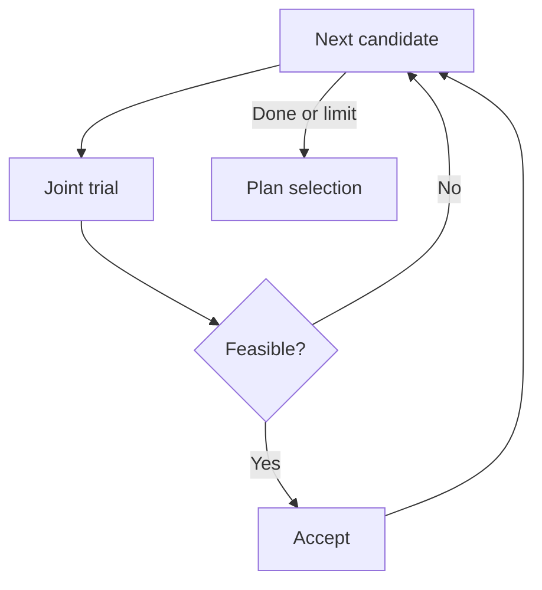

# Pruning design

Structural pruning is a verified change to the shapes and bindings of an existing PyTorch module. Dependency analysis determines which coordinates must change together; planning chooses a legal removal and compiles it into static recipes; application executes those recipes on the original model.

Read the [architecture overview](architecture.md) first for package boundaries, and the [dependency graph design](dependency-graph-design.md) for the coordinate and constraint model.

## Lifecycle and ownership



`Pruner(model, graph=graph)` requires that `model` is the original module associated with the graph. `plan()` and `prune()` require a fresh graph. `Pruner(model).apply(plan)` can execute a compatible saved decision without a graph, example inputs, scoring, or a forward pass.

`prune(**kwargs)` is exactly the convenience composition of `plan(**kwargs)` and `apply(plan)`. It performs one round; it does not train, schedule budgets, or migrate optimizer state.

## Manual and automatic selection

This executable example removes two intermediate features while preserving the input and output interfaces:

```python
import torch
from torch import nn

from torch_kirigami import DependencyGraph
from torch_kirigami.pruning import Pruner

model = nn.Sequential(nn.Linear(8, 12), nn.ReLU(), nn.Linear(12, 4))
x = torch.randn(2, 8)
graph = DependencyGraph.build(model, args=(x,))
remove = graph.parameter("0.weight").axis(0).select([1, 3])
pruner = Pruner(model, graph=graph)
plan = pruner.plan(remove=(remove,))
print(plan.explain())
model, result = pruner.apply(plan)
assert model[0].out_features == model[2].in_features == 10
assert model(x).shape == (2, 4)
```

For automatic selection, replace the manual `plan()` call on the unmodified model with:

```python
from torch_kirigami.pruning import ChannelRatio, Magnitude

plan = pruner.plan(metric=Magnitude(p=2), budget=ChannelRatio(0.25))
```

Manual `remove` is mutually exclusive with `metric`, `budget`, `candidates`, and `strategy`. A manual request is accepted as a joint request or raises `PlanningError`; the planner does not silently substitute another selection.

By default, `preserve_io=True` protects every axis of external input and output tensors using `Fixed` constraints. Set `preserve_io=False` only when the caller also controls the resulting interfaces. Additional `constraints` apply to the combined dependency closure in either selection mode.

## Candidate space and logical budgets

`CandidateSpace(graph, *, candidates=None, axes=None, preserve_io=True, constraints=())` is shared by automatic planning and sparse-training components. Default candidates come from `CandidateAxis` declarations in operator specifications. There is no separate, inferred global grouping algorithm in the training layer.

A `Candidate(key, remove, axis=None)` names one batch of original-coordinate removal seeds. Its associated `axis` describes a logical domain; the candidate itself does not create an indivisible structural constraint. Required coupling comes from dependency relations and constraints.



Automatic discovery excludes a domain only when all its candidates are provably protected by the default IO constraints. Unsupported influence paths remain visible; they cannot silently reduce the budget denominator. Explicit axes retain protected domains. Caller-supplied candidates require explicit budget axes.

| Budget | Local scope | Global scope |
| --- | --- | --- |
| `ChannelRatio(ratio, scope="local", axes=None)` | Per-axis cap `floor(ratio * width)` | One cap `floor(ratio * sum(widths))` |
| `ChannelCount(counts, axes, scope="local")` | Tuple of nonnegative integer caps, aligned with unique axes | One nonnegative integer cap |

A ratio must be finite and in `[0, 1)`. Counts are upper bounds, not a promise that the target is attainable. Global scope adds no hidden local percentage cap. Structural constraints still prohibit invalid results, including empty required dimensions.

Budgets count actual removals in the union of the dependency closure. Two seeds that remove the same logical position count once. If one removal affects two distinct budget axes, both axes contribute. Candidate count, parameter count, MACs, and latency are not channel budgets.

```python
from torch_kirigami.pruning import Candidate, ChannelCount

# A separate example on a fresh model and dependency snapshot.
model = nn.Sequential(nn.Linear(8, 12), nn.ReLU(), nn.Linear(12, 4))
graph = DependencyGraph.build(model, args=(x,))
pruner = Pruner(model, graph=graph)
axis = graph.parameter("0.weight").axis(0)
candidates = tuple(
    Candidate(f"hidden:{i}", (axis.select([i]),), axis) for i in range(axis.tensor.shape[axis.dim])
)
plan = pruner.plan(
    candidates=candidates,
    metric=Magnitude(),
    budget=ChannelCount((3,), axes=(axis,)),
)
```

For several rounds, use [CumulativeChannelBudget](sparse-training.md#cumulative-budgets-and-rebinding) rather than repeatedly applying a ratio to shrinking widths.

## Scoring and strategy contracts

A `Metric` is a callable `metric(context, candidate_batch)` returning one finite real score per candidate. Lower scores are selected first by the default strategy. The batch may contain temporary combined candidates; custom metrics must not assume that a union's score is the sum of its parts.

| Metric | Definition over the affected parameter-region union |
| --- | --- |
| `Magnitude(p=1)` | Sum of absolute parameter values |
| `Magnitude(p=2)` | L2 norm, including the final square root |
| `WeightTaylor(mode="elementwise_abs")` | Sum of `abs(weight * gradient)` |
| `WeightTaylor(mode="joint_abs")` | Absolute value of the sum of signed `weight * gradient` products |

Bias and normalization parameters are included unless `parameter_filter(ref, parameter)` excludes them. Regions and shared parameter bindings are deduplicated within each candidate's influence. Incomplete influence is rejected rather than scored as if missing parameters had zero importance.

`WeightTaylor` reads existing dense, real, unscaled gradients. The caller owns the task loss, loss reduction, calibration data, accumulation, and AMP unscaling. Collect task-only gradients if sparse regularization should not influence importance. This metric does not call `backward()` or estimate per-example Fisher information.

A `Strategy` is a callable `strategy(context)` returning registered candidate keys. A strategy can omit a metric if it never requests scores. The final combined request is independently reanalyzed, budget checked, and compiled after the callback returns.

`PlanningContext` exposes:

| Interface | Purpose |
| --- | --- |
| `graph`, `operations`, `candidates`, `budget`, `axes`, `constraints` | Fixed planning inputs |
| `widths`, `targets` | Frozen denominator and integer caps |
| `impact(remove)` | Propagate joint original-coordinate seeds |
| `require_complete(impact)` | Reject incomplete influence; repairable count constraints may remain |
| `score(candidate_batch)` | Invoke and validate the metric |
| `counts(impact)`, `within_budget(impact)` | Measure and check actual logical removals |
| `compile(impact)` | Verify tensor/attribute recipes without allocating compact weights |
| `report(impact)` | Freeze budget diagnostics |
| `trials`, `limit_reached`, `exclusions` | Strategy-owned diagnostic counters and reasons |

Callbacks must not mutate model state or structural premises. Planning checks graph freshness and tracked tensor identity, version, and `requires_grad` after callbacks; detected mutation raises an error. This check is not a transaction that reverses arbitrary user callback side effects.

## Default greedy search

`Greedy(max_trials=10_000)` computes a deterministic score order, breaking ties by candidate key. It maintains a verified committed selection, tries additions, and can add further candidates to satisfy `Balanced` or `Divisible` constraints. Rejected candidates may become feasible after another commitment. The search does not backtrack or prove global optimality.



`BudgetReport` records `axes`, `widths`, `targets`, actual `removed` counts, `scope`, `trials`, `limit_reached`, and `exclusions`. Its `shortfall` is the unfilled target. A nonzero shortfall can result from coupling, protected dimensions, unsupported execution, or bounded search. `limit_reached=True` is not proof that no better solution exists.

## Recipe compilation and extension points

Analysis completeness is necessary but insufficient for physical execution. The compiler also checks layouts, shape-derived arguments, attribute updates, alias safety, and every activated execution requirement.

An extension receives `RewriteContext(graph, operation, impact, requirements)`. `context.spec` accesses the shared `OperatorSpec`; `compact_shape(ref)` returns an ordinary rectangular compact shape and rejects partitioned layouts. A `RewriteResult` supplies recipes, attributes, handled requirements, and any proved output strides. It must not mutate the model. The dependency layer never calls `lower()`.

A custom lowerer is responsible for proving that the original forward remains valid. Declaring a requirement as handled is not permission to ignore its semantics. The standard lowering path consumes shared attribute and partition-layout declarations; avoid duplicating operator knowledge in checkpoint code.

## Static records and application

| Class | Responsibility |
| --- | --- |
| `PruningPlan` | Immutable analysis summary, selected keys, budget report, recipes, notes, and before/after structures; no live model or tensor |
| `AnalysisSummary` | Portable original-coordinate requests, propagated selections, reasons, and tensor catalog; `selection(ref)` rejects unknown references |
| `TensorRecipe` | Gather retained Cartesian `Region` segments and concatenate them in declared order; preserve a supported memory format |
| `AttributeRecipe` | Validated assignment of a structural module attribute from an expected old value to a new value |
| `ModelStructure` | Immutable module configuration, registered tensor schema, aliases, and ordinary tensor-reference structure |
| `CoordinateSegment` | Map one retained original region to its destination in a compact tensor |
| `PruningResult` | Applied plan, final structure, replaced-parameter map, coordinate maps, and report |
| `PlanningError` | A verified executable decision could not be established |
| `ExecutionError` | Static preconditions, allocation/commit, or state validation failed |

`apply()` validates the plan and the model's original structure, prepares all replacement tensors before changing bindings, checks structure again, and commits tensor/attribute edits. Shared registrations of the same parameter are preserved. The model object's identity is retained, but resized parameters are new `nn.Parameter` objects.

The commit mechanism restores tracked bindings and attributes on ordinary commit failures. It is not an isolation boundary for concurrent model mutation or arbitrary Python side effects. Models with unsupported storage sharing or reference patterns are rejected when the required safety proof cannot be made.

A static decision can be replayed on a compatible original structure whose numerical weights have changed since scoring. Applying it uses the current weights and does not recompute importance. Structural configuration and guarded constants must still satisfy the plan. See [persistence](persistence.md) for saving decisions and final models.

After a nonempty application, rebuild the dependency graph and all graph-bound groups, gate bindings, and regularizers. Recreate the optimizer because it otherwise holds replaced parameters. `result.parameter_map` and `coordinate_maps` expose the transformation for caller-owned integrations; the library does not automatically transform optimizer state.

## Review checklist

- Does a candidate identify the intended logical domain, with all coupling expressed structurally?
- Are scores computed over a complete influence range using the intended task statistics?
- Are caps checked against the joint closure rather than the sum of independent candidate costs?
- Does every activated requirement have a verified lowering, including static forward arguments?
- Are plan serialization and apply independent of live graph identities and scoring callbacks?
- Does a failure leave ordinary registered state unchanged wherever a transaction is promised?
- Are numerical tests based on an independently constructed compact reference? Zeroing a group alone does not prove equivalence when normalization, bias, or other cross-coordinate behavior is involved.
