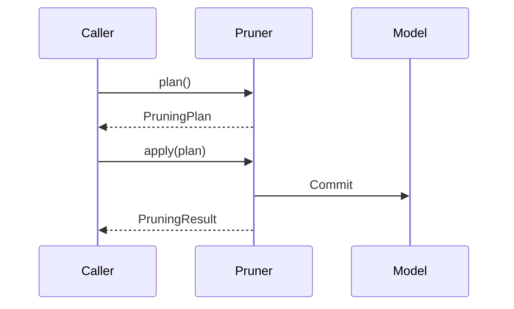
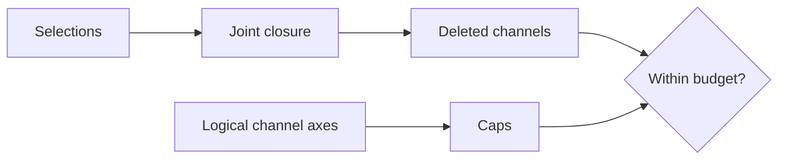
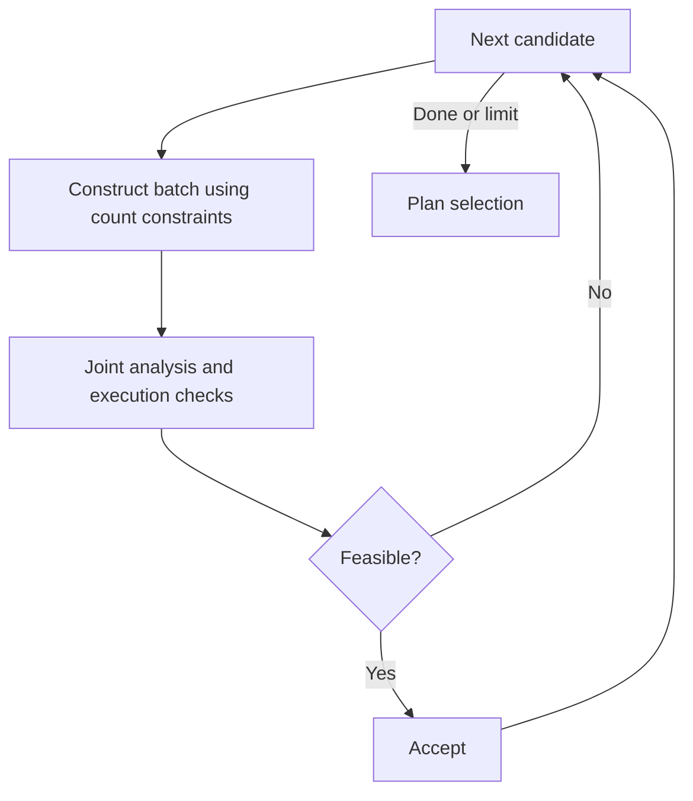

# Pruning design

Structural pruning is a verified change to the shapes and bindings of an existing PyTorch module. Dependency analysis determines which coordinates must change together; planning chooses a legal removal and compiles it into static recipes; application executes those recipes on the original model.

Read the [architecture overview](architecture.md) first for package boundaries, and the [dependency graph design](dependency-graph-design.md) for the coordinate and constraint model.

## Lifecycle and ownership



`Pruner(model, graph=graph)` requires that `model` is the original module associated with the graph. `plan()` and `prune()` require a fresh graph. `Pruner(model).apply(plan)` can execute a compatible saved decision without a graph, example inputs, scoring, or a forward pass.

`prune(space, *, budget, strategy)` composes `plan(space, budget=budget, strategy=strategy)` and `apply(plan)`. It performs one round; it does not train, schedule budgets, or migrate optimizer state.

## Manual and automatic selection

This executable example removes two intermediate features while preserving the input and output interfaces:

```python
import torch
from torch import nn

from torch_kirigami import DependencyGraph
from torch_kirigami.pruning import Pruner

model = nn.Sequential(nn.Linear(8, 12), nn.ReLU(), nn.Linear(12, 4))
x = torch.randn(2, 8)
graph = DependencyGraph.build(model, args=(x,))
remove = graph.parameter("0.weight").axis(0).select([1, 3])
pruner = Pruner(model, graph=graph)
plan = pruner.plan_remove((remove,))
print(plan.explain())
model, result = pruner.apply(plan)
assert model[0].out_features == model[2].in_features == 10
assert model(x).shape == (2, 4)
```

For automatic selection, replace the manual `plan()` call on the unmodified model with:

```python
from torch_kirigami.pruning import ChannelRatio, Greedy, Magnitude

space = pruner.discover_candidates()
plan = pruner.plan(space, budget=ChannelRatio(0.25), strategy=Greedy(Magnitude(p=2)))
```

Manual selections use `plan_remove(remove)`; automatic selections use `plan(space, *, budget, strategy)`. A manual request is accepted as a joint request or raises `PlanningError`; the planner does not silently substitute another selection.

On `Pruner`, `preserve_io=True` protects every axis of external input and output tensors using `Fixed` constraints. Set `preserve_io=False` only when the caller also controls the resulting interfaces. Additional `constraints` apply to the combined dependency closure in either selection mode.

## Candidate space and budgets

### Default candidate entry axes

Candidate discovery is an explicit call to `pruner.discover_candidates(targets=None)`; neither `plan()` nor the `CandidateSpace` constructor discovers anything.

1. Scan captured operations for rule-declared `CandidateAxis` entries.
2. Optionally filter entries by module path patterns supplied through `targets`. This filters starting points, not dependency propagation or constraints. Unmatched patterns raise an error.
3. Deduplicate shared logical domains and exclude domains proved wholly protected by external input/output interfaces.
4. Freeze the logical axes and generate candidates using each rule's declared block size.

**Default discovery covers rule-declared entry axes throughout the graph, not every tensor axis.** For example, the module `Linear` and ordinary `Conv` rules declare weight axis 0, representing output features/channels. They do not also declare their input axes as default entries. See [default entries by operator](operator-coverage.md#default-candidate-entry-axes).

For `Linear(4, 6) → ReLU → Linear(6, 3)`, default discovery finds the two Linear output domains. With default interface protection, the final width-3 output domain is excluded. The hidden width-6 domain supplies six individual candidates. Selecting hidden position 2 propagates to the first Linear's weight row and bias entry, the intervening activation, and the second Linear's weight column. No separate candidate starting at that consumer input column is needed for this change.

This is not an enumeration of all possible entrances followed by deduplication of equivalent dependency groups. Distinct declared entries can still have overlapping effects. Dependency propagation works in both directions; callers can explicitly request another supported entry axis through custom candidates or manual `remove`.

### CandidateSpace contents

`CandidateSpace(candidates, channel_axes, protected_channel_axes=(), exclusions=())` is a frozen data record. Both candidates and channel axes are explicit, copied into tuples, and validated when consumed by a Pruner. It retains no model, graph, constraints, or scoring state.

| Field | Meaning |
| --- | --- |
| `candidates` | Available named batches of original-coordinate removal requests |
| `channel_axes` | Logical axes whose original widths define ratio denominators and whose actual deletions are counted |
| `protected_channel_axes`, `exclusions` | Discovery metadata for cumulative accounting and explanations |

Candidate order aligns with metric scores. Channel-axis order aligns with local counts; these two sequences are not index-aligned. Packaging or overlapping candidates does not change the denominator. Explicit channel axes are not filtered.

`Pruner.impact(candidates)` jointly propagates candidate seeds with the pruner's constraints. `Pruner.parameter_groups(candidates, parameter_filter=None)` extracts complete parameter groups for sparse training. Both require explicit candidate iterables and perform no discovery.

A zero budget still consumes the supplied space; Greedy can skip scoring when the empty request is valid and no candidate can change an uncounted axis.

A `Candidate(key, remove, axis=None)` names one batch of original-coordinate removal seeds. Its associated `axis` describes a logical domain; the candidate itself does not create an indivisible structural constraint. Required coupling comes from dependency relations and constraints.



### Whole-model parameter budget

`ParameterBudget(max_params=...)` sets a nonnegative integer upper bound on the
**final** model parameter count. Pass it to the same `plan` / `prune` entry:

```python
from torch_kirigami.pruning import ParameterBudget

plan = pruner.plan(space, budget=ParameterBudget(max_params=120), strategy=Greedy(Magnitude()))
```

The baseline contains every unique registered Parameter, including frozen,
protected and uncaptured tensors. Buffers are excluded. Each verified tensor
recipe contributes its final shape once, so shared parameters and intersections
of simultaneous row/column deletions are not double-counted. Planning counts
shapes without allocating compact weights. Candidate packaging and `channel_axes`
do not affect this count; axes remain useful for discovery, ranking and channel
policies.

Intermediate requests may remain above the target. Greedy accepts structurally
executable batches and stops as soon as the final count meets the cap. A model
already below the cap produces an empty plan without scoring, provided all added
structural constraints hold. Granularity can force a smaller result than requested.
If search ends above the cap, `PlanningError` reports the count reached, trials and
recent blockers; `prune()` does not apply a partial result. Custom strategies must
also meet the target and undergo independent final validation. This is bounded
greedy selection, not a minimum-accuracy-loss or global-feasibility solver.

`plan.selection_report` is a `ParameterReport` for this budget, containing
`before_params`, `after_params`, `max_params`, `target_met`, `trials`,
`limit_reached`, and `exclusions`. Portable loading and apply recheck its counts
against the before/after structures and reject an unmet recorded cap.

To request a parameter reduction fraction, use
`ParameterBudget.from_ratio(model, pruning_ratio=0.05)`. It uses
`measurement.count_parameters(model)` and returns an ordinary `ParameterBudget`
with `floor(initial_count * (1 - pruning_ratio))`. The finite ratio must lie in
`[0, 1)`; its decimal representation is used to avoid off-by-one caps caused by
binary subtraction. The result retains neither the model nor the ratio. This is
an input conversion, not another budget type or selection algorithm.

For multiple rounds, interpolate absolute caps from a fixed initial count; do not
reapply a fraction to shrinking models. See the iterative workflow. Parameter
budgets impose no hidden per-layer ratio and do not change the metric's meaning
or enable score normalization.

Budget-specific accounting, admissibility and final checks reside in
`PlanningContext`; Greedy also stops early when a parameter target is met.
`Pruner.plan()` independently validates the final selection. These parts share
candidate discovery, scoring, count-constraint completion, dependency
propagation, recipe compilation, and transactional application. Changing an
existing budget at a call site only changes the `budget=` argument. Adding a new
budget semantic would require its accounting/stopping rules and portable report
validation; accepting arbitrary objects does not implement those semantics.

There is no catch-all `ResourceBudget`, budget registry, or nested budget DSL.
Latency remains an explicit post-pruning measurement: its hardware, batch,
compilation and runtime dependence requires isolated trial execution for a future
latency-target search. No `LatencyBudget` placeholder or MAC target is exposed;
partial supported-op MAC accounting cannot establish a strict resource cap.

### Logical channel budgets

Unsupported influence paths remain visible during discovery; they cannot silently reduce the budget denominator. Explicit axes retain protected domains in budget accounting.

| Budget | Local scope | Global scope |
| --- | --- | --- |
| `ChannelRatio(ratio, scope="local")` | Per-axis cap `floor(ratio * width)` | One cap `floor(ratio * sum(widths))` |
| `ChannelCount(counts, channel_axes, scope="local")` | Tuple of nonnegative integer caps, aligned with unique axes | One nonnegative integer cap |

A ratio must be finite and in `[0, 1)`. Counts are upper bounds, not a promise that the target is attainable. Global scope adds no hidden local percentage cap. Structural constraints still prohibit invalid results, including empty required dimensions.

Budgets count actual removals in the union of the dependency closure. Two seeds that remove the same logical position count once. If one removal affects two distinct budget axes, both axes contribute. Candidate count, parameter count, MACs, and latency are not channel budgets.

```python
from torch_kirigami.pruning import Candidate, CandidateSpace, ChannelCount, Greedy

# A separate example on a fresh model and dependency snapshot.
model = nn.Sequential(nn.Linear(8, 12), nn.ReLU(), nn.Linear(12, 4))
graph = DependencyGraph.build(model, args=(x,))
pruner = Pruner(model, graph=graph)
axis = graph.parameter("0.weight").axis(0)
candidates = tuple(
    Candidate(f"hidden:{i}", (axis.select([i]),), axis) for i in range(axis.tensor.shape[axis.dim])
)
space = CandidateSpace(candidates, channel_axes=(axis,))
plan = pruner.plan(space, budget=ChannelCount((3,), (axis,)), strategy=Greedy(Magnitude()))
```

For several rounds, use [CumulativeChannelBudget](sparse-training.md#cumulative-budgets-and-rebinding) rather than repeatedly applying a ratio to shrinking widths.

## Retained-width alignment

`Granularity` is a frozen dataclass on `Pruner`. It adds ordinary `Divisible` constraints; it does not define candidate blocks, score channels, or implement a separate solver.

```python
from torch_kirigami.pruning import Granularity

alignment = Granularity(
    default=1,
    by_type={nn.Conv2d: 8, nn.Linear: 16},
    by_path={"classifier": 1},
)
# Pass this configuration to Pruner(model, graph=graph, granularity=alignment).
```

Factors are positive integers, excluding booleans. Mappings are copied and read-only. Matching precedence is exact module path, exact module type, then default. Paths have no wildcard, prefix or regex semantics; the empty path addresses the root. A path override must identify a captured module declaring logical axes. Unmatched type overrides are listed in the plan explanation.

A setting applies to every logical candidate axis declared by the matched module's operator rule. No weight-layout inference is added. Subclasses require their own registered semantics and type override. Multi-axis custom modules can use explicit axis-level constraints for different factors.

`CandidateAxis.alignment_axis` optionally identifies the corresponding logical
width when the candidate's seed tensor can require partitioned packing. Without
it, alignment uses the seed axis. Convolution rules explicitly bind alignment to
the output activation's channel axis while preserving parameter-based candidate
keys and budget axes. Thus deleting different local input columns in grouped
kernels does not invalidate an unchanged output width. This declaration belongs
to the operator rule; `Granularity` does not infer module-specific layouts or
weaken `Divisible` checks on explicitly constrained physical axes. Both declared
axes must have the same original width, and the rule must relate their positions.

Original aliases are resolved before deduplication. A path override configures the shared module object; contradictory explicit overrides on its aliases raise an error. Separate modules sharing a Parameter retain all their requirements. A factor of one adds no requirement and cannot cancel another module's or operator's constraints.

Alignment is a final-structure requirement, including unchanged and protected axes. Width 10 with factor 4 requires at least two removals; a budget allowing only one cannot produce a valid plan. Width 64 with factor 8 and a 20% deletion cap permits eight removals, leaving a shortfall of four. Manual requests and custom strategies cannot bypass these checks. Configuration resolution appears in plan notes; plans retain static recipes, not the configuration object.

The built-in greedy strategies use these constraints before submitting a joint pruning
request. Candidate discovery retains independently selectable positions or
operator-declared blocks; the strategy combines them into count-feasible batches.
Alignment does not permanently bind adjacent channels or change the budget's
original-width denominator.

## Scoring and strategy contracts

A `Metric` implements `score(context, candidates, *, selected)` and returns one
finite real score per candidate. Lower scores are preferred. `selected` is the
complete joint `Impact` of accepted requests; an initially unresolved count
constraint does not make that influence incomplete. The planner supplies this
argument explicitly, including the empty request for static scoring.

Batching is computational only: a candidate's score must not depend on batch
size, order, or other candidates in the batch. Use `context.candidates` for the
original candidate universe and an explicitly declared logical axis when a
normalization needs a population. A temporary `Candidate` can contain multiple
selections for joint scoring; its score need not equal the sum of separate
scores.

For conditional scoring, built-in metrics propagate `selected.requested` together
with the candidate's seeds, then subtract already selected parameter regions.
Subtracting two scalar scores is incorrect for norms or signed Taylor sums.
Subtracting from an isolated candidate's impact is also insufficient: a
combination can activate dependencies absent from either isolated request.

| Metric | Definition over the affected parameter-region union |
| --- | --- |
| `Magnitude(p=1)` | Sum of absolute parameter values |
| `Magnitude(p=2)` | L2 norm, including the final square root |
| `GroupMagnitude(p=1 or 2)` | Sum of absolute weights raised to `p`, divided by the mean single-position energy of the candidate's surviving logical axis |
| `WeightTaylor(mode="elementwise_abs")` | Sum of `abs(weight * gradient)` |
| `WeightTaylor(mode="joint_abs")` | Absolute value of the sum of signed `weight * gradient` products |

`Magnitude` and `WeightTaylor` include bias and normalization parameters unless
`parameter_filter(ref, parameter)` excludes them. `GroupMagnitude` includes
recognized Conv, Linear, BatchNorm and LayerNorm weight bindings, including their
functional forms, and excludes biases and buffers. Its optional filter further
restricts those weights. Regions and shared parameter bindings are deduplicated
within each influence. Incomplete influence is rejected rather than scored as if
missing parameters had zero importance.

`GroupMagnitude` is the workflow baseline. Its per-axis normalization reduces
scale differences between dependency groups; it is a heuristic, not a guarantee
of task accuracy or a loss estimate. Every candidate must select full slices of
its declared `axis`. The normalization covers all surviving positions of that
axis, including positions absent from a supplied candidate subset; wrapping
positions in blocks or changing scoring batches does not change the baseline.
An all-zero domain scores zero. A nonzero combined influence with an all-zero
single-position baseline requires a custom metric.

Normalization requires complete influence for every surviving reference position,
even when only a subset is offered for selection. If a reference position crosses
an unsupported operation, choose an explicit metric with a provable reference
domain; the library does not silently normalize against a partial population.

This follows Torch-Pruning's mean-reduced, mean-normalized magnitude for fixed
one-to-one group members. It deliberately deduplicates parameter regions, so it
is not an exact reproduction where shared or many-to-one dependency roles would
be counted repeatedly. It is not the DepGraph paper's complete sparse-training
algorithm. Custom modules and model-specific relevance remain explicit metric
extensions. The normalization cache is scoped to one planning context and keeps
at most 32 axis entries: scalar normalization constants and one scalar score per
original axis position, with no live tensors or full impacts. Ordinary weight
version changes invalidate it. Singleton candidates reuse the exact scores
already calculated for normalization; multi-position candidates still require
joint scoring because their affected regions can overlap.

The built-in greedy strategies additionally reuse per-position weight norms when
the complete candidate space consists of singleton requests on tensor-disjoint,
one-to-one axis components. The proof uses declared index relations, including
broadcasting along other dimensions and identity reshape relations; it does not
infer execution support from shapes. Weight reductions run in batches on each
parameter's device. Dynamic ranking recomputes normalization over the remaining
positions and sorts again after each accepted change. No full impacts or copied
weights are retained by this optimization.

This path applies only to exact, unmodified `GroupMagnitude` without a parameter
filter. Scoped/block mappings, intersecting row/column domains, custom relations
or constraints, incomplete influences, inference tensors and last-position
removal use ordinary joint scoring. Each accelerated axis is bounded by the
existing index complexity limit. Model validation and tensor version checks
guard reuse; every proposed combination still passes full propagation, budget
accounting and recipe compilation. This changes neither the public API nor the
mathematical score, apart from ordinary floating-point reduction roundoff.

`WeightTaylor` reads existing dense, real, unscaled gradients. The caller owns the task loss, loss reduction, calibration data, accumulation, and AMP unscaling. Collect task-only gradients if sparse regularization should not influence importance. This metric does not call `backward()` or estimate per-example Fisher information.

A `Strategy` implements `select(context) -> StrategyResult`. The immutable result
contains registered candidate `keys`, a `stop_reason` (`target_reached`,
`exhausted`, or `trial_limit`), and `(key, reason)` exclusions. It does not assert
resource counts or execution validity. A strategy can omit a metric if it never
requests scores. The final combined request is independently reanalyzed, budget
checked, and compiled after selection returns; reporting `target_reached` cannot
bypass those checks.

`PlanningContext` exposes:

| Interface | Purpose |
| --- | --- |
| `graph`, `operations`, `candidates`, `budget`, `channel_axes`, `constraints` | Fixed planning inputs |
| `widths`, `targets` | Frozen denominator and integer caps |
| `impact(remove)` | Propagate joint original-coordinate seeds |
| `attempt(remove)` | Propagate a search attempt and increment the read-only trial counter, including cache hits |
| `require_complete(impact)` | Reject incomplete influence; repairable count constraints may remain |
| `score(metric, candidate_batch, *, selected=None)` | Score candidates relative to the supplied joint Impact; omitted selection means an empty request |
| `counts(impact)` | Actual logical channel removals |
| `admissible(impact)` | Intermediate removal caps; parameter targets allow progress above the final cap |
| `parameter_count(impact)` | Whole-model count from executable joint recipes |
| `within_budget(impact)`, `require_budget(impact)` | Final budget check, boolean or diagnostic exception |
| `compile(impact)` | Verify tensor/attribute recipes without allocating compact weights |
| `report(impact, result)` | Combine measured counts with immutable strategy diagnostics |
| `trials` | Read-only count of calls through `attempt()` |

Callbacks must not mutate model state or structural premises. Planning checks graph freshness and tracked tensor identity, version, and `requires_grad` after callbacks; detected mutation raises an error. This check is not a transaction that reverses arbitrary user callback side effects.

## Static and dynamic greedy search

`Greedy(metric, max_trials=10_000)` computes static candidate scores, breaking ties
by candidate key. It constructs count-feasible batches before joint verification
and retains only verified, executable commitments. Previously rejected candidates
may become feasible after another commitment. Committed choices are never
retracted; the policy does not prove global optimality or infeasibility.

`DynamicGreedy(metric, max_trials=10_000)` uses the same constraint completion,
budget checks and recipe validation. After each accepted complete batch, it
rescores remaining candidates against that accepted joint Impact and sorts
again. It does not rescore halfway through constraint completion or physically
prune a trial model. Dynamic ranking usually costs substantially more and does
not guarantee better accuracy.

A custom metric that deliberately ignores `selected` keeps its fixed ranking
even when called repeatedly. Training learned importance values is an external
statistics-collection step, not a third search protocol: its output can feed
either strategy under the same metric contract.

For `Magnitude` and `GroupMagnitude`, dynamic scoring accounts for weight regions
already removed by earlier choices. `WeightTaylor` still uses caller-supplied
gradients from the original model; it does not obtain post-pruning gradients.
Activation- or calibration-based metrics likewise own their statistics. To
refresh those statistics on a physically compact model, explicitly apply a plan,
rebuild the graph, and collect them before another planning round.

```python
from torch_kirigami.pruning import DynamicGreedy, GroupMagnitude

plan = pruner.plan(
    space,
    budget=ParameterBudget.from_ratio(model, pruning_ratio=0.05),
    strategy=DynamicGreedy(GroupMagnitude(p=2)),
)
```

The selection pipeline is:

1. Analyze eligible individual candidates and score them. Retain compact axis
   index sets from these existing analyses; the full-impact cache remains bounded.
   All metrics receive bounded batches under the same batch-independence contract.
   Scores of combined requests are not assumed additive. The strategy reuses its
   eligibility check when invoking the metric, avoiding a second full propagation scan. Public
   `PlanningContext.score()` still checks arbitrary temporary candidates; both
   paths validate model state and the returned score batch.
2. Starting from the next ranked candidate and the committed selection, combine
   known index effects until every projected `Balanced` and `Divisible` condition
   is satisfied. Reuse each constraint's `check()` implementation on projected
   axis selections; do not duplicate its legality rules in a granularity solver.
   Width 64 with factor 8 normally submits eight removals together. Width 66 with
   factor 8 first requires two. Multiple factors on an axis participate together.
3. For balancing completion, prefer additions that minimize estimated further
   balancing work across all fixed partitions, then use the current score order.
   This heuristic sums each balance condition's deficit from its smallest retained
   partition; overlapping conditions may double-count work. The estimate only
   orders candidates and never determines the budget or certifies feasibility.
4. Propagate the complete batch and check actual counts, all constraints, and
   execution support. If joint effects reveal additional requirements, attempt
   completion using the actual closure. Candidates with no individual axis effect
   remain available here because a combination can complete a structural block.
5. If the batch fails, retry its initial seed through joint analysis within the
   same trial limit, allowing other partners to be considered. If the summaries
   cannot construct a complete batch, use that path directly. A failed projected
   construction is not grounds to freeze a domain or declare it infeasible.

Only exact built-in `Balanced` and `Divisible` instances use projected checks.
Subclasses and arbitrary custom constraints can inspect other tensors in the
closure, so they continue to receive actual joint selections. This is an internal
optimization of the existing strategy, with no additional public candidate-space
or constraint-solving interface.

Completion visits ranked candidates lazily: a caller that finds an acceptable
partner need not scan the remaining candidates. Known contributors retain their
score order; candidates with only potential joint effects remain available in
the fallback pass. This does not pack adjacent channels into fixed candidates or
change the selected sequence.

Candidate axis summaries store only nonempty effects. An axis-to-candidate index
narrows the helpful pass without removing any candidate from the complete ranked
fallback. Parameter budgets skip channel-cap arithmetic and retain recipe-based
whole-model accounting. These indexes propose work; they never certify a joint
request independently of propagation and execution checks.

Recipe compilation validates model state at entry and exit. Each custom lowering
callback also retains an immediate state check, including on exceptions. Exact
`OperatorRule` instances using only default declarative lowering do not repeat a
whole-model fingerprint after every operation. Coordinate, layout, original-call,
shared-binding and attribute checks still run, followed by independent final
plan validation and the usual application preconditions. Downstream execution
checks are not truncated merely because output dimensions stay unchanged.

Requirements are indexed by call and owning module path within each compilation,
preserving declaration order, repeated calls and descendant attribute ownership.
Compact shapes are memoized only within one forward validation, using explicit
partitioned recipes where present. Model fingerprints share raw property and
slot reads within one validation; they do not reuse that readout across queries.
No shape-only execution-proof cache or global validation bypass is introduced.

Monotone propagation also makes the union of current and individual axis removals
a lower bound on joint removals. A proven budget excess can therefore be rejected
without a joint query; overlapping positions count once. Already-covered seeds
are skipped. All remaining trials still undergo joint propagation, actual budget
checks, and execution validation before commitment.

The trial counter measures tentative joint queries, including cache hits and
fallback attempts. Initial scoring queries, projected count checks, and proven
skips do not count. A count-feasible batch uses one trial when its joint check
succeeds. Count construction terminates because each addition contributes new
positions and uses a previously unused candidate. The limit bounds joint search
queries, not total runtime, channel count, or training steps. Reaching it discards
unfinished completion and returns the last verified selection with a shortfall
report.



For channel budgets, `plan.selection_report` is a `SelectionReport` recording
`channel_axes`, `widths`, `targets`, actual `removed` counts, `scope`, `trials`,
`limit_reached`, and `exclusions`. Its `shortfall` is the unfilled channel target.
A nonzero shortfall can result from coupling, protected dimensions, unsupported
execution, or bounded search. `limit_reached=True` does not prove infeasibility.

Greedy reports the latest rejection for each excluded candidate, whether from a
joint attempt or a proven budget excess. Diagnostics include
constraint codes and available operation locations, actual exceeded budget caps,
and execution errors with conditional rewrite advice. A completion failure names
its remaining constraint and the last blocking addition, when one was tested.
Only one failure per candidate is retained; this is not an exhaustive search trace.
A failure from before the accepted selection changed is explicitly labeled as an
earlier, untried-again result when the trial limit stops search. Selected candidates
and requests already covered by the joint selection have no stale exclusion.
Failures before any valid request is found retain the empty-request diagnostic.

Rewrite advice is emitted by the check that knows the cause. Layout-sensitive views
may suggest reshape/contiguous when copying is acceptable; whole-shape reads may
suggest size(dim) when only one dimension is needed; fixed reshape sizes and
in-place writes have their own conditional advice. These suggestions never edit
forward automatically or bypass coordinate, shape, or alias validation. The same
messages are retained in manual errors, automatic exclusions, and serialized plans.


## Recipe compilation and extension points

Analysis completeness is necessary but insufficient for physical execution. The compiler also checks layouts, shape-derived arguments, attribute updates, alias safety, and every activated execution requirement.

An extension receives `RewriteContext(graph, operation, impact, requirements)`. `context.spec` accesses the shared `OperatorSpec`; `compact_shape(ref)` returns an ordinary rectangular compact shape and rejects partitioned layouts. A `RewriteResult` supplies recipes, attributes, handled requirements, and any proved output strides. It must not mutate the model. The dependency layer never calls `lower()`.

A custom lowerer is responsible for proving that the original forward remains valid. Declaring a requirement as handled is not permission to ignore its semantics. The standard lowering path consumes shared attribute and partition-layout declarations; avoid duplicating operator knowledge in checkpoint code.

## Static records and application

| Class | Responsibility |
| --- | --- |
| `PruningPlan` | Immutable analysis summary, selected keys, selection report, recipes, notes, and before/after structures; no live model or tensor |
| `AnalysisSummary` | Portable original-coordinate requests, propagated selections, reasons, and tensor catalog; `selection(ref)` rejects unknown references |
| `TensorRecipe` | Gather retained Cartesian `Region` segments and concatenate them in declared order; preserve a supported memory format |
| `AttributeRecipe` | Validated assignment of a structural module attribute from an expected old value to a new value |
| `ModelStructure` | Immutable module configuration, registered tensor schema, aliases, and ordinary tensor-reference structure |
| `CoordinateSegment` | Map one retained original region to its destination in a compact tensor |
| `PruningResult` | Applied plan, final structure, replaced-parameter map, coordinate maps, and report |
| `PlanningError` | A verified executable decision could not be established |
| `ExecutionError` | Static preconditions, allocation/commit, or state validation failed |

`apply()` validates the plan and the model's original structure, prepares all replacement tensors before changing bindings, checks structure again, and commits tensor/attribute edits. Shared registrations of the same parameter are preserved. The model object's identity is retained, but resized parameters are new `nn.Parameter` objects.

The commit mechanism restores tracked bindings and attributes on ordinary commit failures. It is not an isolation boundary for concurrent model mutation or arbitrary Python side effects. Models with unsupported storage sharing or reference patterns are rejected when the required safety proof cannot be made.

A static decision can be replayed on a compatible original structure whose numerical weights have changed since scoring. Applying it uses the current weights and does not recompute importance. Structural configuration and guarded constants must still satisfy the plan. See [persistence](persistence.md) for saving decisions and final models.

After a nonempty application, rebuild the dependency graph and all graph-bound groups, gate bindings, and regularizers. Recreate the optimizer because it otherwise holds replaced parameters. `result.parameter_map` and `coordinate_maps` expose the transformation for caller-owned integrations; the library does not automatically transform optimizer state.

## Review checklist

- Does a candidate identify the intended logical domain, with all coupling expressed structurally?
- Are scores computed over a complete influence range using the intended task statistics?
- Are caps checked against the joint closure rather than the sum of independent candidate costs?
- Does every activated requirement have a verified lowering, including static forward arguments?
- Are plan serialization and apply independent of live graph identities and scoring callbacks?
- Does a failure leave ordinary registered state unchanged wherever a transaction is promised?
- Are numerical tests based on an independently constructed compact reference? Zeroing a group alone does not prove equivalence when normalization, bias, or other cross-coordinate behavior is involved.

### Execution dtype and backend layout

Compact metadata validation retains each port's captured dtype, including autocast outputs, while preserving its inferred strides. It does not execute the model or allocate real compact weights during planning. The captured execution context remains a premise; changing autocast settings is not automatically proved equivalent.

Convolution (including transposed convolution), BatchNorm, GroupNorm and padding
always retain unknown output strides. The validator does not infer layouts from
CPU/CUDA, dtype, batch size, cuDNN versions or backend settings, and does not use
captured output strides as proof of compact output strides. This uncertainty alone
does not prevent channel pruning: it matters when an affected consumer needs a
stride guarantee. A merging `view` is rejected with a conditional suggestion to use
`reshape(...)` or `contiguous().view(...)` if copying is acceptable. These changes
preserve tensor values/order for a valid target shape, but may change storage
sharing; they do not repair hardcoded dimensions or index constraints.

Cast rules normalize `Tensor.to` overloads into an explicit copy fact; device
transfers also force a copy. No layout decision depends on native backend selection.
Pooling, unpooling, interpolation and channel/pixel shuffle likewise retain unknown
output strides. A generic shape proof still permits views that preserve the shape,
insert/remove singleton axes, or split individual axes into consecutive factors.
These transformations work for any legal input stride; they do not establish known
strides for later consumers. A view merging separate non-singleton input axes still
needs a layout proof and is conservatively rejected when none is available, even
if a particular backend would execute it. Reshape or an explicit contiguous
conversion remain alternatives. Shape-argument and original-coordinate checks
apply in all cases; meta output strides alone are not an execution guarantee.
