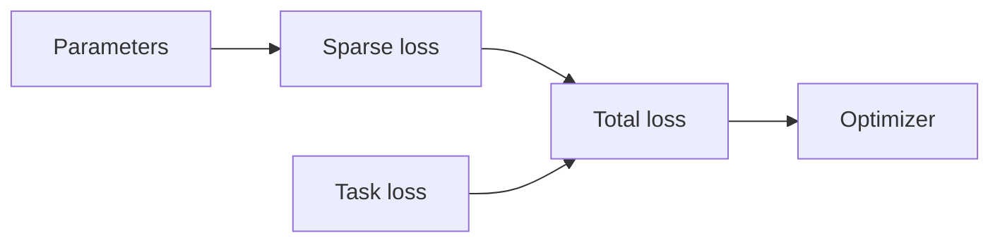
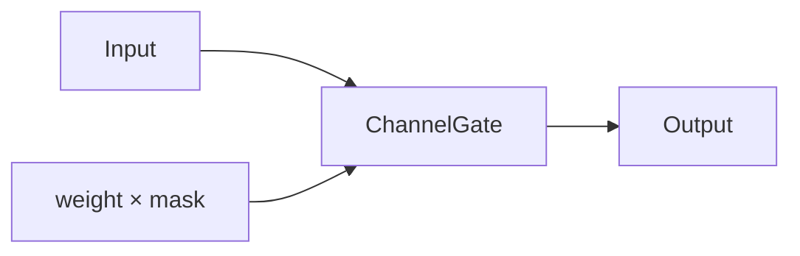
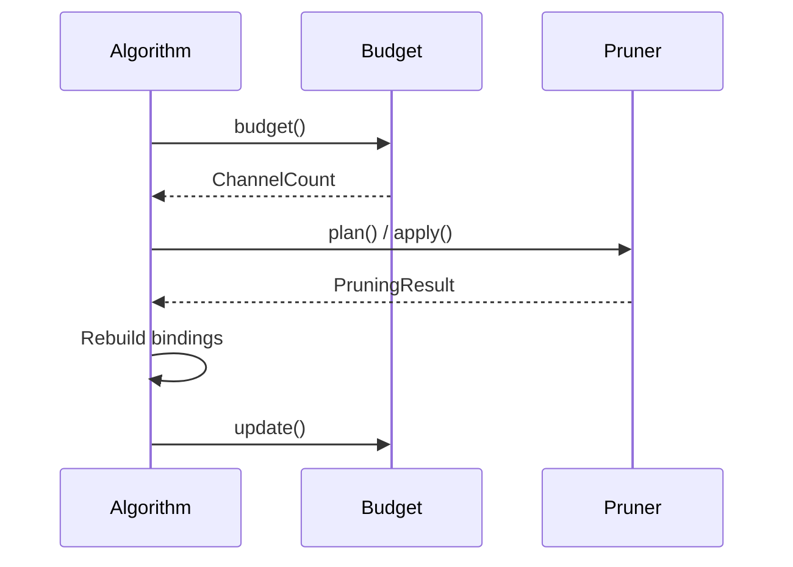

# Sparse training and iterative pruning

`torch_kirigami.sparsity` provides composable penalties, activation gates, parameter operations, schedules, and cumulative channel accounting. It does not own a task loss, optimizer, training loop, or pruning algorithm. The [workflow examples](../examples/workflows/README.md) combine these components with pretrained models and ImageNet data.

The differentiation contract is uniform: a sparse regularizer returns a scalar tensor, and ordinary autograd computes its gradient as part of the caller's total loss. There is no parallel API that injects the same regularizer into `.grad`.

## Components and responsibilities



| Component | Library responsibility | Caller responsibility |
| --- | --- | --- |
| `CandidateSpace`, `ParameterGroup` | Discover logical candidates and expose complete parameter regions | Choose target domains and parameter filters |
| `ScaleL1`, `GroupLasso`, `GroupSquaredL2` | Evaluate scalar penalties on current parameter values | Task loss, strength, training duration, and optimization |
| `ChannelGate`, `GateBinding`, `GateMagnitude` | Explicit scales, structural linkage, and gate scoring | Gate placement and candidate policy |
| `scale_groups_`, `zero_groups_`, `set_group_norms_` | Validated parameter-region updates | Timing, regrowth policy, momentum handling |
| `CumulativeChannelBudget` | Frozen original denominators and observed deletion accounting | Round schedule and successful update sequence |
| Schedules and `SelectionWindow` | Pure scalar interpolation and selection statistics | Step counters, thresholds, and stage transitions |

## Live parameter groups

`CandidateSpace.parameter_groups(candidates=None, *, parameter_filter=None)` propagates each candidate's dependency closure and extracts its affected parameters. `parameter_filter(ref, parameter)` can restrict the objective, for example to weights rather than biases. An incomplete influence range or an empty resulting group is rejected.

`ParameterGroup(graph, selections, key="")` represents a union of selected regions, not necessarily a slice of a single parameter. Its `bindings()` method returns current `(Parameter, Selection)` pairs after graph validation.

Within one group, regions and aliases of the same parameter are deduplicated. Fully equivalent groups on the same graph are canonicalized independently of their labels. Distinct groups may overlap: their regularizer contributions add as specified by the objective. Passing equivalent groups with different coefficients is an error.

A complete parameter group describes structural influence. It does not establish that zeroing those parameters is numerically equivalent to deleting a dimension. Repairable balance/divisibility constraints may remain when groups are extracted; `plan()` must still verify the final joint physical request. Normalization domains and bias paths require particular care in equivalence tests.

Groups remain usable after ordinary numerical optimizer updates. Structural changes, parameter replacement, or other snapshot-invalidating changes require rebuilding the graph and the binding. Selected parameters must be finite, dense, real floating-point tensors on one device, with all groups belonging to one graph. Distributed or sharded gathering is not provided.

## Scalar regularizers

Let `W_g` be the flattened region union of group `g`, and let `a_g` be an explicitly supplied coefficient.

| API | Scalar objective |
| --- | --- |
| `ScaleL1(graph, parameters)` | Sum of absolute values of explicitly named one-dimensional scale parameters |
| `GroupLasso(groups, *, coefficients=None)` | `sum_g a_g * ||W_g||_2` |
| `GroupSquaredL2(groups, *, coefficients=None)` | `0.5 * sum_g a_g * ||W_g||_2^2` |

Group coefficients default to one and must be finite, nonnegative Python numbers aligned with the supplied groups. They are fixed configuration, not trainable tensors. There is no implicit averaging or group-size normalization. Multiply the returned scalar by the overall strength in the training loop.

`ScaleL1` accepts parameter paths or `TensorRef` objects. It validates one-dimensional shape and deduplicates aliases; it does not infer whether a parameter semantically represents a BN or gate scale. That choice is explicit.

All regularizers read the latest values on each call and preserve autograd connectivity without retaining graphs across steps. They do not call `backward()`, change parameter values, modify gradients, or access optimizer state. Frozen parameters remain part of the objective, although autograd does not produce gradients for them.

Reductions use at least float32, retaining float64 if any selected parameter is float64. The L2 norm uses scaling for numerical stability and the zero subgradient at the origin. No smoothing term changes the mathematical formula. Nonfinite selected values or results raise an error.

### Ordinary training integration

This minimal example demonstrates the API; use pretrained models and representative task data to evaluate pruning quality.

```python
import torch
from torch import nn

from torch_kirigami import DependencyGraph
from torch_kirigami.pruning import CandidateSpace
from torch_kirigami.sparsity import GroupLasso

model = nn.Sequential(nn.Linear(8, 12), nn.ReLU(), nn.Linear(12, 4))
x, target = torch.randn(2, 8), torch.randn(2, 4)
graph = DependencyGraph.build(model, args=(x,))
space = CandidateSpace(graph)
regularizer = GroupLasso(space.parameter_groups())
optimizer = torch.optim.AdamW(model.parameters(), lr=1e-3)

optimizer.zero_grad()
task_loss = nn.functional.mse_loss(model(x), target)
sparse_loss = regularizer()
loss = task_loss + 1e-4 * sparse_loss
loss.backward()
optimizer.step()
```

The same contract works with SGD, AdamW, gradient accumulation, AMP, and clipping. The caller chooses the loss scaling: when averaging across `N` microbatches, scale the total loss consistently so the sparse term is not accidentally multiplied by `N`. Under AMP, combine the losses before applying the gradient scaler; unscale before clipping or reading Taylor statistics.

For Taylor scoring, perform a separate task-only gradient collection pass. Decide the model mode explicitly; an evaluation-mode calibration pass can avoid changing BN running statistics. The [workflow utility](../examples/workflows/workflow_utils.py) restores the original module modes after collecting task-only gradients.

## Explicit activation gates

`ChannelGate(size, axis, trainable=True)` computes `y = x * broadcast(weight * mask)` along the chosen activation axis. It starts with a one-valued parameter and a one-valued buffer. Negative axes are supported. The input rank is preserved, and its gated width must equal `size`.



Call `gate.set_mask(binary_values)` outside a live backward graph to change its fixed binary mask. A mask does not physically shrink the network. `trainable=False` freezes the gate weight while retaining the same module and checkpoint structure.

Place the gate explicitly in the model, then register its operator semantics before building the graph:

```python
from torch_kirigami import OperatorRegistry
from torch_kirigami.pruning import ChannelCount, Pruner
from torch_kirigami.sparsity import (
    ChannelGate,
    GateBinding,
    GateMagnitude,
    ScaleL1,
    register_gate_operators,
)

model = nn.Sequential(nn.Linear(8, 12), ChannelGate(12, axis=-1), nn.Linear(12, 4))
operators = OperatorRegistry.default()
register_gate_operators(operators)
graph = DependencyGraph.build(model, args=(x,), operators=operators)
space = CandidateSpace(graph)
regularizer = ScaleL1(graph, ("1.weight",))
binding = GateBinding(graph, "1")
axis = graph.parameter("0.weight").axis(0)
plan = Pruner(model, graph=graph).plan(
    candidates=binding.candidates(space),
    metric=GateMagnitude((binding,)),
    budget=ChannelCount((3,), axes=(axis,)),
)
model, result = Pruner(model, graph=graph).apply(plan)
```

`register_gate_operators(operators)` adds a leaf rule linking input/output axes to the gate weight and mask, with a requirement to update `size`. It adds no candidate budget domain, so the gate does not inflate the denominator. Its multiplication produces fresh storage; this fact supports checks for an immediately following in-place activation without relaxing other alias or multiple-consumer constraints.

`GateBinding(graph, path).candidates(space)` discovers which existing candidates affect that gate by dependency propagation. `GateMagnitude(bindings)` scores the sum of `abs(weight * mask)` over affected scales. It rejects ungated candidates. Aliases sharing both the weight and mask count once; a shared weight paired with different masks contributes for each distinct pair.

The library does not automatically insert gates or rewrite arbitrary networks. After physical pruning, retained gate values remain intact and need not equal one. Save and restore with a model factory containing the same gate placements; see [persistence](persistence.md).

## Parameter operations for soft pruning and projection

These functions deliberately modify parameter values under `no_grad`; they are separate from the scalar-regularizer API.

| Operation | Semantics |
| --- | --- |
| `scale_groups_(groups, factor)` | Multiply the union of selected regions once by a finite nonnegative factor |
| `zero_groups_(groups)` | Set the union to zero once, without installing a persistent mask |
| `set_group_norms_(groups, targets)` | Rescale each disjoint group to a finite nonnegative L2 target |

Execute operations outside a live forward/backward graph, usually after a successful optimizer step. Scaling and zeroing update overlapping regions once. Norm projection canonicalizes equivalent groups with equal targets, but rejects other overlaps, even if their requested norms happen to match. Equivalent groups with conflicting targets are also rejected.

A zero vector cannot be assigned a positive norm because it has no direction. Target zero is supported. Distinct tensor objects sharing storage are rejected, including unselected registered aliases that an update could affect.

Validation and new values are prepared before committing any parameter change. Ordinary runtime/value failures during the commit restore original values. Gradients and optimizer state are untouched: momentum can regrow zeroed parameters on later steps. A method that requires persistent zeros must explicitly reapply its operation or use a mask; it must also specify any optimizer-state handling.

## Cumulative budgets and rebinding

Applying `ChannelRatio(0.2)` repeatedly means 20% of each new snapshot's widths, with new rounding every round. `CumulativeChannelBudget` instead records the original logical widths and subtracts only observed, successfully applied removals.

For an initial width `W`, current width `w`, and cumulative target ratio `r`, the next local cap is `max(0, floor(r * W) - (W - w))`. Global scope uses the sums of original and current widths. A shortfall is not counted as completed pruning.



```python
from torch_kirigami.pruning import Magnitude
from torch_kirigami.sparsity import CumulativeChannelBudget

# Start a new accounting baseline at the model's current structure.
graph = DependencyGraph.build(model, args=(x,), operators=operators)
space = CandidateSpace(graph)
account = CumulativeChannelBudget(space, scope="local")
for ratio in (0.1, 0.2, 0.3):
    pruner = Pruner(model, graph=space.graph)
    plan = pruner.plan(
        metric=Magnitude(),
        candidates=space.candidates,
        budget=account.budget(space, ratio),
    )
    model, result = pruner.apply(plan)
    graph = DependencyGraph.build(model, args=(x,), operators=operators)
    space = CandidateSpace(graph)
    account.update(result, space)
    optimizer = torch.optim.SGD(model.parameters(), lr=1e-3)
```

This loop continues the gated example above. For custom candidate definitions, recreate the same logical domains on the new graph instead of using old `AxisRef` objects. An ordinary ungated model can use the default registry.

Cumulative accounting requires named parameter axes. It validates domain paths, dimensions, declarations, widths, and model structure at each transition. Unrecorded external structure changes and incompatible domains are errors. A domain that becomes wholly IO-protected can retain its original denominator when the new space proves that protection.

`state_dict()` returns portable accounting data. `load_state_dict(state, space)` validates compatibility against a fresh restored space before changing state. The component does not store scores, stage triggers, or a training loop.

## Schedules and selection stability

Schedules are stateless callables: the caller supplies a nonnegative integer step and saves its own progress counter.

| API | Behavior |
| --- | --- |
| `Constant(value)` | Fixed finite value |
| `Linear(start, end, finish, *, begin=0)` | Linear interpolation, clamped before `begin` and after `finish` |
| `Polynomial(start, end, finish, begin=0, power=1.0)` | `start + (end-start) * progress**power`, clamped at endpoints |
| `Piecewise(points)` | Value at the latest milestone; first milestone must be zero |

`selection_similarity(left, right)` computes the mean per-domain Jaccard similarity of retained integer identities. Inputs map stable domain strings to retained positions. Empty/empty is one, and changed domain keys are rejected. This is an average over domains, not a pooled Jaccard weighted by domain width.

`SelectionWindow(size)` averages the most recent `size` adjacent comparisons. `update(selection)` returns `None` until that many comparisons exist, so a size-two window requires three observations. `reset()` starts a new coordinate universe. `state_dict()` and `load_state_dict()` preserve history with compatibility validation.

Similarity thresholds, delayed regularization, progressive strengths, reselection, and stage transitions belong to the algorithm. After physical pruning, reset stability statistics unless the caller explicitly maintains a valid original-identity mapping.

## What the workflows demonstrate

The standalone [workflow scripts](../examples/workflows/README.md) show magnitude/Taylor pruning, iterative budgets, BN scale L1, group Lasso and increasing squared L2, soft zeroing/norm decay, gate training, and stability-driven stage switching. Method-specific schedules and policies live in those scripts. They are component demonstrations, not complete reproductions of published training recipes or accuracy claims.

Final model checkpoints and training recovery state have different responsibilities. Save the compact model with the library checkpoint functions; save optimizer, progress, algorithm state, and RNG separately in the training application. See [persistence](persistence.md#training-state-is-caller-owned).

## Method background and deliberate simplifications

These references explain the ideas behind the example compositions. The library components implement their documented mathematical contracts; the examples do not claim full paper reproduction.

| Reference | Connection to the examples | Scope of this implementation |
| --- | --- | --- |
| [Network Slimming](https://arxiv.org/abs/1708.06519) | Channel sparsity through learned scaling factors | The BN workflow applies `ScaleL1` to explicitly selected ResNet BN scales, then ranks and physically prunes those channels |
| [Neural Pruning via Growing Regularization](https://arxiv.org/abs/2012.09243) | Gradually increasing regularization strength | The squared-L2 workflow reselects target groups and applies a simple linear strength schedule; it does not reproduce every importance-estimation or training variant |
| [Decay Pruning Method](https://arxiv.org/html/2406.03879v2) | Gradual target-norm decay during optimization | The decay workflow projects one union of selected dependency regions and reselects between two cycles; it does not implement the paper's gradient-driven self-rectification criteria or separate per-structure norm trajectories |
| [One-Cycle Structured Pruning](https://arxiv.org/html/2501.13439v2) | Selection stability based on layer-wise Jaccard similarity | The stability workflow uses a two-comparison adjacent-selection window and a fixed trigger; it does not reproduce the paper's full delayed-start and one-cycle training policy |

The soft-zeroing mode retains SGD momentum and includes an unprojected recovery interval so regions can regrow. The gate workflow demonstrates explicit activation scaling and L1 selection without introducing expected-L0 objectives, a control network, or a specialized optimizer.
