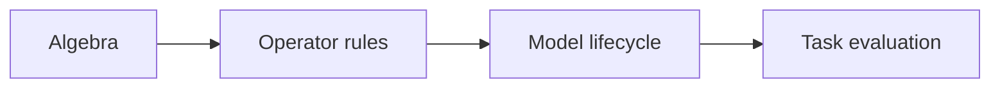
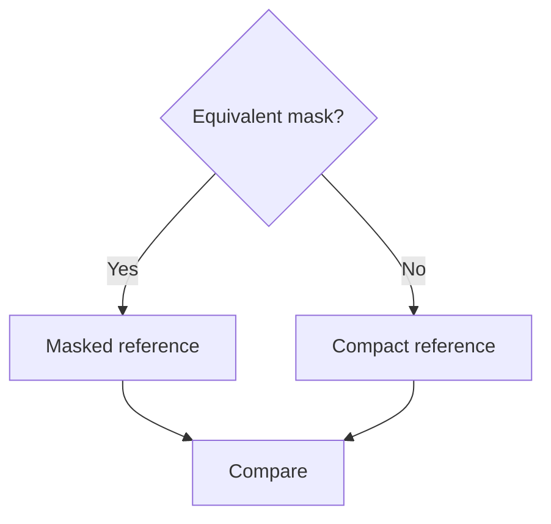

# Verification guide

Use this page to find the evidence for a design contract. It summarizes what the tests prove and how to review them without treating a test count as a blanket compatibility claim.

## Verification levels

Each level adds a different question. Coverage at one level does not imply coverage at every later level. In particular, the native operator-entry inventory is a rule-level inventory; it does not claim a full model lifecycle for every registered spelling.

## Contract map

| Contract | Representative tests | Review focus |
| --- | --- | --- |
| Index and region algebra | [coordinate properties](../tests/core/test_coordinate_properties.py), [selection](../tests/core/test_selection.py) | Set equivalence, partial sections, compact shapes, bounds and symbolic large domains |
| Constraint validity | [constraint properties](../tests/core/test_constraint_properties.py), [constraints](../tests/core/test_constraints.py) | Balance, divisibility, nonempty domains and precise rejection |
| Capture isolation | [isolation](../tests/capture/test_isolation.py), [mutation](../tests/capture/test_mutation.py), [bindings](../tests/capture/test_bindings.py) | Buffer/input/RNG restoration, aliases and rejected parameter writes |
| Shape and configuration provenance | [shape expressions](../tests/capture/test_shape_expressions.py), [shape provenance](../tests/integration/test_shape_provenance.py), [Python contracts](../tests/integration/test_python_contracts.py) | Which values can safely change after compaction |
| Graph closure and ownership | [propagation](../tests/graph/test_propagation.py), [queries](../tests/graph/test_queries.py), [freshness](../tests/graph/test_freshness.py) | Joint arrivals, reference identity and stale graph rejection |
| Native operator registration | [registered entries](../tests/operators/test_registered_entries.py), [independent cases](../tests/support/operator_cases.py) | Actual signatures and explicitly declared propagation axes |
| Composed coordinate transforms | [coordinate compositions](../tests/integration/test_coordinate_compositions.py), [compact networks](../tests/integration/test_compact_networks.py) | Reshape, permutation and shared-path behavior in real graphs |
| Scores and budgets | [metrics](../tests/pruning/test_metrics.py), [precision](../tests/pruning/test_precision.py), [budget](../tests/pruning/test_budget.py), [strategy](../tests/pruning/test_strategy.py) | Region unions, finite scores, precision, coupled counts and search limits |
| Plan purity and replay | [static plans](../tests/persistence/test_plan.py), [portable queries](../tests/integration/test_portable_queries.py) | No live graph/model retention, compatible replay and invalid input rejection |
| Transactional execution | [lifecycle](../tests/integration/test_lifecycle.py), [transactions](../tests/integration/test_transactions.py) | Exact binding restoration after failure, repeated rounds and successful alternatives |
| Checkpoint integrity | [checkpoint validation](../tests/persistence/test_checkpoint_validation.py), [checkpoint state](../tests/persistence/test_checkpoint_state.py), [cross-process restoration](../tests/persistence/test_process.py) | Aliases, extra state, payload consistency and failure isolation |
| Sparse loss and operations | [regularizers](../tests/sparsity/test_regularizers.py), [operations and gates](../tests/sparsity/test_operations_gates.py) | Independent formulas, autograd, precision, shared regions and mutation atomicity |
| Iteration and scheduling | [budget and schedules](../tests/sparsity/test_budget_schedule.py), [sparse workflows](../tests/integration/test_sparse_workflows.py) | Actual cumulative deletion accounting, stale domains and continuation after pruning |
| Measurement | [measurement integration](../tests/integration/test_measurement.py) | MAC conventions, unknown operations, modes/RNG restoration and timing boundaries |
| Workflow integration | [pretrained examples](../tests/integration/test_pretrained_examples.py) | Requested official weights, local data/cache loading, stages, metrics and checkpoint output |

## Boundary families from independent review

Operator spelling coverage alone misses interactions between capture, dependency propagation, execution, and restoration. The following regression families combine successful alternatives with rejection and failure-state assertions:

| Invariant | Public regression coverage |
| --- | --- |
| Coordinate-neutral edges still carry layout and value effects | [Graph boundaries](../tests/integration/test_review_graph_boundaries.py): slice → view/reshape/flatten, reduction → integer cast → unknown size consumer, independent branch pruning |
| Structural constants reflect the value at their read | [Graph boundaries](../tests/integration/test_review_graph_boundaries.py): read-only versus temporarily mutated integer buffers, direct and view aliases, `dim`/`ndim` |
| Shared calls have one declared budget domain | [Graph boundaries](../tests/integration/test_review_graph_boundaries.py): repeated ordinary/grouped ConvTranspose1d/2d/3d, independent compact numerical references |
| Restored values retain ownership and runtime semantics | [State boundaries](../tests/integration/test_review_state_boundaries.py): nested/order-sensitive dictionaries, cached tensors, parent references, slots, hooks, custom decoding, rollback and backward |
| Measurement executes the caller's input relationships | [Measurement boundaries](../tests/integration/test_review_measurement_boundaries.py): actual MHA native path, args/kwargs identity, shared views, full buffer registration restoration on success and failure |
| Optimizations preserve objectives and reduce work | [Optimizations](../tests/integration/test_review_optimizations.py): allocating unary families followed by in-place activation, bounded protected-domain queries, zero-budget planning without rediscovery or scoring, shared-state equality, batched and irregular loss/gradient references, extreme and mixed precision |

Every registered native entry also checks any fresh-storage promise against the actual PyTorch output, including registered parameters and buffers among possible aliases.

Performance regression assertions count expensive operations or autograd gather nodes instead of imposing noisy timing thresholds. Numerical loss references are independent formulas. Model tests check outputs and backward where applicable; shape-only success is insufficient. New cases should extend the relevant family across forms and lifecycle boundaries, rather than only reproduce one reported example.

## Operator support is conditional

A registered operation can still reject a particular argument combination, axis, index pattern, layout or alias relationship. Read the [operator support guide](operator-coverage.md) before interpreting the native-entry matrix.

The machine-readable [contract inventory](../tests/architecture/contract_inventory.json) maps public exports and implementation classes to test functions and maps built-in registrations to rule tests. [Architecture guards](../tests/architecture/test_coverage_inventory.py) reject missing or obsolete entries. The inventory is a navigation aid, not a generated proof of numerical correctness.

## Sparse and gated numerical comparisons

Removing a dependency group need not preserve the dense model's function, even after selected weights are zero. Biases, normalization domains and residual paths can affect the argument.

The sparse integration tests include residual/grouped CNN paths, FFN dimensions and attention-head gates. These are targeted structural and numerical checks, not exhaustive combinations of every supported operator.

## What pretrained workflow tests establish

The workflow test suite uses temporary Parquet data and substitutes weight loading during automated algorithm runs. It checks that executable examples request the official weight enum and follow the intended pruning and training stages. Small models and synthetic data remain test fixtures.

The suite also checks torchvision computation, explicit gate placement, independent compact references, backward and checkpoint reconstruction. HF cache tests exercise local resolution without downloading ImageNet.

These tests do not establish ImageNet top-1/top-5 accuracy or fine-tuning recovery. Those results require running a pretrained workflow on the actual dataset and reporting its sample counts and settings. Compiler tests likewise need their backend identified: eager-backend checks and default Inductor measurements are different evidence.

## Reviewing a new contract

For a new feature, trace the chain from the stated invariant to an independent assertion, then to a public lifecycle test if multiple layers interact. Include a failure that checks preserved state and a valid alternative where applicable.

See [Development and testing](testing.md) for commands, device handling and CI scope.

## Execution-context and numeric-boundary families

[Execution contexts](../tests/integration/test_execution_contexts.py), [constant guards](../tests/integration/test_constant_guards.py), and [backend layouts](../tests/integration/test_backend_layouts.py) exercise public capture, portable planning, application and checkpoint loading. Cases span autocast joins, inference-mode copies, singleton channels-last strides, ordinary Tensor containers and names resembling extra-state keys. Valid metadata/configuration alternatives and explicit layout operations accompany rejection tests.

[Sparse regularizers](../tests/sparsity/test_regularizers.py) include subnormal float32/float64 gradients with independent normalized integer directions, including overlapping and irregular regions. [Group scaling](../tests/integration/test_group_scaling.py) checks geometric deduplication collisions and operation counts instead of timing-sensitive performance thresholds. These are family-level regressions, not a claim of exhaustive model coverage.

Further regression families exercise pruning-induced metadata branch changes, native torch configuration, device/dictionary extra-state relocation, backend-independent layout uncertainty for convolution/normalization and internal/explicit padding modes, all `Tensor.to(copy=...)` overloads, and externally scaled norm gradients. Metadata tests distinguish preserved dimension/type/layout observations from changed ones, including Tensor keyword aliases and portable-plan preconditions. Unknown-layout views have positive tests for axis splitting and singleton changes, followed by downstream views that still require known strides. Later views are checked after these operations, so layout errors cannot hide behind successful local shape checks.

Container tests also reject Tensor/Module dictionary keys and verify the supported value-binding alternative. Complex NaN buffers cover conjugate and ordinary storage; weighted-loss references use wider independent arithmetic, and nonzero groups with zero rows compare first derivatives against the direct mathematical objective. Built-in L2 double backward is explicitly rejected.

Known capture limitation: FX can silently omit Proxy identity/type/runtime-state decisions, including `x.grad is None`. These programs are excluded by the [capture contract](dependency-graph-design.md#unsupported-python-decisions-that-fx-may-not-detect); passing tests or successful build does not establish their correctness. Eager guard regressions do not claim to cover this unobservable Proxy path.

The numerical boundary tests also cover final scalar aggregation across many tiny
squared contributions and groups, with Decimal references, and first derivatives with extreme coefficients and upstream gradients. Measurement tests
exercise ordinary-attribute input aliases, shared views, cached native MHA paths,
exception restoration and rejected alias-breaking device transfer.

Range tests also sample reproducible combinations of parameter magnitudes, group
coefficients and upstream gradients against Decimal objectives and derivatives;
they cover finite results as well as explicit rejection of unrepresentable losses.
Shuffle regressions pair unsafe view rejection with independently checked reshape
and contiguous alternatives. Extra-state tests cross empty/nonempty tensors with
parameter/buffer bindings and registered aliases versus independent copies.

## Maintainability regressions

The [maintainability review](maintainability-review.md) records the refactors and
optimization tradeoffs. Public regressions check one effect query per captured
call, conflicting shared-attribute edits (including no-ops) before mutation, and
mixed regular/irregular/scalar parameter groups without duplicate contributions
or repeated binding scans. Regularizer references cover ordinary and extreme
values, updates between calls, and failure-state preservation. Existing lifecycle
and operator tests exercise the shared region-shape calculation and the split
build/validation responsibilities.
