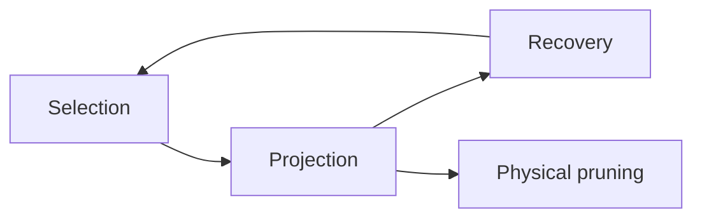
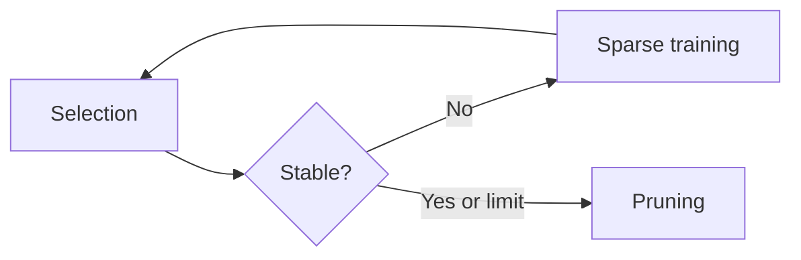

# Pretrained ImageNet pruning workflows

These executable examples show how to combine torch-kirigami's structural pruning and sparse-training components. Every workflow starts from torchvision's ImageNet-pretrained **ResNet-18** or **ViT-B/16**; BN sparsity supports ResNet-18 only. Each entry defines its own task-specific arguments, training, dependency capture, candidate selection, physical pruning, and checkpoint handling. Shared support modules provide data loading, model construction, evaluation, and measurement. Accuracy is evaluated on ImageNet validation; training and Taylor calibration use the separate ImageNet training split.


Sparse training and fine-tuning are optional. Each workflow evaluates the pretrained baseline and the results of its pruning and training stages.

## Environment and data

Configure the environment **at the repository root**, then enter this directory as the final step:

```bash
uv venv .venv
source .venv/bin/activate
uv pip install --torch-backend=auto -r examples/workflows/requirements-examples.txt
cd examples/workflows
```

The installer selects a PyTorch backend from the operating system and installed
CUDA driver. The project does not pin a CPU-only index. All workflows default to
`--device cuda` and fail before loading data or weights if CUDA is unavailable;
use `--device cpu` explicitly for CPU execution. Run scripts with the activated
environment's `python` so project synchronization does not replace a locally
selected backend or remove optional workflow dependencies.

Download the validation split of [HF ILSVRC/imagenet-1k](https://huggingface.co/datasets/ILSVRC/imagenet-1k):

```bash
hf download ILSVRC/imagenet-1k --repo-type dataset \
  --include 'data/validation-*.parquet'
```

For sparse training, fine-tuning, or Taylor calibration, also download the training split:

```bash
hf download ILSVRC/imagenet-1k --repo-type dataset \
  --include 'data/train-*.parquet'
```

These commands use the default Hugging Face cache. The scripts read the cached Parquet shards without downloading dataset files during execution. The shards contain images and class labels; no separate image archive, label file, or test split is needed. Torchvision downloads model weights separately on first use. An existing dataset snapshot can be supplied with `--data-dir PATH`, where `PATH/data/` contains the shards.

By default, evaluation uses the full 50,000-image validation split, and each training epoch uses a fixed shuffled subset of 512 training images. Use `--val-samples 256` for a short evaluation or `--train-samples 0` for the full training split. Sample limits change what the script reads, not how much the download commands fetch. Both splits use the selected weights' RGB preprocessing; these examples do not implement a full training-augmentation recipe.

## Models, scope, and results

| Setting | Behavior |
| --- | --- |
| `--model resnet18` | Default for model-selectable scripts; BN sparsity fixes this model. Prune internal BasicBlock channels between `conv1` and `conv2`. |
| `--model vit_b_16` | Prune FFN intermediate dimensions; keep hidden width and attention heads intact. |
| `--layers all` | Include all supported blocks; the default includes only the first block. Comma-separated block paths are also accepted. |
| `--granularity 8` | Retained producer widths must be multiples of eight. Use `1` for no extra alignment requirement. |
| `--ratio 0.25` | Default cumulative reduction target within the selected channel domains, not a whole-model parameter or MAC reduction. |
| `--finetune-epochs 0` | Default: no ordinary post-pruning fine-tuning. Set a positive value to enable it. |
| `--device cuda` | Default. Run training, evaluation, and measurement on CUDA; use `--device cpu` to opt into CPU execution. |
| `--compile` | Measure compiled inference latency. Training and accuracy evaluation keep their ordinary execution path. |

Each script builds a `Pruner` with exact-path `Granularity` settings and calls `discover_candidates(targets=...)` for the internal producers selected by `--layers`. `--layers all` includes all supported blocks at the task-specific axes listed above, not every prunable axis in the model. Candidates remain individual producer channels; alignment constrains the retained width and does not require adjacent removals. Each task supplies its own importance scores to `Greedy`, which checks joint dependencies, alignment and deletion caps. Group regularizers operate on each channel's dependent parameter regions. The dependency graph still covers the complete model. See [candidate discovery](../../docs/pruning-design.md#default-candidate-entry-axes).

Both models retain their original 1,000-class classifier. ViT uses an explicit forward adapter that preserves the official weights and computation while exposing the structure to FX. Physical pruning replaces parameters, so subsequent training uses a new optimizer. Iterative pruning rebuilds the dependency graph before planning the next round. Fine-tuning uses the task loss alone.

Each recorded stage prints validation cross-entropy, top-1/top-5 accuracy, top-1 change from the pretrained baseline in percentage points, `#Params`, `#MACs`, and `latency_ms`. Pruning stages also report target/actual channel reduction and budget shortfall. Training prints task and sparse losses. Latency and MACs use a separate inference batch of size one by default; `--benchmark-batch-size`, `--warmup`, and `--repetitions` control measurement. Inspect `unsupported_ops` when interpreting MAC counts; see the [measurement contract](../../docs/measurement.md).

Results default to `runs/<script-name>`; use `--output runs/NAME` to separate runs of the same task. The directory contains `metrics.json`, a compact `model.pt`, and `training.pt` with optimizer, algorithm, configuration, and RNG state. Iterative pruning also saves cumulative budget accounting. Each script verifies model checkpoint restoration; a command-line training-resume workflow is not provided.

Task options are declared in each file, without a shared parser:

| Script | Task-specific options |
| --- | --- |
| `prune_finetune.py` | `--metric magnitude\|taylor` |
| `iterative_pruning.py` | `--rounds` |
| `bn_sparsity.py` | `--sparse-epochs`, `--strength`; fixed ResNet-18, no `--model` option |
| `group_sparsity.py` | `--penalty lasso\|squared`, `--sparse-epochs`, `--strength` |
| `soft_pruning.py` | `--operation zero\|decay`, `--cycles`, `--projection-epochs` |
| `gate_pruning.py` | `--sparse-epochs`, `--strength` |
| `stability_pruning.py` | `--search-steps`, `--window`, `--threshold`, `--strength` |

All scripts provide explicit data, device, channel-budget, optional fine-tuning, and measurement options. Unrelated task flags are rejected by the parser.

## 1. Basic pruning and optional fine-tuning

[prune_finetune.py](prune_finetune.py) ranks channel groups by producer-weight magnitude or Taylor importance, prunes them, and evaluates immediately. Taylor collects task-only gradients from one training batch in evaluation mode without updating weights or BN statistics.

```bash
python prune_finetune.py --model resnet18 --ratio 0.25
python prune_finetune.py --model vit_b_16 --ratio 0.25 --finetune-epochs 1
python prune_finetune.py --metric taylor --finetune-epochs 1
```

The first command requires only validation data. Taylor and any positive fine-tuning epoch count also require training data.

## 2. Iterative pruning

[iterative_pruning.py](iterative_pruning.py) gradually increases the cumulative target. Every round recomputes magnitude scores and subtracts actual prior deletions from the target based on the original channel widths. An underfilled round is not counted as having met its target.


```bash
python iterative_pruning.py --model resnet18 --rounds 3 --ratio 0.3 --finetune-epochs 1
```

## 3. BN-scale sparse training

[bn_sparsity.py](bn_sparsity.py) applies L1 regularization to the selected blocks' BN scales, then ranks groups by scale magnitude. This example supports **ResNet-18 only**; ViT uses LayerNorm.

```bash
python bn_sparsity.py --sparse-epochs 2 --finetune-epochs 1
```

## 4. Dependency-group sparse training

[group_sparsity.py](group_sparsity.py) regularizes complete dependency parameter groups. `lasso` applies Group Lasso to all candidate groups. `squared` reselects low-magnitude groups each epoch and increases their squared-L2 penalty linearly. Final selection uses producer-weight magnitude.

```bash
python group_sparsity.py --model resnet18 --penalty lasso --finetune-epochs 1
python group_sparsity.py --model vit_b_16 --penalty squared --sparse-epochs 2 --finetune-epochs 1
```

## 5. Soft pruning and gradual norm decay

[soft_pruning.py](soft_pruning.py) performs one warm-up training epoch to establish SGD momentum, followed by `--cycles` projection cycles (default: two). After each optimizer step, it either zeros the selected parameter-region union or reduces that union's L2 norm toward zero. An unprojected recovery epoch between cycles allows regrowth and reselection. The last cycle's selected coordinates are revalidated after training and then physically pruned.



```bash
python soft_pruning.py --model resnet18 --operation zero --finetune-epochs 1
python soft_pruning.py --model vit_b_16 --operation decay --finetune-epochs 1
```

`--projection-epochs` sets the number of epochs in each projection cycle; both it and `--cycles` must be positive. Momentum is retained during these cycles and reset by optimizer reconstruction after physical pruning.

## 6. Gate training and pruning

[gate_pruning.py](gate_pruning.py) inserts explicit, initially unit-valued channel gates after ResNet BN or ViT FFN activation. It trains gate scales with L1 regularization, ranks their magnitudes, and physically removes the corresponding dimensions. Remaining gate values are preserved in the compact model and checkpoint.

```bash
python gate_pruning.py --model resnet18 --sparse-epochs 2 --finetune-epochs 1
python gate_pruning.py --model vit_b_16 --sparse-epochs 2 --finetune-epochs 1
```

## 7. Stability-driven pruning

[stability_pruning.py](stability_pruning.py) alternates magnitude-based selection with increasing squared-L2 regularization of selected groups. `--window 2` compares retained-position sets over two adjacent Jaccard comparisons, which requires three selections. Search stops at `--threshold 0.99` or after `--search-steps 3` selection checks, then recomputes the final plan and prunes. Training occurs only between selection checks. A search limit shorter than the window is allowed, but cannot establish stability. Reports distinguish selection checks from training epochs.



```bash
python stability_pruning.py --model vit_b_16 --search-steps 4 --finetune-epochs 1
```

## Implementation guide

These workflows demonstrate component composition, not complete reproductions of paper experiments or established accuracy/speedup claims. The default training subset, SGD settings, fixed preprocessing, candidate grouping, and stopping policies keep the examples small and readable. See [sparse training](../../docs/sparse-training.md) for component formulas and method context.

Start with each entry's `main()` to read the complete pruning workflow. Training loops, regularization, candidate scoring, graph construction, plan/apply calls, optimizer reconstruction, and saving remain visible in that file. Gate insertion is also explicit in the gate example. There is no shared experiment runner or callback-driven workflow.

Three support modules are reused:

| Module | Responsibility |
| --- | --- |
| [imagenet_data.py](imagenet_data.py) | Local ImageNet loading, label alignment, preprocessing, and validation accuracy |
| [imagenet_models.py](imagenet_models.py) | Official model/weight selection and the ViT FX adapter |
| [model_metrics.py](model_metrics.py) | Parameter/MAC counts and inference latency reporting |

When copying an entry elsewhere, include these three files and install the Python dependencies. CLI definitions remain task-specific. Examples are maintained by hand; tests cover the shared infrastructure and every entry's complete pruning/checkpoint path. Run any entry with `--help` for its argument list.
